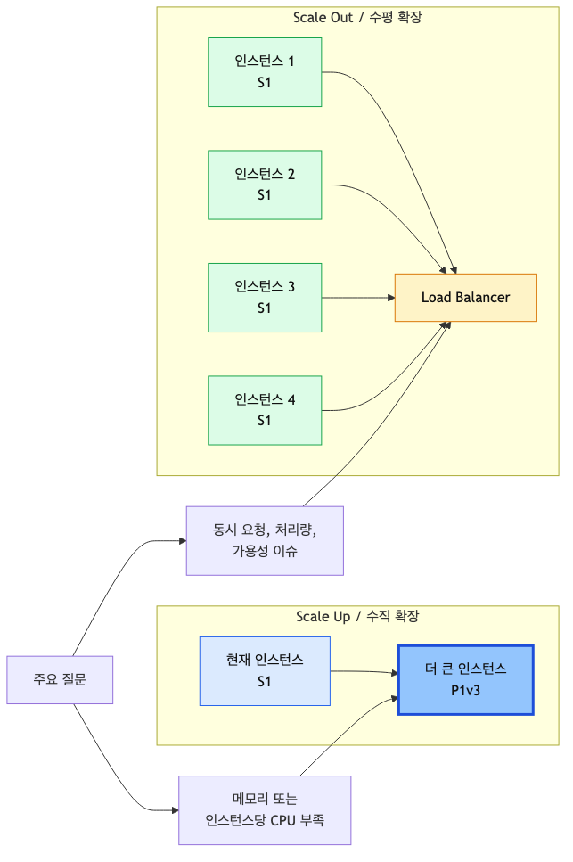
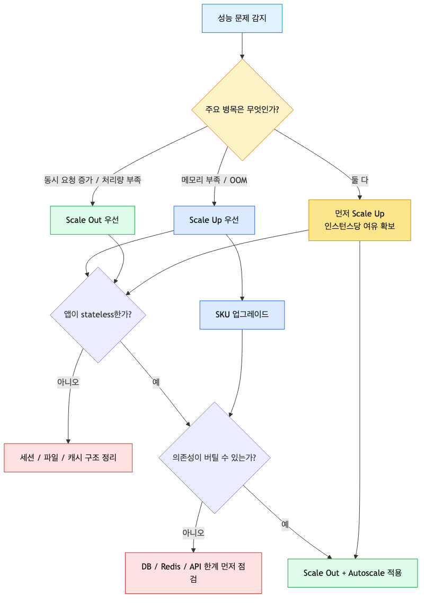
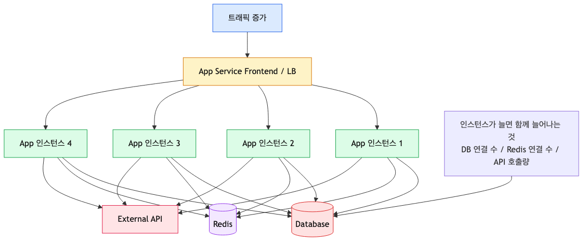
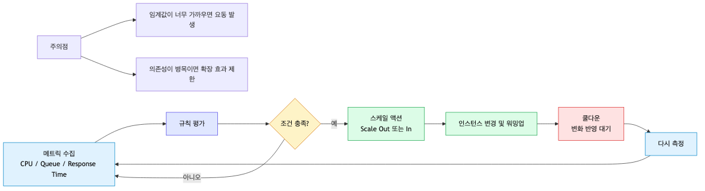

# Scaling 101: 언제 Scale Up vs Scale Out?

> Azure App Service 101 시리즈 (7/7) - 마지막

마케팅 팀이 방금 연락했습니다. “오늘 저녁 8시에 플래시 세일 나갑니다. 평소보다 트래픽이 10배는 들어올 거예요.”

이때 운영팀이 해야 할 일은 단순히 “인스턴스를 늘리자”가 아닙니다. **병목이 CPU인지, 메모리인지, 연결 수인지, 외부 의존성인지 먼저 구분하고, 그에 맞는 방향으로 확장해야 합니다.** 잘못된 스케일링은 성능 문제를 해결하기는커녕 데이터베이스만 먼저 무너뜨릴 수도 있습니다.

이 글은 Azure App Service 101 시리즈의 마지막 글입니다. 여기서는 **Scale Up과 Scale Out의 차이**, **언제 무엇을 먼저 선택할지에 대한 판단 기준**, **Autoscale을 안전장치로 쓰는 방법**, 그리고 **운영팀이 실제로 가져가야 할 스케일링 플레이북**을 정리합니다.

---

<!-- a-grade-intro:begin -->
## 핵심 질문

수동·자동·규칙 기반 스케일을 어떻게 조합해야 비용과 SLA를 동시에 잡을까요?

이 글은 그 질문에 답하기 위해 App Service 스케일링의 핵심 결정과 운영 함정을 살펴봅니다.

<!-- a-grade-intro:end -->

## 이 글에서 답할 질문

- 수직 스케일(scale up)과 수평 스케일(scale out)은 어떤 신호와 어떤 비용을 만드는가?
- Auto-scale rule은 어떤 메트릭(CPU, queue, custom)을 보고 의사결정하는가?
- 스케일 in 시 ARR Affinity 세션은 어떻게 처리되는가?
- Premium SKU의 always-ready 인스턴스는 콜드 스타트를 얼마나 줄여주는가?
- 스케일 한도와 비용 한도를 모두 지키는 가드는 어떻게 설정하는가?

## 왜 마지막 주제가 스케일링일까?

이 시리즈는 “앱을 올리는 법”보다 “운영 가능한 상태로 만드는 법”에 더 가까웠습니다. App Service의 구조를 이해하고, 요청 흐름을 보고, 호스팅 모델을 고르고, 배포하고, 설정을 분리하고, 로그와 모니터링을 붙였다면 이제 마지막 질문이 남습니다.

**“그래서 트래픽이 몰리면, 우리는 무엇을 할 건가?”**

스케일링은 성능 최적화의 부록이 아닙니다. 아키텍처, 운영, 비용, 장애 대응이 한 번에 만나는 지점입니다. 특히 App Service처럼 관리형 플랫폼을 쓸 때는 더 그렇습니다. 플랫폼이 많은 것을 대신해 주지만, **무엇을 늘릴지에 대한 판단은 여전히 팀의 몫**이기 때문입니다.

---

## Scale Up vs Scale Out: 방향이 다르면 해결하는 문제도 다르다

App Service에서 확장은 크게 두 방향으로 나뉩니다.

| 방향 | 의미 | 주로 해결하는 문제 | 대표적인 비용 형태 |
|------|------|-------------------|-------------------|
| **Scale Up** | 더 큰 SKU, 더 큰 인스턴스로 변경 | 메모리 부족, 인스턴스당 CPU 부족, 상위 플랜 기능 필요 | 인스턴스당 비용 증가 |
| **Scale Out** | 인스턴스 개수 증가 | 동시 요청 증가, 처리량 부족, 가용성 향상 | 인스턴스 수 증가 |



*인스턴스 크기 확장과 수평 확장의 차이*

둘 다 “리소스를 더 준다”는 점은 같지만, 적용 방식은 완전히 다릅니다.

- **Scale Up**은 한 대를 더 강하게 만듭니다.
- **Scale Out**은 여러 대가 일을 나눠 갖게 만듭니다.

운영에서 자주 나오는 오해는 이것입니다. “느리면 무조건 Scale Out.” 꼭 그렇지 않습니다. 예를 들어 앱이 이미지 처리나 대용량 응답 생성처럼 **요청 하나당 메모리를 많이 먹는 구조**라면, 인스턴스를 여러 개로 늘려도 각 인스턴스가 여전히 메모리 부족에 시달릴 수 있습니다. 반대로 요청은 가볍지만 동시 접속이 몰리는 API라면, 큰 인스턴스 한 대보다 작은 인스턴스 여러 대가 더 나은 선택일 수 있습니다.

---

## 먼저 판단해야 할 것: 지금 병목은 어디인가?

스케일링을 시작하기 전에 가장 먼저 해야 할 일은 “느리다”를 기술적으로 번역하는 것입니다.

### 이런 신호라면 Scale Up을 먼저 검토합니다

- 메모리 사용률이 지속적으로 높고 GC, OOM, 프로세스 재시작이 반복됨
- 특정 요청이 무겁고, 한 인스턴스 안에서 처리 자원이 부족함
- 현재 SKU에서 제공되지 않는 기능이 필요함 (예: 더 높은 격리, 더 큰 메모리, 상위 네트워킹 기능)
- 인스턴스 수를 늘려도 각 인스턴스의 CPU/메모리 압박이 크게 줄지 않음

### 이런 신호라면 Scale Out을 먼저 검토합니다

- 피크 시간대에 동시 요청 수가 급증함
- CPU는 높지만 요청 패턴이 비교적 균일하고 병렬 처리하기 좋음
- 단일 인스턴스 장애가 곧 서비스 전체 장애로 이어짐
- 응답 시간과 HTTP Queue Length가 트래픽 증가와 함께 상승함

### 둘 다 맞는 상황도 많습니다

현실에서는 “메모리도 부족하고 트래픽도 늘었다”가 더 흔합니다. 이때는 보통 **Scale Up으로 인스턴스당 여유를 확보한 뒤, Scale Out으로 처리량을 받치는 순서**가 안정적입니다. 작은 인스턴스를 무한히 복제해도, 각 인스턴스가 이미 비좁다면 전체 구조가 불안정해지기 쉽습니다.



*병목 유형에 따른 스케일링 선택 흐름*

---

## Scale Up: “한 대가 감당할 수 있는 일”의 한계를 늦춘다

Scale Up은 App Service Plan의 SKU를 더 큰 등급으로 바꾸는 것입니다. **같은 앱을 더 큰 상자에 넣는 일**입니다.

### Scale Up이 잘 맞는 대표 시나리오

1. **메모리 중심 병목**
   - 캐시가 커서 워킹셋이 큼
   - 이미지/문서 처리처럼 요청 하나가 무거움
   - 런타임 특성상 메모리 압박이 성능으로 바로 이어짐
2. **기능 요구사항 변경**
   - 현재 티어에서 지원하지 않는 기능이 필요함
3. **인스턴스 수를 늘리기 전에 기본 체력을 올려야 할 때**
   - 너무 작은 인스턴스가 이미 한계에 도달해 있음

### 장점과 주의점

| 장점 | 주의점 |
|------|--------|
| 판단이 비교적 단순함 | 변경 시 재시작이 발생할 수 있음 |
| 앱이 완전히 stateless가 아니어도 일단 대응 가능 | 결국 상한선이 있음 |
| 기능 업그레이드와 함께 진행 가능 | 비용이 계단식으로 커질 수 있음 |

### CLI 예시

```bash
# 예: S1에서 P1v3로 변경
az appservice plan update \
    --resource-group $RG \
    --name $PLAN_NAME \
    --sku P1v3
```

```bash
# 현재 App Service Plan SKU 확인
az appservice plan show \
    --resource-group $RG \
    --name $PLAN_NAME \
    --query "sku" \
    --output json
```

Scale Up은 즉각적이고 실용적이지만, **확장 전략의 종착지로 생각하면 곤란합니다.** 큰 인스턴스 하나는 강력해도, 여전히 단일 인스턴스 의존성을 줄여 주지는 못합니다.

---

## Scale Out: 처리량과 가용성을 함께 올리려면 결국 이 방향이다

Scale Out은 같은 App Service Plan 아래 **워커 인스턴스 수를 늘려 요청을 분산 처리**하는 방식입니다.

### Scale Out이 잘 맞는 대표 시나리오

- 캠페인, 이벤트, 배치 완료 직후처럼 **짧은 시간에 요청이 몰리는 패턴**
- CPU 중심의 웹/API 부하
- 장애 허용성을 위해 최소 2개 이상 인스턴스가 필요한 운영 환경
- 배포/재시작 중에도 서비스를 유지하고 싶은 경우

### CLI 예시

```bash
# 수동으로 4개 인스턴스로 확장
az appservice plan update \
    --resource-group $RG \
    --name $PLAN_NAME \
    --number-of-workers 4
```

여기서 중요한 전제가 하나 있습니다. **앱이 stateless해야 합니다.**

---

## Scale Out의 전제: 앱이 stateless해야 한다

App Service 인스턴스는 영원히 고정되어 있지 않습니다. 배포, 재시작, 헬스 체크, 플랫폼 유지보수, 스케일링 과정에서 계속 바뀔 수 있습니다. 따라서 인스턴스 메모리나 로컬 디스크에 상태를 붙잡아 두면, Scale Out은 구조적으로 불안정해집니다.

| Stateless 패턴 | Stateful 안티패턴 |
|------------------|--------------------|
| 세션을 Redis나 DB에 저장 | 세션을 프로세스 메모리에 저장 |
| 업로드 파일을 Blob Storage에 저장 | 로컬 파일에 저장 후 다른 인스턴스가 읽길 기대 |
| 캐시 미스가 발생해도 복구 가능 | 인스턴스별 메모리 캐시에 강하게 의존 |
| 인스턴스 재기동을 가정한 시작 로직 | 특정 인스턴스가 오래 살아 있길 기대 |

```python
# 인스턴스 메모리에 세션 저장
user_sessions = {}

def save_session(user_id, session_data):
    user_sessions[user_id] = session_data

# 외부 저장소에 세션 저장
import json
import os
import redis

redis_client = redis.Redis(host=os.environ["REDIS_HOST"], decode_responses=True)

def save_session(user_id, session_data):
    redis_client.set(f"session:{user_id}", json.dumps(session_data), ex=3600)
```

Scale Out을 하려면 “인스턴스가 몇 대가 되든, 어느 인스턴스가 응답하든 결과가 같아야 한다”는 기준으로 앱을 다시 봐야 합니다. 이 기준을 통과하지 못하면, 스케일링은 성능 향상이 아니라 **버그 증폭기**가 됩니다.

---

## 현실적인 이야기: 플래시 세일을 앞두고 무엇을 할 것인가?

다시 처음 상황으로 돌아가 보겠습니다. 오늘 저녁 8시에 플래시 세일이 시작되고, 평소보다 10배의 트래픽이 예상됩니다. 이때 실무적인 접근은 보통 이런 순서입니다.

### 1) “자동으로 늘어나겠지”라고 믿고 기다리지 않는다

Autoscale은 훌륭한 기능이지만, **사후 반응형**입니다. 메트릭이 쌓이고, 규칙이 평가되고, 인스턴스가 추가되고, 새 인스턴스가 워밍업되는 데 시간이 필요합니다. 이미 트래픽이 급증한 뒤라면 첫 몇 분은 버텨야 합니다.

그래서 예측 가능한 이벤트라면 보통 이렇게 합니다.

- 시작 15~30분 전에 최소 인스턴스를 미리 올려 둠
- 이벤트 동안 Autoscale이 추가 완충 역할을 하게 함
- 이벤트 종료 후 천천히 Scale In

즉, **예정된 피크에는 선제적 수동 확장 + Autoscale 보조**가 더 안전합니다.

### 2) 의존성부터 점검한다

웹 인스턴스를 2개에서 8개로 늘리는 일은 쉬울 수 있습니다. 하지만 DB, Redis, 외부 결제 API는 같은 속도로 늘어나지 않습니다. 이때 흔히 생기는 문제가 “앱은 더 많아졌는데, 오히려 전체 장애가 빨라졌다”는 상황입니다.



*인스턴스 증가가 의존성 부하로 번지는 흐름*

예를 들어 인스턴스당 DB 연결 풀을 20개로 잡아 두었다면,

- 인스턴스 2개 → 최대 연결 40개
- 인스턴스 6개 → 최대 연결 120개
- 인스턴스 10개 → 최대 연결 200개

앱만 늘리고 DB 한계를 확인하지 않으면, 스케일링이 곧 연결 폭증으로 이어집니다.

### 3) 운영팀은 “얼마나 늘릴까?”보다 “무엇이 같이 늘어나는가?”를 본다

체크리스트는 단순합니다.

| 의존성 | 확인할 것 |
|--------|-----------|
| Database | 최대 연결 수, 쿼리 지연, 커넥션 풀 설정 |
| Redis / Cache | 처리량, 연결 수, eviction 여부 |
| 외부 API | rate limit, burst 허용치, 타임아웃/재시도 정책 |
| Outbound 네트워크 | SNAT 포트 사용량, 대량 outbound 호출 여부 |

스케일링은 앱 서버 숫자를 바꾸는 작업이 아니라, **시스템 전체 부하 분포를 다시 그리는 일**입니다.

---

## Autoscale: 마법이 아니라 안전장치다

Autoscale은 App Service Plan의 메트릭을 기준으로 **자동으로 인스턴스 수를 늘리고 줄이는 메커니즘**입니다. 아주 유용하지만, 이것만 켜 두면 운영이 끝난다고 생각하면 위험합니다.



*메트릭 기반 Autoscale 판단과 조정 흐름*

Autoscale이 잘하는 일은 분명합니다.

- 갑작스러운 부하 상승에 사람 없이 반응
- 야간/주말처럼 인력이 바로 보기 어려운 시간대를 완충
- 일정 범위 안에서 비용과 성능 균형을 유지

하지만 Autoscale은 어디까지나 **정해 둔 규칙에 따라 반응**할 뿐입니다. 설계가 잘못되면 다음 같은 문제가 생깁니다.

### 함정 1) Oscillation: 늘었다 줄었다를 반복하는 요동

Scale Out과 Scale In 기준이 너무 가까우면, 시스템이 계속 흔들립니다.

- Scale Out: CPU > 70% for 10m
- Scale In: CPU < 65% for 10m

이렇게 붙여 두면 새 인스턴스가 추가된 직후 CPU가 잠깐 내려가고, 바로 축소 판단이 나면서 다시 늘고 줄고를 반복할 수 있습니다. 그래서 보통은 **히스테리시스(hysteresis)** 가 생기도록 간격을 둡니다.

- Scale Out: CPU > 70% for 10m
- Scale In: CPU < 35% for 20m

### 함정 2) 쿨다운을 무시한 과민 반응

새 인스턴스가 실제로 트래픽을 받기까지는 시간이 걸립니다. 워밍업 전에 다시 평가해 버리면 필요 이상으로 많이 늘릴 수 있습니다. 그래서 **쿨다운(cooldown)** 은 “게으른 설정”이 아니라 “플랫폼이 반영될 시간을 주는 설정”입니다.

### 함정 3) 앱만 늘고 병목은 그대로인 구조

CPU 규칙만 보고 인스턴스를 늘렸는데 실제 병목이 DB 락, 외부 API rate limit, Redis 지연이라면 상황은 거의 나아지지 않습니다. 오히려 애플리케이션이 더 빠르게 의존성을 압박할 수 있습니다.

즉, Autoscale은 **안전망**이지 **아키텍처 대체재**가 아닙니다.

---

## Autoscale 규칙은 이렇게 시작하는 편이 안전하다

정답은 없지만, 입문 단계에서는 다음 원칙이 가장 실용적입니다.

### 1) 최소 인스턴스 수를 2 이상으로 시작한다

운영 환경에서는 보통 최소 2개 이상이 기본입니다. 그래야 단일 인스턴스 재시작이나 헬스 체크 제외가 바로 전체 장애로 이어지지 않습니다.

### 2) 최대 인스턴스 수는 “기술 한계”가 아니라 “운영 의지”로 정한다

무한정 늘리도록 열어 두는 것은 비용뿐 아니라 의존성 측면에서도 위험합니다. DB와 캐시가 감당할 수 있는 범위를 기준으로 상한을 정해야 합니다.

### 3) 규칙은 단순하게 시작하고, 관측 데이터를 보고 조정한다

처음부터 복잡한 다중 조건을 넣기보다, 가장 설명력 높은 메트릭 몇 개로 시작하는 편이 좋습니다.

예를 들어:

- Scale Out: `Percentage CPU > 70 avg 10m`
- Scale In: `Percentage CPU < 35 avg 20m`
- 최소 2, 기본 2, 최대 6

### 4) 예측 가능한 이벤트는 스케줄 또는 사전 수동 확장을 함께 쓴다

블랙프라이데이, 웨비나 시작 직후, 사내 공지 메일 발송 직후처럼 **언제 몰릴지 아는 이벤트**는 Autoscale만 믿지 말고 미리 바닥값을 올리는 편이 낫습니다.

### CLI 예시

```bash
# Autoscale 설정 생성
az monitor autoscale create \
    --resource-group $RG \
    --resource $PLAN_NAME \
    --resource-type Microsoft.Web/serverfarms \
    --name "$PLAN_NAME-autoscale" \
    --min-count 2 \
    --max-count 6 \
    --count 2
```

```bash
# CPU 평균 70% 초과 10분이면 1개 확장
az monitor autoscale rule create \
    --resource-group $RG \
    --autoscale-name "$PLAN_NAME-autoscale" \
    --condition "Percentage CPU > 70 avg 10m" \
    --scale out 1
```

```bash
# CPU 평균 35% 미만 20분이면 1개 축소
az monitor autoscale rule create \
    --resource-group $RG \
    --autoscale-name "$PLAN_NAME-autoscale" \
    --condition "Percentage CPU < 35 avg 20m" \
    --scale in 1
```

```bash
# 현재 Autoscale 설정 확인
az monitor autoscale show \
    --resource-group $RG \
    --name "$PLAN_NAME-autoscale" \
    --output json
```

---

## Scale Up vs Scale Out, 실무용 결정 프레임워크

결정을 빠르게 내려야 할 때는 아래 순서대로 묻는 편이 좋습니다.

### 질문 1) 느린 이유가 “각 요청이 무겁기 때문”인가, “요청 수가 많기 때문”인가?

- **요청 하나가 무겁다** → Scale Up 쪽 신호
- **동시에 들어오는 요청이 많다** → Scale Out 쪽 신호

### 질문 2) 앱이 정말 stateless한가?

- 아니다 → Scale Out 전에 세션/파일/캐시 구조부터 수정
- 그렇다 → Scale Out 후보

### 질문 3) 외부 의존성이 같이 버틸 수 있는가?

- 아니다 → 인스턴스만 늘리면 병목이 이동함
- 그렇다 → Scale Out 효과가 큼

### 질문 4) 재시작을 감수하고 큰 인스턴스로 옮기는 편이 더 단순한가?

- 그렇다 → 단기 대응으로 Scale Up이 실용적일 수 있음

### 질문 5) 이 부하는 일시적인가, 구조적인가?

- 일시적 피크 → Scale Out + Autoscale + 일정 기반 대응
- 구조적 성장 → Scale Up/Out과 함께 아키텍처 재검토

아래 표는 현장에서 빠르게 쓰기 좋은 요약입니다.

| 상황 | 먼저 볼 것 | 우선 전략 |
|------|-----------|----------|
| 메모리 부족, OOM, GC 압박 | 인스턴스당 메모리 사용량 | **Scale Up** |
| 캠페인/이벤트성 트래픽 급증 | 요청 수, Queue, 응답 지연 | **Scale Out** |
| 가용성 확보가 최우선 | 최소 인스턴스 수 | **Scale Out** |
| 기능/네트워킹 요구사항 상승 | 현재 SKU 제한 | **Scale Up** |
| 메모리도 부족하고 요청도 증가 | 메모리 + 동시성 | **Scale Up 후 Scale Out** |

---

## 운영 플레이북: 상황별로 이렇게 대응한다

### 1) 마케팅 이벤트 직전

1. 최소 인스턴스를 미리 상향
2. DB/Redis/외부 API 상한 확인
3. 알람과 대시보드 준비
4. 이벤트 종료 후 Scale In 시점을 문서화

```bash
# 긴급 또는 사전 수동 Scale Out
az appservice plan update \
    --resource-group $RG \
    --name $PLAN_NAME \
    --number-of-workers 6
```

### 2) 메모리 경보가 지속적으로 발생할 때

1. 요청별 메모리 사용 패턴 확인
2. 메모리 누수인지, 정상적인 워킹셋 증가인지 구분
3. 단기적으로 Scale Up
4. 장기적으로 코드/캐시 전략 점검

### 3) Autoscale이 생각보다 늦게 반응할 때

1. 규칙 평가 창이 너무 긴지 확인
2. 워밍업 시간을 고려했는지 확인
3. 예상 가능한 이벤트라면 사전 확장으로 전환

### 4) 인스턴스는 늘었는데 응답 시간은 그대로일 때

1. DB 지연, 락, 연결 수 확인
2. Redis/외부 API rate limit 확인
3. 앱 서버 외부 병목으로 판단

스케일링은 “늘렸다”로 끝나는 작업이 아닙니다. **왜 늘렸고, 무엇이 나아졌고, 비용이 얼마나 더 들었는지**까지 남겨야 다음 이벤트에서 더 빨라집니다.

---

## 모니터링 없이 스케일링하면, 사실상 감으로 운영하는 것이다

Scale 전략은 메트릭과 함께 있을 때만 의미가 있습니다. 적어도 아래 항목은 계속 봐야 합니다.

| 메트릭 | 왜 중요한가 | 해석 예시 |
|--------|--------------|-----------|
| CPU Percentage | 계산 자원 압박 | 지속적 고CPU면 확장 또는 코드 병목 의심 |
| Memory Percentage | 인스턴스당 메모리 한계 | 지속적 고메모리면 Scale Up 우선 검토 |
| HTTP Queue Length | 앱이 처리하지 못한 요청 적체 | 트래픽 증가 또는 인스턴스 부족 신호 |
| Response Time (p95/p99) | 사용자 체감 성능 | CPU보다 먼저 악화되기도 함 |
| Instance Count | 현재 확장 상태와 비용 | 기대보다 자주 최대치면 재설계 신호 |

알람도 함께 두는 편이 좋습니다.

```bash
# 구독 ID를 먼저 가져옵니다
SUB=$(az account show --query id -o tsv)

az monitor metrics alert create \
    --resource-group $RG \
    --name "${PLAN_NAME}-high-cpu" \
    --scopes "/subscriptions/$SUB/resourceGroups/$RG/providers/Microsoft.Web/serverfarms/$PLAN_NAME" \
    --condition "avg Percentage CPU > 80" \
    --window-size 5m
```

특히 이 시리즈의 이전 글에서 다룬 **로그와 모니터링**이 여기서 다시 중요해집니다. 스케일링은 메트릭으로 판단하고, 로그로 원인을 읽어야 합니다. 둘 중 하나라도 빠지면 “늘리면 되겠지” 수준에서 벗어나기 어렵습니다.

---

## 비용 최적화: 덜 쓰는 시간까지 같이 설계해야 한다

스케일링은 보통 “늘리는” 쪽만 떠올리기 쉽지만, 운영에서 비용을 가르는 건 종종 **어떻게 줄이느냐** 입니다.

- 업무 시간과 비업무 시간의 최소 인스턴스를 다르게 둔다
- 이벤트 종료 후 공격적으로 원복한다
- 상한을 정해 두고, 상한을 자주 치면 아키텍처를 다시 본다
- Scale Up이 더 싼지, Scale Out이 더 싼지 실제 워크로드 기준으로 비교한다

중요한 건 무조건 싸게 만드는 것이 아니라, **예측 가능한 비용 곡선을 만드는 것**입니다. 운영은 최저가 경쟁이 아니라, 장애 없이 예산 안에서 버티는 게임에 가깝습니다.

---

## 정리: 스케일링에서는 무엇을 늘릴지부터 알아야 한다

이 글의 핵심만 다시 묶어 보면 이렇습니다.

- **Scale Up**은 인스턴스당 자원이 부족할 때 유리합니다.
- **Scale Out**은 처리량과 가용성을 높일 때 유리합니다.
- **Scale Out의 전제는 stateless 설계**입니다.
- **Autoscale은 안전망이지 마법이 아닙니다.** 요동, 워밍업 지연, 의존성 병목을 항상 함께 봐야 합니다.
- **예측 가능한 피크는 미리 준비하는 쪽이 낫습니다.**

결국 좋은 스케일링은 “플랫폼 기능을 켰다”가 아니라, **내 시스템의 병목과 한계를 이해한 상태에서 필요한 만큼만 늘렸다**고 말할 수 있을 때 완성됩니다.

---

## 시리즈를 마치며

이번 시리즈는 App Service를 단순한 “코드 올리는 곳”이 아니라, **운영 관점에서 이해해야 하는 플랫폼**으로 보는 데 초점을 맞췄습니다.

우리는 7편에 걸쳐 다음 여정을 함께 지나왔습니다.

1. **플랫폼 아키텍처**를 보며 Management / Runtime / SCM Plane을 구분했습니다.
2. **Request Lifecycle**을 따라가며 요청이 어디에서 실패할 수 있는지 이해했습니다.
3. **Hosting Model과 Plan**을 비교하며 어떤 선택이 운영 포인트를 바꾸는지 봤습니다.
4. **첫 배포**를 하며 로컬 코드가 실제 App Service 런타임으로 넘어가는 과정을 익혔습니다.
5. **Configuration**을 정리하며 설정, 민감 정보, 환경 분리의 기준을 세웠습니다.
6. **로그와 모니터링**을 붙이며 문제를 추적할 수 있는 관측성을 확보했습니다.
7. 마지막으로 **Scaling**을 통해 트래픽과 비용, 가용성을 함께 다루는 운영 감각을 정리했습니다.

처음 App Service를 만날 때는 “서버를 안 봐도 된다”는 말이 가장 크게 들립니다. 하지만 시리즈를 끝낸 지금은 조금 다른 문장으로 이해하게 되었을 겁니다.

**“서버를 덜 보게 해 주지만, 플랫폼은 더 정확히 이해해야 한다.”**

그 이해가 쌓이면 App Service는 막연한 블랙박스가 아니라, 충분히 예측 가능하고 다루기 쉬운 운영 플랫폼이 됩니다. 그리고 그 순간부터 배포는 출발점이 되고, 운영은 훨씬 덜 운에 의존하게 됩니다.

정말 마지막으로 한 문장만 남기면 이렇습니다. **좋은 App Service 운영은 포털 메뉴를 많이 아는 것이 아니라, 변경이 런타임에 어떤 영향을 주는지 읽을 수 있는 팀이 되는 것**입니다.

---

## 다음 단계: 이제는 고급 운영 주제로 넘어갈 차례

이 101 시리즈를 마쳤다면, 다음 단계에서는 이런 주제가 자연스럽게 이어집니다.

- **Deployment Slots**: 무중단 배포와 안전한 롤백
- **CI/CD**: GitHub Actions 또는 Azure DevOps로 배포 자동화
- **네트워킹 심화**: VNet Integration, Private Endpoint, 접근 제한
- **보안 심화**: Managed Identity, Key Vault, 민감 정보 회전
- **컨테이너 운영**: Custom Container, 시작 실패, 이미지 전략
- **성능 최적화**: cold start, 캐시 전략, 부하 테스트, 병목 분석

기초를 한 바퀴 돌고 나면, 이제부터는 기능이 아니라 **운영 설계**가 실력을 가릅니다. 이 시리즈가 그 출발점이 되었기를 바랍니다.

---

## 이 시리즈에서의 위치

이번 글은 App Service 101 시리즈를 마무리하는 편으로, 앞선 배포·설정·모니터링 내용을 바탕으로 스케일링 판단 기준을 정리합니다. 시리즈 전체를 다시 훑어 보면 App Service를 단순 배포 도구가 아니라 운영 플랫폼으로 보는 관점이 한 줄로 이어집니다.

---

## 시니어 엔지니어는 이렇게 생각합니다

- **스케일 아웃이 우선, 스케일 업은 최후** — 수평 확장이 가용성과 비용 양쪽에 유리합니다.
- **스케일 신호를 SLA 메트릭과 정렬** — CPU 단독은 사용자 체감을 반영하지 못합니다.
- **상한·하한을 반드시 둔다** — 비용 사고를 막는 단순하지만 강력한 장치입니다.
- **Cooldown으로 진동을 막는다** — 지나치게 짧으면 비용·안정성을 모두 해칩니다.
- **세션 친화도를 끈다** — stateless를 유지해야 스케일이 진짜로 동작합니다.

## 운영 체크리스트

- [ ] 수직/수평 스케일 결정 기준을 워크로드 특성에 맞춰 정리했다
- [ ] Auto-scale 메트릭과 임계값을 측정 데이터로 calibration 했다
- [ ] 스케일 in 시 sticky session 영향을 검증했다
- [ ] always-ready 인스턴스 수와 비용 트레이드오프를 결정했다
- [ ] max instance count와 알람으로 비용 폭주를 차단했다

<!-- toc:begin -->
## 시리즈 목차

- [Azure App Service란? - 플랫폼 아키텍처 이해하기](./01-what-is-app-service.md)
- [Request Lifecycle: 3am에 터진 502를 어디서부터 봐야 할까](./02-request-lifecycle.md)
- [Hosting Models: 어떤 플랜을 선택해야 할까?](./03-hosting-models.md)
- [첫 번째 배포: 로컬에서 Azure까지 (Python/Flask)](./04-first-deploy.md)
- [Configuration 마스터하기: App Settings & 환경변수](./05-configuration.md)
- [로그와 모니터링 기초: “앱이 느려요”에 답할 수 있는 상태 만들기](./06-logging-monitoring.md)
- **Scaling 101: 언제 Scale Up vs Scale Out? (현재 글)**

<!-- toc:end -->

---

## 참고 자료

### 공식 문서
- [Scale up an app in Azure App Service (Microsoft Learn)](https://learn.microsoft.com/azure/app-service/manage-scale-up)
- [Autoscale overview in Azure Monitor (Microsoft Learn)](https://learn.microsoft.com/azure/azure-monitor/autoscale/autoscale-overview)
- [Get started with autoscale (Microsoft Learn)](https://learn.microsoft.com/azure/azure-monitor/autoscale/autoscale-get-started)
- [Best practices for Azure App Service (Microsoft Learn)](https://learn.microsoft.com/azure/app-service/app-service-best-practices)

### 관련 시리즈
- [Azure Functions 101](../azure-functions-101/)

---
