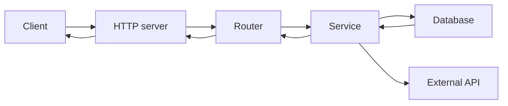

# 백엔드 개발이란 무엇인가?

> Backend Development 101 시리즈 (1/10)


## 이 글에서 다룰 문제

프론트엔드만 다루면 *보이는 것* 만 만들 수 있습니다. 백엔드를 알아야 *지속 가능한 시스템* 을 만들 수 있습니다. 데이터, 인증, 정합성, 운영 — 이 모든 것이 백엔드의 책임이고, 사용자가 보지 않는 곳에서 결정됩니다.

> 백엔드는 *눈에 보이지 않지만 모든 것을 결정합니다.*

## 전체 흐름


요청은 *왼쪽에서 오른쪽으로* 들어가고, 응답은 같은 길을 되돌아옵니다.

## Before/After

**Before (프론트에서 모든 것을 한다)**

```python
# 브라우저 코드 안에 비밀번호 검증 로직이 있다
if password == "admin123":
    show_dashboard()
```

**After (백엔드가 책임진다)**

```python
# server.py
@app.post("/login")
def login(body):
    if not auth.verify(body["email"], body["password"]):
        return 401, {"error": "invalid"}
    return 200, {"token": auth.token(body["email"])}
```

비밀번호 검증은 *서버* 의 일입니다. 클라이언트는 결과만 받습니다.

## 첫 백엔드 5단계

### 1단계 — 가장 작은 서버

```python
# 1_app.py
from fastapi import FastAPI
app = FastAPI()

@app.get("/")
def hello():
    return {"message": "hello"}
```

### 2단계 — 실행

```bash
uvicorn 1_app:app --reload
```

`http://127.0.0.1:8000/` 에 접속하면 JSON이 보입니다.

### 3단계 — 라우트 추가

```python
# 2_routes.py
from fastapi import FastAPI
app = FastAPI()

USERS = [{"id": 1, "name": "Alice"}]

@app.get("/users")
def list_users():
    return USERS
```

### 4단계 — 입력 받기

```python
# 3_input.py
from fastapi import FastAPI
from pydantic import BaseModel

app = FastAPI()

class UserIn(BaseModel):
    name: str

@app.post("/users")
def create_user(payload: UserIn):
    return {"id": 99, "name": payload.name}
```

### 5단계 — 호출 확인

```bash
curl -X POST -H "Content-Type: application/json" \
     -d '{"name":"Bob"}' http://127.0.0.1:8000/users
```

응답 JSON이 돌아옵니다.

## 이 코드에서 주목할 점

- 서버는 *주소(path) → 함수* 의 매핑입니다.
- 입력은 *검증* 후 함수에 전달됩니다.
- 응답은 *데이터(JSON)* 입니다 — 화면이 아닙니다.

## 자주 하는 실수 5가지

1. **백엔드를 *DB 호출 코드* 로 좁게 본다.** 라우팅, 인증, 검증, 로깅까지 모두 포함합니다.
2. **모든 로직을 라우트 함수에 넣는다.** 곧 한 파일이 1000줄이 됩니다.
3. **검증을 클라이언트만 한다.** 서버는 *항상* 다시 검증해야 합니다.
4. **에러를 그냥 500으로 돌려준다.** 의미 있는 코드(400, 404, 409)를 골라야 합니다.
5. **로그를 남기지 않는다.** 프로덕션에서 일어난 일을 영원히 모릅니다.

## 실무에서는 이렇게 쓰입니다

스타트업이든 대기업이든 백엔드의 구조는 비슷합니다 — Router, Service, Repository, 그리고 그 위의 Middleware. 처음부터 이 *layer 분리* 를 익혀두면 회사가 어디든 적응할 수 있습니다. 그렇지 않으면 매번 코드 구조부터 새로 배워야 합니다.

## 체크리스트

- [ ] 백엔드의 다섯 layer를 말할 수 있다.
- [ ] FastAPI로 가장 작은 서버를 띄울 수 있다.
- [ ] GET과 POST를 구분할 수 있다.
- [ ] 입력 검증의 이유를 안다.
- [ ] 다음 글에서 무엇을 배울지 안다.

## 정리 및 다음 단계

백엔드는 *책임의 집합* 입니다. 다음 글에서는 가장 아래에 있는 *HTTP 서버* 가 어떻게 동작하는지 직접 만들어 봅니다.

<!-- toc:begin -->
- **백엔드 개발이란 무엇인가? (현재 글)**
- HTTP 서버 만들기 (예정)
- Routing과 Controller (예정)
- Service Layer (예정)
- Database Layer (예정)
- 인증과 권한 (예정)
- Logging과 Error Handling (예정)
- 백엔드 테스트 (예정)
- 백엔드 배포 (예정)
- 운영 가능한 백엔드 구조 (예정)
<!-- toc:end -->

## 참고 자료

- [FastAPI Tutorial](https://fastapi.tiangolo.com/tutorial/)
- [HTTP overview (MDN)](https://developer.mozilla.org/en-US/docs/Web/HTTP/Overview)
- [Twelve-Factor App](https://12factor.net/)
- [Backend roadmap](https://roadmap.sh/backend)
