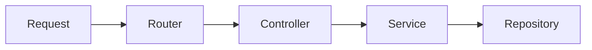

# Routing과 Controller

> Backend Development 101 시리즈 (3/10)

<!-- a-grade-intro:begin -->

**핵심 질문**: 한 서버에 100개의 endpoint가 있을 때, 어떻게 *깨끗하게* 정리하나요?

> Router는 *주소* 를 정하고, Controller는 *입력을 받아 다음 layer로 전달* 합니다. 둘의 책임을 나누면 코드가 자연스럽게 정돈됩니다.

<!-- a-grade-intro:end -->

## 이 글에서 배울 것

- Router와 Controller의 역할 차이
- path/query/body 파라미터의 차이
- REST 스타일로 endpoint 설계하기
- FastAPI의 `APIRouter` 로 모듈 나누기
- Controller에서 *해야 할 일* 과 *하지 말아야 할 일*

## 왜 중요한가

작은 프로젝트에서는 한 파일에 모두 넣어도 동작합니다. 하지만 endpoint가 늘면 *한 파일이 곧 지옥* 이 됩니다. 처음부터 layer를 나눠 두면 새 기능을 추가할 때마다 *어디에 둘지* 가 자명해집니다.

> 좋은 구조는 *어디에 코드를 둘지 고민하지 않게* 만들어 줍니다.

## 개념 한눈에 보기



Router는 *지도* , Controller는 *접수창구* , Service는 *전문가* 입니다.

## 핵심 용어 정리

- **Router**: URL 패턴과 함수를 연결.
- **Controller**: 요청을 받아 검증하고 service를 호출.
- **Path parameter**: `/users/{id}` 의 `{id}`.
- **Query parameter**: `/users?active=true` 의 `active`.
- **Body**: POST/PUT 요청의 JSON 본문.

## Before/After

**Before (한 파일에 다 넣기)**

```python
# main.py
from fastapi import FastAPI
app = FastAPI()

@app.get("/users")
def list_users(): ...

@app.get("/orders")
def list_orders(): ...

@app.get("/products")
def list_products(): ...
```

**After (모듈 별 router)**

```python
# routers/users.py
from fastapi import APIRouter
router = APIRouter(prefix="/users", tags=["users"])

@router.get("")
def list_users():
    return []

# main.py
from fastapi import FastAPI
from routers import users, orders
app = FastAPI()
app.include_router(users.router)
app.include_router(orders.router)
```

기능별로 파일이 나뉘니 *어디를 고쳐야 할지* 가 명확해집니다.

## 실습: 5단계로 라우팅 정돈하기

### 1단계 — Path 파라미터

```python
# 1_path.py
from fastapi import FastAPI
app = FastAPI()

@app.get("/users/{user_id}")
def get_user(user_id: int):
    return {"id": user_id}
```

### 2단계 — Query 파라미터

```python
# 2_query.py
from fastapi import FastAPI
app = FastAPI()

@app.get("/users")
def list_users(active: bool = True, limit: int = 10):
    return {"active": active, "limit": limit}
```

### 3단계 — Body로 JSON 받기

```python
# 3_body.py
from fastapi import FastAPI
from pydantic import BaseModel

app = FastAPI()

class UserIn(BaseModel):
    name: str
    age: int

@app.post("/users")
def create_user(payload: UserIn):
    return {"id": 1, **payload.model_dump()}
```

### 4단계 — Router 분리

```python
# routers/products.py
from fastapi import APIRouter
router = APIRouter(prefix="/products", tags=["products"])

@router.get("")
def list_products():
    return []

@router.get("/{pid}")
def get_product(pid: int):
    return {"id": pid}
```

### 5단계 — Controller에서 service 호출

```python
# controllers/user_controller.py
from services.user_service import UserService

class UserController:
    def __init__(self, svc: UserService):
        self.svc = svc

    def create(self, payload):
        return self.svc.register(payload.name, payload.age)
```

Controller는 *얇게* 유지합니다 — 검증하고, service에 위임할 뿐.

## 이 코드에서 주목할 점

- Path는 *식별* 에, query는 *필터* 에 씁니다.
- Body는 POST/PUT/PATCH에서만 의미가 있습니다.
- `tags` 는 OpenAPI 문서를 *그룹화* 합니다.

## 자주 하는 실수 5가지

1. **모든 데이터를 query string에 넣는다.** 검색 조건은 query, 새 자원은 body가 맞습니다.
2. **Controller에 비즈니스 로직을 쓴다.** Service로 옮겨야 재사용·테스트가 쉽습니다.
3. **`/getUsers`, `/createUser` 처럼 동사 path를 쓴다.** REST는 *명사 + HTTP method* 입니다.
4. **검증 없이 받은 값을 DB에 직접 넣는다.** Pydantic으로 *항상* 모델링합니다.
5. **상태 변경을 GET으로 한다.** GET은 *안전(safe)* 해야 합니다.

## 실무에서는 이렇게 쓰입니다

큰 백엔드는 도메인별로 router 디렉터리(`routers/orders.py`, `routers/payments.py`)를 둡니다. 새 기능이 들어오면 *어떤 router에 어떤 path를 추가할지* 만 결정하면 됩니다. 이 단순한 규칙 하나가 코드베이스 수명을 몇 년 늘립니다.

## 시니어 엔지니어는 이렇게 생각합니다

- URL은 *명사* 로, 행동은 *method* 로 표현한다.
- Controller는 한 화면 안에 들어올 만큼 짧게.
- 입력은 Pydantic으로 *반드시* 모델링한다.
- Router 단위로 권한·로깅 미들웨어를 단다.
- 새 endpoint를 만들기 전에 *기존 endpoint를 확장할 수 있는지* 부터 본다.

## 체크리스트

- [ ] Path / query / body 파라미터를 구분할 수 있다.
- [ ] APIRouter로 router를 분리할 수 있다.
- [ ] REST 명사 path를 설계할 수 있다.
- [ ] Controller에서 service를 호출하는 흐름을 안다.
- [ ] OpenAPI 문서(`/docs`)를 열어 봤다.

## 연습 문제

1. `/orders` router를 만들고 `GET /orders`, `GET /orders/{id}`, `POST /orders` 를 구현하세요.
2. `GET /users` 에 `?role=admin` 필터를 추가하세요.
3. Pydantic 모델 `OrderIn` 을 정의하고 잘못된 입력을 422로 떨어뜨려 보세요.

## 정리 및 다음 단계

Router는 *지도* , Controller는 *접수창구* 입니다. 다음 글에서는 그 안쪽에서 *비즈니스 규칙* 을 다루는 Service Layer를 봅니다.

<!-- toc:begin -->
- [백엔드 개발이란 무엇인가?](./01-what-is-backend-development.md)
- [HTTP 서버 만들기](./02-building-an-http-server.md)
- **Routing과 Controller (현재 글)**
- Service Layer (예정)
- Database Layer (예정)
- 인증과 권한 (예정)
- Logging과 Error Handling (예정)
- 백엔드 테스트 (예정)
- 백엔드 배포 (예정)
- 운영 가능한 백엔드 구조 (예정)
<!-- toc:end -->

## 참고 자료

- [FastAPI Path operations](https://fastapi.tiangolo.com/tutorial/path-params/)
- [FastAPI APIRouter](https://fastapi.tiangolo.com/tutorial/bigger-applications/)
- [REST API Tutorial](https://restfulapi.net/)
- [Pydantic Models](https://docs.pydantic.dev/latest/concepts/models/)
