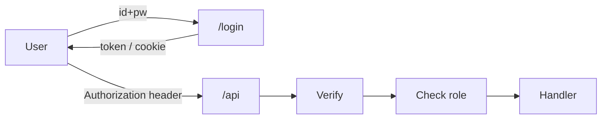

# 인증과 권한

> Backend Development 101 시리즈 (6/10)


## 이 글에서 다룰 문제

인증 코드는 *유일하게* 잘못 짜면 회사가 망할 수 있는 영역입니다. 처음에 평문으로 비밀번호를 저장한 한 줄, 처음에 토큰을 검증하지 않은 한 줄이 *수년 후* 사고로 돌아옵니다.

> 인증 코드는 *가장 적은 양으로, 가장 표준적으로* 작성해야 합니다.

## 전체 흐름


인증은 *너 누구야?* 권한은 *그걸 해도 돼?*

## Before/After

**Before (평문 비밀번호 저장)**

```python
def register(name, password):
    db.execute("INSERT INTO users(name, pw) VALUES(?, ?)", (name, password))
```

**After (해시 + 검증)**

```python
from passlib.hash import bcrypt
def register(name, password):
    pw_hash = bcrypt.hash(password)
    db.execute("INSERT INTO users(name, pw_hash) VALUES(?, ?)", (name, pw_hash))

def verify(name, password):
    row = db.fetchone("SELECT pw_hash FROM users WHERE name=?", (name,))
    return row and bcrypt.verify(password, row["pw_hash"])
```

DB가 유출돼도 비밀번호는 *원문으로 복원되지 않습니다*.

## 인증 흐름 5단계

### 1단계 — 비밀번호 해시

```python
# 1_hash.py
from passlib.hash import bcrypt
hashed = bcrypt.hash("mySecret123")
print(bcrypt.verify("mySecret123", hashed))  # True
```

### 2단계 — JWT 발급

```python
# 2_jwt.py
import jwt, time
SECRET = "change-me"
token = jwt.encode({"sub": "alice", "exp": time.time() + 3600}, SECRET, algorithm="HS256")
print(token)
```

### 3단계 — JWT 검증

```python
# 3_verify.py
import jwt
data = jwt.decode(token, SECRET, algorithms=["HS256"])
print(data["sub"])
```

### 4단계 — 보호된 endpoint

```python
# 4_protected.py
from fastapi import FastAPI, Depends, HTTPException, Header

app = FastAPI()

def current_user(authorization: str = Header(...)):
    try:
        token = authorization.removeprefix("Bearer ")
        data = jwt.decode(token, SECRET, algorithms=["HS256"])
        return data["sub"]
    except Exception:
        raise HTTPException(401)

@app.get("/me")
def me(user: str = Depends(current_user)):
    return {"user": user}
```

### 5단계 — 역할 기반 권한

```python
# 5_role.py
def require_role(role: str):
    def _dep(user: dict = Depends(current_user_with_role)):
        if user["role"] != role:
            raise HTTPException(403)
        return user
    return _dep

@app.delete("/admin/users/{uid}")
def delete_user(uid: int, _: dict = Depends(require_role("admin"))):
    return {"deleted": uid}
```

## 이 코드에서 주목할 점

- 비밀번호는 *절대* 평문으로 저장하지 않습니다.
- JWT secret은 *절대* 코드에 박지 않습니다 — 환경 변수.
- 401(미인증)과 403(권한 부족)은 *다른 의미* 입니다.

## 자주 하는 실수 5가지

1. **MD5 / SHA-1로 비밀번호를 해시한다.** bcrypt / argon2를 씁니다.
2. **JWT의 `exp` 를 안 둔다.** 토큰이 *영원히* 유효해집니다.
3. **JWT를 localStorage에 저장하고 끝낸다.** XSS에 노출됩니다 — httpOnly 쿠키도 검토합니다.
4. **권한 체크를 프론트만 한다.** 서버에서 *항상* 다시 확인합니다.
5. **모든 endpoint를 다 인증으로 막는다.** 공개 endpoint(`/healthz`, `/login`)를 *명시적* 으로 분리합니다.

## 실무에서는 이렇게 쓰입니다

대부분의 SaaS는 *bcrypt + JWT + role-based access* 조합으로 시작합니다. 규모가 커지면 OAuth2(외부 로그인), MFA(다중 인증), permission matrix가 추가되지만 핵심은 동일합니다 — 인증과 권한을 *명확히 분리* 한 코드만 확장됩니다.

## 체크리스트

- [ ] bcrypt로 해시하고 검증할 수 있다.
- [ ] JWT를 발급하고 만료 시간을 설정할 수 있다.
- [ ] FastAPI에서 보호된 endpoint를 만들 수 있다.
- [ ] 401과 403의 차이를 안다.
- [ ] role 기반 권한 검사를 작성할 수 있다.

## 정리 및 다음 단계

인증은 *신원* , 권한은 *행동 허가* 입니다. 다음 글에서는 운영의 눈이 되는 *Logging과 Error Handling* 을 봅니다.

<!-- toc:begin -->
- [백엔드 개발이란 무엇인가?](./01-what-is-backend-development.md)
- [HTTP 서버 만들기](./02-building-an-http-server.md)
- [Routing과 Controller](./03-routing-and-controllers.md)
- [Service Layer](./04-service-layer.md)
- [Database Layer](./05-database-layer.md)
- **인증과 권한 (현재 글)**
- Logging과 Error Handling (예정)
- 백엔드 테스트 (예정)
- 백엔드 배포 (예정)
- 운영 가능한 백엔드 구조 (예정)
<!-- toc:end -->

## 참고 자료

- [OWASP Authentication Cheat Sheet](https://cheatsheetseries.owasp.org/cheatsheets/Authentication_Cheat_Sheet.html)
- [FastAPI Security](https://fastapi.tiangolo.com/tutorial/security/)
- [JWT Introduction](https://jwt.io/introduction)
- [Passlib bcrypt docs](https://passlib.readthedocs.io/en/stable/lib/passlib.hash.bcrypt.html)
