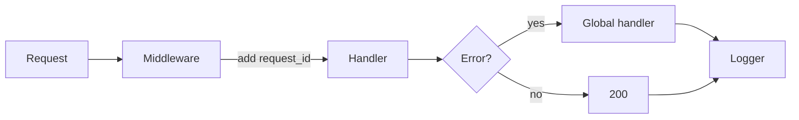

# Logging과 Error Handling

> Backend Development 101 시리즈 (7/10)

<!-- a-grade-intro:begin -->

**핵심 질문**: 새벽 3시 알림이 울렸을 때, 30분 안에 *원인* 을 찾으려면 무엇이 필요한가요?

> 구조화된 로그, 의미 있는 status code, 글로벌 예외 처리. 이 셋이 있으면 *코드를 다시 읽지 않아도* 답이 보입니다.

<!-- a-grade-intro:end -->

## 이 글에서 배울 것

- print 대신 logger를 쓰는 이유
- 구조화 로그(structured logging)의 모양
- 글로벌 예외 처리로 *모든 응답* 을 일관되게
- request_id로 한 요청을 추적하기
- 로그 레벨을 *바르게* 고르는 법

## 왜 중요한가

코드는 한 번 짜고 *수년간 운영* 됩니다. 운영의 90%는 *읽는 일* 이며, 읽는 도구가 바로 로그입니다. 처음부터 구조화된 로그를 쌓아두면 장애 대응 시간이 *수십 배* 줄어듭니다.

> 좋은 로그는 *코드보다* 더 자주 읽히는 자산입니다.

## 개념 한눈에 보기



모든 길은 *로그* 로 모입니다.

## 핵심 용어 정리

- **Logger**: 로그 메시지를 보내는 객체.
- **Log level**: DEBUG / INFO / WARNING / ERROR / CRITICAL.
- **Structured log**: JSON 등 *기계가 읽을 수 있는* 형식의 로그.
- **request_id**: 한 요청을 끝까지 따라가게 해주는 식별자.
- **Global exception handler**: 모든 예외를 *한 곳에서* 응답으로 변환.

## Before/After

**Before (print 디버깅)**

```python
print("user=", user_id, "error", e)
```

**After (구조화 로그)**

```python
import logging, json
log = logging.getLogger("app")

log.error(json.dumps({
    "event": "order_failed",
    "user_id": user_id,
    "error": str(e),
}))
```

`event` 만 보고도 *집계* 가 가능해집니다.

## 실습: 로그와 에러 처리 5단계

### 1단계 — 표준 로거 설정

```python
# 1_setup.py
import logging
logging.basicConfig(
    level=logging.INFO,
    format='%(asctime)s %(levelname)s %(name)s %(message)s',
)
log = logging.getLogger("app")
log.info("server started")
```

### 2단계 — 구조화 로그(JSON)

```python
# 2_json_log.py
import logging, json, sys
class JsonFmt(logging.Formatter):
    def format(self, r):
        return json.dumps({"level": r.levelname, "msg": r.getMessage()})
h = logging.StreamHandler(sys.stdout)
h.setFormatter(JsonFmt())
logging.basicConfig(handlers=[h], level=logging.INFO)
logging.info("hello")
```

### 3단계 — request_id 미들웨어

```python
# 3_request_id.py
from fastapi import FastAPI, Request
import uuid, logging

app = FastAPI()
log = logging.getLogger("app")

@app.middleware("http")
async def add_request_id(request: Request, call_next):
    rid = str(uuid.uuid4())
    request.state.rid = rid
    response = await call_next(request)
    response.headers["X-Request-ID"] = rid
    log.info(f"req rid={rid} path={request.url.path}")
    return response
```

### 4단계 — 글로벌 예외 처리

```python
# 4_global_handler.py
from fastapi import FastAPI, Request
from fastapi.responses import JSONResponse

app = FastAPI()

class DomainError(Exception):
    def __init__(self, code: str, message: str):
        self.code, self.message = code, message

@app.exception_handler(DomainError)
async def handle_domain(_: Request, exc: DomainError):
    return JSONResponse(
        status_code=400,
        content={"code": exc.code, "message": exc.message},
    )
```

### 5단계 — 로그 레벨 전략

```python
# 5_levels.py
log.debug("trace data")
log.info("user logged in")
log.warning("retrying upstream call")
log.error("payment failed")
log.critical("database is down")
```

## 이 코드에서 주목할 점

- 로그는 *언제나 한 줄* 이어야 검색이 쉽습니다.
- request_id는 *모든* 로그에 포함되어야 추적됩니다.
- 도메인 예외는 *비즈니스 의미* 를 가진 코드로 분류합니다.

## 자주 하는 실수 5가지

1. **print로 디버깅을 끝낸다.** print는 운영에서 *사라집니다*.
2. **모든 로그를 ERROR로 찍는다.** 알림이 무뎌져 *진짜 장애* 를 놓칩니다.
3. **로그에 비밀번호/토큰을 넣는다.** 즉시 보안 사고입니다.
4. **try/except로 모두 잡고 무시한다.** 에러가 *조용히 사라집니다*.
5. **예외 메시지만 남기고 stack trace는 버린다.** 디버깅이 거의 불가능해집니다.

## 실무에서는 이렇게 쓰입니다

운영 환경에서는 로그가 *수집기* (CloudWatch, Loki, Datadog)로 흘러갑니다. 거기서 `event=order_failed` 같은 필드로 *대시보드와 알림* 을 만듭니다. 처음부터 구조화 로그를 쌓아두면 *별도 작업 없이* 모니터링이 따라옵니다.

## 시니어 엔지니어는 이렇게 생각합니다

- 로그는 *집계 가능한 데이터* 로 본다.
- request_id는 *반드시* 응답 헤더로도 돌려준다.
- 도메인 예외와 인프라 예외를 *분리* 한다.
- 알림이 울리는 로그는 *행동 가능한* 메시지여야 한다.
- "왜 이게 실패했지?"가 *로그만으로* 답이 나오는지 본다.

## 체크리스트

- [ ] 표준 logger를 설정할 수 있다.
- [ ] JSON 구조화 로그를 출력할 수 있다.
- [ ] request_id 미들웨어를 작성할 수 있다.
- [ ] 글로벌 예외 핸들러를 등록할 수 있다.
- [ ] 로그 레벨을 의미에 맞게 고를 수 있다.

## 연습 문제

1. JSON 로거에 `request_id` 필드를 자동으로 포함시키세요.
2. `DomainError` 와 `InfraError` 두 종류 예외를 정의하고 다르게 처리하세요.
3. 일부 endpoint에 인위적 예외를 만들고, 로그에서 stack trace를 확인하세요.

## 정리 및 다음 단계

좋은 로그와 일관된 에러 처리는 *운영의 시야* 입니다. 다음 글에서는 그 코드를 안전하게 바꿀 수 있게 해주는 *백엔드 테스트* 를 봅니다.

<!-- toc:begin -->
- [백엔드 개발이란 무엇인가?](./01-what-is-backend-development.md)
- [HTTP 서버 만들기](./02-building-an-http-server.md)
- [Routing과 Controller](./03-routing-and-controllers.md)
- [Service Layer](./04-service-layer.md)
- [Database Layer](./05-database-layer.md)
- [인증과 권한](./06-auth-and-authorization.md)
- **Logging과 Error Handling (현재 글)**
- 백엔드 테스트 (예정)
- 백엔드 배포 (예정)
- 운영 가능한 백엔드 구조 (예정)
<!-- toc:end -->

## 참고 자료

- [Python logging HOWTO](https://docs.python.org/3/howto/logging.html)
- [FastAPI exception handlers](https://fastapi.tiangolo.com/tutorial/handling-errors/)
- [Twelve-Factor logs](https://12factor.net/logs)
- [structlog docs](https://www.structlog.org/en/stable/)
