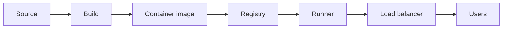

# 백엔드 배포

> Backend Development 101 시리즈 (9/10)


## 이 글에서 다룰 문제

배포가 *공포* 가 되는 순간 팀의 출시 빈도가 떨어지고, 출시 빈도가 떨어지면 한 번의 배포가 *더 큰 변경* 을 담아 더 위험해집니다. 배포를 *지루한 일* 로 만드는 것이 시니어의 중요한 일입니다.

> 좋은 배포는 *드라마가 없습니다.*

## 전체 흐름


코드는 *이미지* 가 되고, 이미지가 *어디서든* 같은 모습으로 돕니다.

## Before/After

**Before (수동 배포)**

```bash
ssh server
git pull
pip install -r requirements.txt
systemctl restart app
```

**After (Dockerized + 같은 이미지가 어디서나 돕니다)**

```bash
docker build -t myapp:1.2.3 .
docker push registry/myapp:1.2.3
# 운영 환경은 같은 이미지를 가져와 실행
```

## 배포 5단계

### 1단계 — Dockerfile

```dockerfile
# Dockerfile
FROM python:3.12-slim
WORKDIR /app
COPY requirements.txt .
RUN pip install --no-cache-dir -r requirements.txt
COPY . .
EXPOSE 8000
CMD ["uvicorn", "main:app", "--host", "0.0.0.0", "--port", "8000"]
```

### 2단계 — 빌드와 실행

```bash
docker build -t myapp:0.1 .
docker run -p 8000:8000 myapp:0.1
```

### 3단계 — 환경 변수

```python
# main.py
import os
DB_URL = os.environ["DATABASE_URL"]
JWT_SECRET = os.environ["JWT_SECRET"]
```

```bash
docker run -e DATABASE_URL=postgres://... -e JWT_SECRET=... myapp:0.1
```

### 4단계 — Healthcheck endpoint

```python
# health.py
@app.get("/healthz")
def healthz():
    return {"status": "ok"}
```

`docker-compose.yml` 에서:

```yaml
healthcheck:
  test: ["CMD", "curl", "-f", "http://localhost:8000/healthz"]
  interval: 10s
  retries: 3
```

### 5단계 — Rolling update

```bash
# Kubernetes / ECS / Docker Swarm 모두 같은 아이디어
# 1) 새 이미지 배포
# 2) healthcheck 통과 확인
# 3) 트래픽 점진 이동
# 4) 이전 버전 제거
```

핵심은 *새 버전이 살아 있음을 확인한 뒤* 트래픽을 옮기는 것.

## 이 코드에서 주목할 점

- 이미지 안에 *비밀이 들어가지 않게* 합니다.
- `--no-cache-dir` 같은 옵션으로 이미지 크기를 줄입니다.
- 애플리케이션이 *자체* healthcheck를 제공해야 합니다.

## 자주 하는 실수 5가지

1. **`latest` 태그로 운영 배포한다.** 어떤 버전이 떠 있는지 *추적 불가능* 해집니다.
2. **secret을 이미지에 baked in한다.** 이미지가 유출되면 끝입니다.
3. **healthcheck 없이 LB 뒤에 둔다.** 죽은 인스턴스로 트래픽이 갑니다.
4. **마이그레이션을 *수동으로* 운영에서 돌린다.** 배포 자동화의 의미가 사라집니다.
5. **롤백 절차를 미리 만들어두지 않는다.** 사고 대응이 *연습되지 않은* 상태가 됩니다.

## 실무에서는 이렇게 쓰입니다

대부분의 팀은 *Docker + GitHub Actions + 컨테이너 오케스트레이터(Kubernetes/ECS)* 조합을 씁니다. PR이 머지되면 CI가 이미지 빌드 → 푸시 → 배포 trigger를 자동으로 수행합니다. 운영자는 *명령을 내리는 사람* 이 아니라 *시스템을 관찰하는 사람* 이 됩니다.

## 체크리스트

- [ ] Dockerfile을 작성하고 이미지를 빌드할 수 있다.
- [ ] 환경 변수로 설정을 분리할 수 있다.
- [ ] `/healthz` endpoint를 만들 수 있다.
- [ ] 이미지에 secret이 들어가지 않게 한다.
- [ ] rolling update의 흐름을 설명할 수 있다.

## 정리 및 다음 단계

배포는 *재현 가능성* 의 문제입니다. 마지막 글에서는 지금까지의 모든 layer를 모아 *운영 가능한 백엔드 구조* 로 정리합니다.

<!-- toc:begin -->
- [백엔드 개발이란 무엇인가?](./01-what-is-backend-development.md)
- [HTTP 서버 만들기](./02-building-an-http-server.md)
- [Routing과 Controller](./03-routing-and-controllers.md)
- [Service Layer](./04-service-layer.md)
- [Database Layer](./05-database-layer.md)
- [인증과 권한](./06-auth-and-authorization.md)
- [Logging과 Error Handling](./07-logging-and-error-handling.md)
- [백엔드 테스트](./08-testing-the-backend.md)
- **백엔드 배포 (현재 글)**
- 운영 가능한 백엔드 구조 (예정)
<!-- toc:end -->

## 참고 자료

- [Docker get-started](https://docs.docker.com/get-started/)
- [Twelve-Factor App](https://12factor.net/)
- [Kubernetes probes](https://kubernetes.io/docs/tasks/configure-pod-container/configure-liveness-readiness-startup-probes/)
- [GitHub Actions for Python](https://docs.github.com/en/actions/automating-builds-and-tests/building-and-testing-python)
