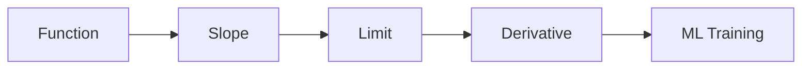

# 미분이란 무엇인가

> Calculus for ML 101 시리즈 (1/10)

<!-- a-grade-intro:begin -->

**핵심 질문**: ML이 *학습* 한다는 말은 *미분* 으로 *어떤* 일이 일어난다는 뜻일까요?

> *미분* 은 *변화율* 이고, *학습* 은 *손실의 미분* 으로 *방향* 을 잡는 과정입니다.

<!-- a-grade-intro:end -->

## 이 글에서 배울 것

- *미분* 의 *직관*
- *변화율* 과 *접선*
- *극한* 의 의미
- *수치 미분*
- ML과의 *연결 고리*

## 왜 중요한가

*경사하강*, *역전파*, *학습률* 모두 *미분* 위에서 정의됩니다.

## 개념 한눈에 보기



## 핵심 용어 정리

- **derivative**: *순간 변화율*.
- **slope**: 두 점의 *기울기*.
- **limit**: *접근* 하는 값.
- **tangent**: *한 점* 의 *직선*.
- **numerical**: *근사* 적 계산.

## Before/After

**Before**: *손실* 이 *왜* 줄어드는지 모른다.

**After**: *손실* 의 *기울기* 가 *방향* 을 알려준다.

## 실습: 미니 미분 키트

### 1단계 — 함수 정의

```python
def f(x):
    return x ** 2
```

### 2단계 — 평균 변화율

```python
def avg_rate(f, a, b):
    return (f(b) - f(a)) / (b - a)
```

### 3단계 — 수치 미분

```python
def deriv(f, x, h=1e-5):
    return (f(x + h) - f(x - h)) / (2 * h)
```

### 4단계 — 접선의 기울기

```python
slope = deriv(f, 2.0)  # 약 4.0
```

### 5단계 — 손실 직관

```python
def loss(w):
    return (w - 3) ** 2

g = deriv(loss, 0.0)   # 음수 -> w를 키워야 손실 감소
```

## 이 코드에서 주목할 점

- *수치 미분* 은 *중심 차분*.
- *접선* 의 *기울기* 가 *도함수*.
- *손실* 의 *기울기 부호* 가 *방향*.

## 자주 하는 실수 5가지

1. ***h* 를 *너무 작게* 잡아 *부동소수* 오류.**
2. ***평균 변화율* 을 *순간 변화율* 로 혼동.**
3. ***도함수* 와 *함숫값* 을 혼동.**
4. ***부호* 무시한 채 *크기* 만 본다.**
5. ***불연속점* 에서 *극한* 가정.**

## 실무에서는 이렇게 쓰입니다

*손실 함수의 기울기* 로 *모델 가중치* 를 갱신하는 것이 *모든 ML 학습* 의 *기본* 입니다.

## 시니어 엔지니어는 이렇게 생각합니다

- *미분* 은 *방향*.
- *기울기* 는 *학습 신호*.
- *수치 미분* 은 *디버깅* 용.
- *해석 미분* 은 *프로덕션* 용.
- *극한* 은 *직관* 으로 충분.

## 체크리스트

- [ ] *함수* 명시.
- [ ] *기울기* 계산.
- [ ] *부호* 해석.
- [ ] *수치 안정성* 확인.

## 연습 문제

1. *도함수* 한 줄 정의.
2. *평균 변화율* 한 줄 정의.
3. *손실의 기울기* 가 의미하는 것 한 줄.

## 정리 및 다음 단계

다음 글은 *함수와 기울기* 입니다.

<!-- toc:begin -->
- **미분이란 무엇인가 (현재 글)**
- 함수와 기울기 (예정)
- 편미분 (예정)
- Gradient (예정)
- 연쇄 법칙 (예정)
- 손실 함수 (예정)
- 경사하강법 (예정)
- 최적화 (예정)
- 역전파 직관 (예정)
- 딥러닝에서의 미분 (예정)
<!-- toc:end -->

## 참고 자료

- [Calculus - Khan Academy](https://www.khanacademy.org/math/calculus-1)
- [Essence of Calculus - 3Blue1Brown](https://www.3blue1brown.com/topics/calculus)
- [Deep Learning Book - Numerical Computation](https://www.deeplearningbook.org/contents/numerical.html)
- [NumPy Numerical Differentiation](https://numpy.org/doc/stable/reference/generated/numpy.gradient.html)
