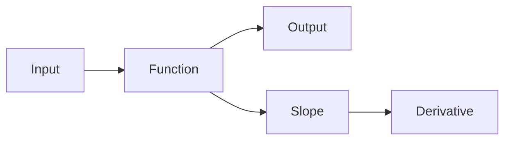

# 함수와 기울기

> Calculus for ML 101 시리즈 (2/10)


## 이 글에서 다룰 문제

ML 모델은 *함수의 합성* 이고, 학습은 *각 함수의 기울기* 를 *통과* 시키는 일입니다.

## 전체 흐름


## Before/After

**Before**: 함수는 *공식* 으로만 본다.

**After**: 함수는 *그래프* 와 *기울기* 로도 본다.

## 미니 함수 키트

### 1단계 — 일차함수

```python
def linear(x, a=2, b=1):
    return a * x + b
```

### 2단계 — 일차함수 기울기

```python
def linear_slope(a):
    return a
```

### 3단계 — 비선형 함수

```python
def relu(x):
    return max(0.0, x)
```

### 4단계 — ReLU 국소 기울기

```python
def relu_grad(x):
    return 1.0 if x > 0 else 0.0
```

### 5단계 — 시그모이드

```python
import math

def sigmoid(x):
    return 1 / (1 + math.exp(-x))
```

## 이 코드에서 주목할 점

- *일차함수* 의 기울기는 *상수*.
- *ReLU* 의 기울기는 *0 또는 1*.
- *시그모이드* 는 *부드러운 단계 함수*.

## 자주 하는 실수 5가지

1. ***일차* 와 *비선형* 혼동.**
2. ***ReLU* 가 *0* 에서 미분 *불가능* 임을 무시.**
3. ***시그모이드* 의 *포화 영역* 무시.**
4. ***활성화* 의 *기울기 0* 영향 무시.**
5. ***스케일* 이 다른 입력 *직접 비교*.**

## 실무에서는 이렇게 쓰입니다

*활성화 함수 선택*, *그래프 직관*, *그래디언트 소실* 진단 모두 *함수의 기울기* 직관에서 시작합니다.

## 체크리스트

- [ ] *함수* 그려보기.
- [ ] *기울기* 분포 확인.
- [ ] *포화* 영역 점검.
- [ ] *입력 스케일* 정렬.

## 정리 및 다음 단계

다음 글은 *편미분* 입니다.

<!-- toc:begin -->
- [미분이란 무엇인가](./01-what-is-derivative.md)
- **함수와 기울기 (현재 글)**
- 편미분 (예정)
- Gradient (예정)
- 연쇄 법칙 (예정)
- 손실 함수 (예정)
- 경사하강법 (예정)
- 최적화 (예정)
- 역전파 직관 (예정)
- 딥러닝에서의 미분 (예정)
<!-- toc:end -->

## 참고 자료

- [Functions - Khan Academy](https://www.khanacademy.org/math/algebra/x2f8bb11595b61c86:functions)
- [Activation Functions - Stanford CS231n](https://cs231n.github.io/neural-networks-1/)
- [Deep Learning Book - MLP](https://www.deeplearningbook.org/contents/mlp.html)
- [PyTorch Activations](https://pytorch.org/docs/stable/nn.html#non-linear-activations-weighted-sum-nonlinearity)
