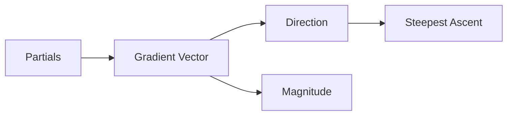

# Gradient

> Calculus for ML 101 시리즈 (4/10)

<!-- a-grade-intro:begin -->

**핵심 질문**: *모든 편미분* 을 *한 벡터* 로 묶으면 *어떤 의미* 가 생길까요?

> *Gradient* 는 *손실이 가장 빠르게 증가* 하는 *방향* 을 가리키는 *벡터* 입니다.

<!-- a-grade-intro:end -->

## 이 글에서 배울 것

- *Gradient* 의 정의
- *방향* 과 *크기*
- *등고선* 직관
- *최대 증가 방향*
- *반대 방향* 의 의미

## 왜 중요한가

*경사하강* 은 *gradient 의 반대 방향* 으로 *한 걸음* 옮기는 일입니다.

## 개념 한눈에 보기



## 핵심 용어 정리

- **gradient**: *편미분 벡터*.
- **direction**: *방향* (단위 벡터).
- **magnitude**: *길이*.
- **contour**: *같은 값* 의 *선*.
- **steepest**: *가장 가파른*.

## Before/After

**Before**: 변수마다 *따로* 본다.

**After**: *한 벡터* 로 *통합* 한다.

## 실습: 미니 Gradient 키트

### 1단계 — Gradient 함수

```python
def grad(f, x, h=1e-5):
    g = []
    for i in range(len(x)):
        xp = x.copy(); xm = x.copy()
        xp[i] += h; xm[i] -= h
        g.append((f(xp) - f(xm)) / (2 * h))
    return g
```

### 2단계 — 손실 함수

```python
def loss(w):
    return (w[0] - 1) ** 2 + (w[1] + 2) ** 2
```

### 3단계 — Gradient 계산

```python
g = grad(loss, [0.0, 0.0])  # [-2, 4]
```

### 4단계 — 크기

```python
import math

def norm(v):
    return math.sqrt(sum(x ** 2 for x in v))
```

### 5단계 — 반대 방향 한 걸음

```python
def step(w, g, lr=0.1):
    return [wi - lr * gi for wi, gi in zip(w, g)]
```

## 이 코드에서 주목할 점

- *gradient* 는 *벡터*.
- *반대 방향* 이 *손실 감소*.
- *크기* 가 *학습 신호* 의 *세기*.

## 자주 하는 실수 5가지

1. ***gradient* 를 *스칼라* 로 취급.**
2. ***부호* 를 반대로 적용.**
3. ***학습률* 을 *gradient 크기* 와 혼동.**
4. ***등고선* 직관 무시.**
5. ***좌표 순서* 가 *가중치* 와 어긋남.**

## 실무에서는 이렇게 쓰입니다

*역전파* 는 *전체 모델* 에 대한 *gradient* 를 *한 번* 에 계산합니다.

## 시니어 엔지니어는 이렇게 생각합니다

- *gradient* 는 *지도*.
- *반대 방향* 이 *진행 방향*.
- *크기* 로 *상태* 진단.
- *좌표 정합* 을 *고정*.
- *벡터화* 가 *속도*.

## 체크리스트

- [ ] *벡터* 모양 확인.
- [ ] *부호* 검토.
- [ ] *크기* 모니터링.
- [ ] *좌표 순서* 고정.

## 연습 문제

1. *gradient* 한 줄 정의.
2. *반대 방향* 의 의미 한 줄.
3. *gradient 크기* 의 의미 한 줄.

## 정리 및 다음 단계

다음 글은 *연쇄 법칙* 입니다.

<!-- toc:begin -->
- [미분이란 무엇인가](./01-what-is-derivative.md)
- [함수와 기울기](./02-functions-and-slope.md)
- [편미분](./03-partial-derivatives.md)
- **Gradient (현재 글)**
- 연쇄 법칙 (예정)
- 손실 함수 (예정)
- 경사하강법 (예정)
- 최적화 (예정)
- 역전파 직관 (예정)
- 딥러닝에서의 미분 (예정)
<!-- toc:end -->

## 참고 자료

- [Gradient - Khan Academy](https://www.khanacademy.org/math/multivariable-calculus/multivariable-derivatives/partial-derivative-and-gradient-articles)
- [Vector Calculus - 3Blue1Brown](https://www.3blue1brown.com/topics/calculus)
- [Deep Learning Book - Numerical Computation](https://www.deeplearningbook.org/contents/numerical.html)
- [PyTorch Autograd Mechanics](https://pytorch.org/docs/stable/notes/autograd.html)
