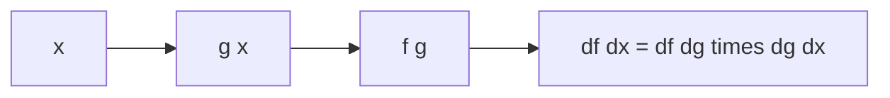

# 연쇄 법칙

> Calculus for ML 101 시리즈 (5/10)

<!-- a-grade-intro:begin -->

**핵심 질문**: *함수 안에 함수* 가 있을 때 *기울기* 를 *어떻게* 전달할까요?

> *연쇄 법칙* 은 *바깥 미분 곱하기 안 미분* 이며, *역전파* 의 *수학적 토대* 입니다.

<!-- a-grade-intro:end -->

## 이 글에서 배울 것

- *합성 함수*
- *연쇄 법칙* 의 *공식*
- *바깥/안* 직관
- *기울기 곱*
- *역전파* 와의 *연결*

## 왜 중요한가

*신경망* 은 *수많은 함수의 합성* 이며, *연쇄 법칙* 만이 *전체 기울기* 를 *효율적* 으로 계산합니다.

## 개념 한눈에 보기



## 핵심 용어 정리

- **composition**: *함수 * 의 *함수*.
- **outer**: *바깥* 함수.
- **inner**: *안* 함수.
- **chain**: *곱* 으로 *연결*.
- **propagation**: *기울기* *전파*.

## Before/After

**Before**: *합성 함수* 의 *전체* 미분 어려움.

**After**: *각 단계* 미분 후 *곱*.

## 실습: 미니 연쇄 법칙 키트

### 1단계 — 합성 함수

```python
def g(x):
    return 2 * x + 1

def f(u):
    return u ** 2

def h(x):
    return f(g(x))
```

### 2단계 — 안과 바깥 미분

```python
def dg(x):
    return 2.0

def df(u):
    return 2 * u
```

### 3단계 — 연쇄 법칙

```python
def dh(x):
    return df(g(x)) * dg(x)
```

### 4단계 — 수치 검증

```python
def deriv(f, x, h=1e-5):
    return (f(x + h) - f(x - h)) / (2 * h)

assert abs(dh(1.0) - deriv(h, 1.0)) < 1e-3
```

### 5단계 — 다단 합성

```python
def chain(*derivs):
    p = 1.0
    for d in derivs:
        p *= d
    return p
```

## 이 코드에서 주목할 점

- *연쇄 법칙* 은 *곱* 한 줄.
- *수치 미분* 으로 *검증*.
- *다단 합성* 도 *동일 원리*.

## 자주 하는 실수 5가지

1. ***순서* 가 뒤바뀜.**
2. ***안 함수* 의 *값* 을 *원래 x* 로 평가.**
3. ***기울기 0* 한 단계가 *전체 0* 임을 무시.**
4. ***다변수* 에서 *행렬 곱* 임을 잊음.**
5. ***부호* 누락.**

## 실무에서는 이렇게 쓰입니다

*역전파* 는 *연쇄 법칙* 을 *역방향* 으로 적용해 *모든 가중치* 의 기울기를 한 번에 계산합니다.

## 시니어 엔지니어는 이렇게 생각합니다

- *연쇄 법칙* 은 *역전파의 본질*.
- *순서* 를 *고정*.
- *기울기 0* 단계 를 *경계*.
- *수치 검증* 으로 *디버깅*.
- *행렬 곱* 으로 *확장*.

## 체크리스트

- [ ] *합성 순서* 표시.
- [ ] *각 단계* 미분.
- [ ] *수치 검증*.
- [ ] *0 기울기* 확인.

## 연습 문제

1. *연쇄 법칙* 한 줄 식.
2. *바깥/안* 의 의미 한 줄.
3. *기울기 0* 단계 의 위험 한 줄.

## 정리 및 다음 단계

다음 글은 *손실 함수* 입니다.

<!-- toc:begin -->
- [미분이란 무엇인가](./01-what-is-derivative.md)
- [함수와 기울기](./02-functions-and-slope.md)
- [편미분](./03-partial-derivatives.md)
- [Gradient](./04-gradient.md)
- **연쇄 법칙 (현재 글)**
- 손실 함수 (예정)
- 경사하강법 (예정)
- 최적화 (예정)
- 역전파 직관 (예정)
- 딥러닝에서의 미분 (예정)
<!-- toc:end -->

## 참고 자료

- [Chain Rule - Khan Academy](https://www.khanacademy.org/math/ap-calculus-ab/ab-differentiation-2-new/ab-3-1a/v/chain-rule-introduction)
- [Backpropagation - CS231n](https://cs231n.github.io/optimization-2/)
- [Deep Learning Book - Backprop](https://www.deeplearningbook.org/contents/mlp.html)
- [Automatic Differentiation - Baydin et al.](https://arxiv.org/abs/1502.05767)
