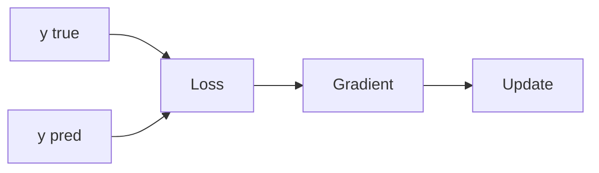

# 손실 함수

> Calculus for ML 101 시리즈 (6/10)


## 이 글에서 다룰 문제

*잘못된 손실* 은 *잘못된 모델* 을 만듭니다. *손실 선택* 이 *문제 정의* 입니다.

## 전체 흐름


## Before/After

**Before**: *눈* 으로 *예측* 평가.

**After**: *손실* 로 *수치* 평가.

## 미니 손실 키트

### 1단계 — MSE

```python
def mse(y, p):
    return sum((yi - pi) ** 2 for yi, pi in zip(y, p)) / len(y)
```

### 2단계 — MSE 기울기

```python
def mse_grad(y, p):
    n = len(y)
    return [-2 * (yi - pi) / n for yi, pi in zip(y, p)]
```

### 3단계 — 이진 교차 엔트로피

```python
import math

def bce(y, p, eps=1e-7):
    return -sum(yi * math.log(pi + eps) + (1 - yi) * math.log(1 - pi + eps) for yi, pi in zip(y, p)) / len(y)
```

### 4단계 — 손실 비교

```python
y = [1, 0, 1]
p = [0.9, 0.2, 0.7]
loss = bce(y, p)
```

### 5단계 — 학습 신호 점검

```python
def signal(y, p):
    return sum(abs(yi - pi) for yi, pi in zip(y, p)) / len(y)
```

## 이 코드에서 주목할 점

- *MSE* 는 *회귀* 에 적합.
- *BCE* 는 *분류* 에 적합.
- *학습 신호* 는 *손실 기울기* 의 *크기*.

## 자주 하는 실수 5가지

1. ***회귀* 에 *분류 손실* 사용.**
2. ***log(0)* 처리 누락.**
3. ***평균* 과 *합* 의 *스케일* 혼동.**
4. ***이상치* 에 *MSE* 가 *민감* 함을 무시.**
5. ***라벨 인코딩* 불일치.**

## 실무에서는 이렇게 쓰입니다

*손실 곡선 모니터링*, *손실 가중치 조정*, *클래스 불균형 보정* 모두 *손실 설계* 의 일부입니다.

## 체크리스트

- [ ] *문제 유형* 에 맞는 손실.
- [ ] *수치 안정성*.
- [ ] *스케일* 일치.
- [ ] *학습 곡선* 모니터링.

## 정리 및 다음 단계

다음 글은 *경사하강법* 입니다.

<!-- toc:begin -->
- [미분이란 무엇인가](./01-what-is-derivative.md)
- [함수와 기울기](./02-functions-and-slope.md)
- [편미분](./03-partial-derivatives.md)
- [Gradient](./04-gradient.md)
- [연쇄 법칙](./05-chain-rule.md)
- **손실 함수 (현재 글)**
- 경사하강법 (예정)
- 최적화 (예정)
- 역전파 직관 (예정)
- 딥러닝에서의 미분 (예정)
<!-- toc:end -->

## 참고 자료

- [Loss Functions - PyTorch](https://pytorch.org/docs/stable/nn.html#loss-functions)
- [Cross Entropy - CS231n](https://cs231n.github.io/linear-classify/)
- [Deep Learning Book - Loss](https://www.deeplearningbook.org/contents/mlp.html)
- [Class Imbalance - scikit-learn](https://scikit-learn.org/stable/modules/svm.html#unbalanced-problems)
