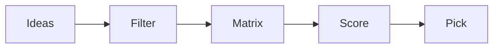

# 주제 선정

> 캡스톤 프로젝트 101 시리즈 (2/10)


## 이 글에서 다룰 문제

*주제* 가 흔들리면 *남은 한 학기* 가 흔들립니다.

## 전체 흐름


## Before/After

**Before**: *멋진 주제* 만 찾는다.

**After**: *팀에 맞는 주제* 를 고른다.

## 주제 비교 매트릭스

### 1단계 — 후보

```python
ideas = ["schedule_checker", "mood_diary", "campus_map"]
```

### 2단계 — 점수 축

```python
axes = ["impact", "feasibility", "interest"]
```

### 3단계 — 점수표

```python
score = {"schedule_checker": [4, 5, 4], "mood_diary": [3, 4, 5], "campus_map": [4, 3, 3]}
```

### 4단계 — 합계

```python
total = {k: sum(v) for k, v in score.items()}
```

### 5단계 — 선택

```python
pick = max(total, key=total.get)
```

## 이 코드에서 주목할 점

- *비교* 가 있어야 *결정* 이 쉽다.
- *축* 이 *기준* 이다.
- *합계* 만 보지 말고 *균형* 도 본다.

## 자주 하는 실수 5가지

1. ***트렌드* 만 좇는다.**
2. ***팀 역량* 을 *과대평가*.**
3. ***점수표* 없이 *감* 으로 결정.**
4. ***축* 을 *섞어* 정의.**
5. ***대안* 을 *남기지* 않는다.**

## 실무에서는 이렇게 쓰입니다

제품 *우선순위 회의* 도 *비슷한 매트릭스* 를 씁니다.

## 체크리스트

- [ ] *후보* 3개 이상.
- [ ] *축* 3개.
- [ ] *점수표*.
- [ ] *최종* 선정 사유.

## 정리 및 다음 단계

다음 글은 *문제 정의* 입니다.

<!-- toc:begin -->
- [캡스톤 프로젝트란 무엇인가](./01-what-is-capstone.md)
- **주제 선정 (현재 글)**
- 문제 정의 (예정)
- 요구사항 정리 (예정)
- 팀 역할 나누기 (예정)
- MVP 설계 (예정)
- 기술 스택 선택 (예정)
- 일정 관리 (예정)
- 발표 자료 만들기 (예정)
- 프로젝트 회고 (예정)
<!-- toc:end -->

## 참고 자료

- [The Mom Test](http://momtestbook.com/)
- [Jobs to be Done](https://strategyn.com/jobs-to-be-done/)
- [How to Get Startup Ideas - Paul Graham](http://paulgraham.com/startupideas.html)
- [Atlassian Decision Matrix](https://www.atlassian.com/work-management/project-management/decision-matrix)
