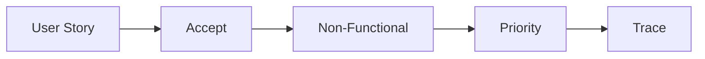

# 요구사항 정리

> 캡스톤 프로젝트 101 시리즈 (4/10)

<!-- a-grade-intro:begin -->

**핵심 질문**: *기능 목록* 만 적으면 *왜 부족할까요*?

> *비기능* 과 *우선순위* 가 빠지면 *결정* 이 *흔들리기* 때문입니다.

<!-- a-grade-intro:end -->

## 이 글에서 배울 것

- *사용자 스토리*
- *비기능 요건*
- *우선순위* 매기기
- *수용 기준*
- 요구사항 *추적*

## 왜 중요한가

요구사항이 *명세* 가 되어야 *변경* 을 *추적* 할 수 있습니다.

## 개념 한눈에 보기



## 핵심 용어 정리

- **user story**: *사용자 관점* 요구.
- **acceptance**: *수용 기준*.
- **non-functional**: *비기능*.
- **MoSCoW**: *우선순위* 라벨.
- **traceability**: *추적성*.

## Before/After

**Before**: *기능 나열*.

**After**: *스토리 + 기준 + 우선순위*.

## 실습: 요구사항 표

### 1단계 — 사용자 스토리

```python
story = "학생으로서 시간표 충돌을 즉시 보고 싶다"
```

### 2단계 — 수용 기준

```python
accept = ["입력 5초", "결과 1초", "에러 명확"]
```

### 3단계 — 비기능

```python
nf = ["mobile", "no_signup", "korean_first"]
```

### 4단계 — 우선순위

```python
prio = {"core": "Must", "share": "Should", "ai": "Could"}
```

### 5단계 — 추적

```python
trace = {"ST-1": ["F-1", "F-2"]}
```

## 이 코드에서 주목할 점

- *스토리* 는 *동사* 로 시작.
- *기준* 은 *수치 + 가독성*.
- *추적* 은 *ID* 기반.

## 자주 하는 실수 5가지

1. ***스토리* 가 *기능 설명* 으로 변한다.**
2. ***비기능* 을 잊는다.**
3. ***우선순위* 가 *전부 Must*.**
4. ***기준* 이 *주관적*.**
5. ***추적성* 이 없다.**

## 실무에서는 이렇게 쓰입니다

스타트업 PM도 *Must/Should/Could* 라벨을 매주 사용합니다.

## 시니어 엔지니어는 이렇게 생각합니다

- *스토리* 는 *짧게*.
- *기준* 은 *측정 가능*.
- *우선순위* 는 *서너* 개.
- *비기능* 은 *별도*.
- *추적* 은 *문서*.

## 체크리스트

- [ ] *스토리* 5+개.
- [ ] *수용 기준*.
- [ ] *비기능* 표.
- [ ] *우선순위* 라벨.

## 연습 문제

1. *사용자 스토리* 한 줄 정의.
2. *수용 기준* 한 줄 정의.
3. *MoSCoW* 의 의미 한 줄.

## 정리 및 다음 단계

다음 글은 *팀 역할 나누기* 입니다.

<!-- toc:begin -->
- [캡스톤 프로젝트란 무엇인가](./01-what-is-capstone.md)
- [주제 선정](./02-choosing-a-topic.md)
- [문제 정의](./03-defining-the-problem.md)
- **요구사항 정리 (현재 글)**
- 팀 역할 나누기 (예정)
- MVP 설계 (예정)
- 기술 스택 선택 (예정)
- 일정 관리 (예정)
- 발표 자료 만들기 (예정)
- 프로젝트 회고 (예정)
<!-- toc:end -->

## 참고 자료

- [User Stories Applied - Mike Cohn](https://www.mountaingoatsoftware.com/books/user-stories-applied)
- [MoSCoW Method - Atlassian](https://www.atlassian.com/agile/product-management/requirements)
- [Specification by Example](https://gojko.net/books/specification-by-example/)
- [INVEST in Good Stories](https://www.agilealliance.org/glossary/invest/)
