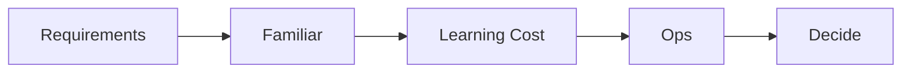

# 기술 스택 선택

> 캡스톤 프로젝트 101 시리즈 (7/10)

<!-- a-grade-intro:begin -->

**핵심 질문**: *최신 스택* 이 *항상 정답* 은 아닌 이유는 무엇일까요?

> *학습 비용* 과 *운영 부담* 이 *일정* 을 잡아먹기 때문입니다.

<!-- a-grade-intro:end -->

## 이 글에서 배울 것

- *친숙도* 평가
- *학습 곡선* 비교
- *생태계* 확인
- *운영 비용*
- *대안* 비교

## 왜 중요한가

*올바른 선택* 이 *집중* 을 만듭니다.

## 개념 한눈에 보기



## 핵심 용어 정리

- **familiarity**: *경험*.
- **learning curve**: *학습 곡선*.
- **ecosystem**: *생태계 / 라이브러리*.
- **ops**: *배포 / 운영*.
- **alternative**: *대안*.

## Before/After

**Before**: *최신* 스택을 무조건 쓴다.

**After**: *친숙도 + 비용* 기준으로 고른다.

## 실습: 결정 표

### 1단계 — 후보 정리

```python
candidates = ["FastAPI", "Flask", "Django"]
```

### 2단계 — 친숙도 평가

```python
familiar = {"FastAPI": 4, "Flask": 5, "Django": 2}
```

### 3단계 — 학습 비용

```python
learning_cost = {"FastAPI": 2, "Flask": 1, "Django": 4}
```

### 4단계 — 운영 부담

```python
ops = {"FastAPI": 2, "Flask": 1, "Django": 3}
```

### 5단계 — 점수 합산

```python
score = {k: familiar[k] - learning_cost[k] - ops[k] for k in candidates}
```

## 이 코드에서 주목할 점

- *점수* 는 *친숙도 - 비용*.
- *대안* 은 *3개* 이내.
- *결정 기록* 은 *문서*.

## 자주 하는 실수 5가지

1. ***인기* 만 본다.**
2. ***친숙도* 를 무시한다.**
3. ***운영* 비용을 잊는다.**
4. ***결정 기록* 이 없다.**
5. ***대안* 비교가 없다.**

## 실무에서는 이렇게 쓰입니다

회사 팀도 *ADR* 로 결정 이유를 남깁니다.

## 시니어 엔지니어는 이렇게 생각합니다

- *친숙도* 가 *속도*.
- *학습* 은 *비용*.
- *운영* 은 *지속*.
- *대안* 은 *문서*.
- *결정* 은 *되돌릴* 수 있게.

## 체크리스트

- [ ] *후보 3개*.
- [ ] *친숙도* 점수.
- [ ] *학습 비용*.
- [ ] *결정 기록*.

## 연습 문제

1. *ADR* 의 의미 한 줄.
2. *친숙도* 가 중요한 이유 한 줄.
3. *운영 부담* 의 정의 한 줄.

## 정리 및 다음 단계

다음 글은 *일정 관리* 입니다.

<!-- toc:begin -->
- [캡스톤 프로젝트란 무엇인가](./01-what-is-capstone.md)
- [주제 선정](./02-choosing-a-topic.md)
- [문제 정의](./03-defining-the-problem.md)
- [요구사항 정리](./04-organizing-requirements.md)
- [팀 역할 나누기](./05-splitting-team-roles.md)
- [MVP 설계](./06-designing-the-mvp.md)
- **기술 스택 선택 (현재 글)**
- 일정 관리 (예정)
- 발표 자료 만들기 (예정)
- 프로젝트 회고 (예정)
<!-- toc:end -->

## 참고 자료

- [Architecture Decision Records](https://adr.github.io/)
- [Choose Boring Technology - Dan McKinley](https://boringtechnology.club/)
- [The Twelve-Factor App](https://12factor.net/)
- [Tech Radar - Thoughtworks](https://www.thoughtworks.com/radar)
