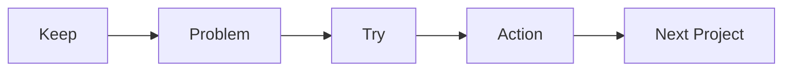

# 프로젝트 회고

> 캡스톤 프로젝트 101 시리즈 (10/10)


## 이 글에서 다룰 문제

*회고* 가 *다음 프로젝트* 를 만듭니다.

## 전체 흐름


## Before/After

**Before**: *감정* 만 토로한다.

**After**: *사실 + 행동* 을 기록한다.

## 회고 표

### 1단계 — KPT

```python
kpt = {"keep": [], "problem": [], "try": []}
```

### 2단계 — 데이터

```python
metrics = {"velocity": 12, "bugs": 5, "review_time": 1.5}
```

### 3단계 — 5 Whys

```python
whys = ["bug_at_demo", "missed_test", "no_ci", "no_template", "first_time"]
```

### 4단계 — 다음 행동

```python
actions = [{"who": "A", "what": "add_ci", "by": "next_sprint"}]
```

### 5단계 — 학습 정리

```python
lessons = ["scope_first", "ci_early", "demo_dryrun"]
```

## 이 코드에서 주목할 점

- *KPT* 는 *3 칸*.
- *데이터* 는 *수치*.
- *행동* 은 *담당자 + 마감*.

## 자주 하는 실수 5가지

1. ***누가* 잘못했는지 따진다.**
2. ***감정* 만 적는다.**
3. ***행동* 이 없다.**
4. ***데이터* 가 없다.**
5. ***다음 프로젝트* 로 *연결* 되지 않는다.**

## 실무에서는 이렇게 쓰입니다

회사 팀도 *스프린트 회고* 와 *포스트모템* 을 운영합니다.

## 체크리스트

- [ ] *KPT* 표.
- [ ] *데이터* 수집.
- [ ] *5 Whys*.
- [ ] *다음 행동* 3개.

## 정리 및 다음 단계

이로써 *캡스톤 입문* 시리즈가 끝났습니다. 다음 시리즈는 *포트폴리오 프로젝트 101* 입니다.

<!-- toc:begin -->
- [캡스톤 프로젝트란 무엇인가](./01-what-is-capstone.md)
- [주제 선정](./02-choosing-a-topic.md)
- [문제 정의](./03-defining-the-problem.md)
- [요구사항 정리](./04-organizing-requirements.md)
- [팀 역할 나누기](./05-splitting-team-roles.md)
- [MVP 설계](./06-designing-the-mvp.md)
- [기술 스택 선택](./07-choosing-the-tech-stack.md)
- [일정 관리](./08-schedule-management.md)
- [발표 자료 만들기](./09-presentation-materials.md)
- **프로젝트 회고 (현재 글)**
<!-- toc:end -->

## 참고 자료

- [Agile Retrospectives - Esther Derby](https://pragprog.com/titles/dlret/agile-retrospectives/)
- [The Five Whys - Toyota Production System](https://en.wikipedia.org/wiki/Five_whys)
- [Postmortem Culture - Google SRE](https://sre.google/sre-book/postmortem-culture/)
- [Project Retrospectives - Norman Kerth](https://retrospectives.com/)
