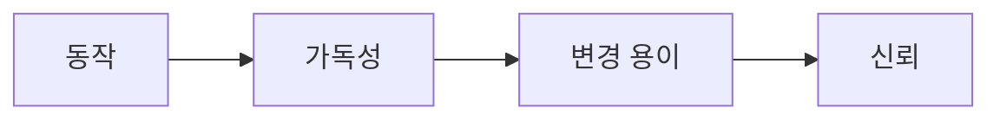

# Clean Code란 무엇인가?

> Clean Code 101 시리즈 (1/10)


## 이 글에서 다룰 문제

코드는 한 번 쓰이고 100번 읽힙니다. 가독성이 곧 변경 비용을 결정합니다.

> Clean Code는 다음 사람의 시간을 줄이는 일이다.

## 전체 흐름


동작은 시작이고, 신뢰가 끝입니다.

## Before/After

**Before — 동작만 OK**

```python
def f(d, t):
    return d * (1 + t)
```

**After — 의도 분명**

```python
def total_with_tax(amount: int, tax_rate: float) -> float:
    return amount * (1 + tax_rate)
```

이름과 타입이 의도를 말합니다.

## 더러움을 측정하기

### 1단계 — 함수 길이

```python
# 1_length.py
def process(order):
    # 80 lines ...
    pass
```

20 lines를 넘으면 "왜?"를 적어 두세요.

### 2단계 — 매개변수 수

```python
# 2_args.py
def create_user(name, email, age, address, role, plan, ref):
    ...
```

3개 넘어가면 객체로 묶을 후보입니다.

### 3단계 — 들여쓰기 깊이

```python
# 3_depth.py
if a:
    if b:
        if c:
            do()
```

3 depth 넘으면 함수 분리 후보입니다.

### 4단계 — 이름의 정직함

```python
# 4_name.py
def calc(x):  # 무엇을?
    ...
def calculate_invoice_total(line_items):
    ...
```

이름이 거짓이면 코드가 거짓입니다.

### 5단계 — 인지 부담 측정

```bash
# 5_cc.sh
radon cc app/ -a -s
```

cyclomatic complexity 10 이상은 분해 후보.

## 이 코드에서 주목할 점

- 이름이 의도를 말합니다.
- 함수 길이/깊이/인자가 측정 가능한 신호.
- 작은 원칙이 모여 큰 차이를 만듭니다.

## 자주 하는 실수 5가지

1. **"동작하면 됐어".** 6개월 후 이 말은 빚이 됩니다.
2. **거대 함수.** 디버깅이 곧 고문.
3. **거짓말하는 이름.** 코드와 이름의 불일치.
4. **깊은 들여쓰기.** 분기가 의도를 가립니다.
5. **측정 안 함.** 좋아지지 않습니다.

## 실무에서는 이렇게 쓰입니다

좋은 팀은 함수 길이/복잡도/이름 길이의 임계값을 코드 리뷰 가이드에 두고, 자동 lint로 점차 강제합니다. 큰 함수는 PR에서 자동 코멘트로 분리 제안.

## 체크리스트

- [ ] 함수가 20 lines 이하인가?
- [ ] 매개변수가 3개 이하인가?
- [ ] 들여쓰기 3 depth 이하인가?
- [ ] 이름이 의도를 말하는가?
- [ ] 복잡도를 측정하는가?

## 정리 및 다음 단계

Clean Code는 측정 가능한 작은 원칙들의 합입니다. 다음 글에서는 가장 큰 단일 효과 — 이름 짓기 — 를 봅니다.

<!-- toc:begin -->
- **Clean Code란 무엇인가? (현재 글)**
- 이름 짓기 (예정)
- 함수 작게 만들기 (예정)
- 조건문 줄이기 (예정)
- 중복 제거 (예정)
- 오류 처리 (예정)
- 주석과 문서화 (예정)
- 테스트 가능한 코드 (예정)
- 리팩토링 기초 (예정)
- 좋은 코드 리뷰 기준 (예정)
<!-- toc:end -->

## 참고 자료

- [Clean Code — Robert C. Martin](https://www.oreilly.com/library/view/clean-code-a/9780136083238/)
- [A Philosophy of Software Design — John Ousterhout](https://web.stanford.edu/~ouster/cgi-bin/aposd.php)
- [Refactoring — Martin Fowler](https://martinfowler.com/books/refactoring.html)
- [Google — Code Health Articles](https://testing.googleblog.com/search/label/Code%20Health)
