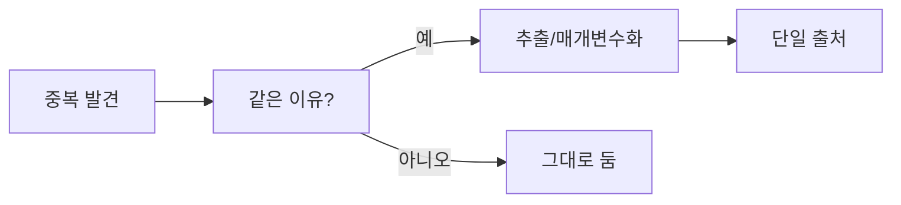

# 중복 제거

> Clean Code 101 시리즈 (5/10)


## 이 글에서 다룰 문제

중복은 버그를 곱셈으로 늘립니다. 한 곳을 고치면 다른 곳을 잊습니다.

> 같은 지식이 두 군데 살면, 둘은 곧 어긋난다.

## 전체 흐름


같은 이유로 변할 때만 추출합니다.

## Before/After

**Before**

```python
def email_admin(msg):
    print(f"[admin] {msg}")
def email_user(msg):
    print(f"[user] {msg}")
def email_guest(msg):
    print(f"[guest] {msg}")
```

**After**

```python
def email(role, msg):
    print(f"[{role}] {msg}")
```

다른 부분(role)이 인자가 됩니다.

## 중복을 안전하게 제거하기

### 1단계 — 두 번째 발생까지 기다리기

```python
# 1_rule_of_three.py
# 같은 패턴이 3번 등장한 다음에 추출하라.
def calc_a(x): return x * 1.1
def calc_b(x): return x * 1.2
# 세 번째가 나오면 그때 통합 결정.
```

성급한 추출은 비싼 결합을 만듭니다.

### 2단계 — 함수 추출

```python
# 2_extract.py
def with_tax(price, rate): return int(price * (1 + rate))
def krw(price): return with_tax(price, 0.1)
def jpy(price): return with_tax(price, 0.08)
```

세율이라는 다른 점만 인자로.

### 3단계 — 매개변수화

```python
# 3_param.py
def greet(name, lang="ko"):
    msgs = {"ko": "안녕하세요", "en": "Hello"}
    return f"{msgs[lang]}, {name}"
```

분기 대신 lookup.

### 4단계 — 데이터 중복 제거

```python
# 4_data.py
PLANS = {
    "free":  {"price": 0,  "limit": 100},
    "pro":   {"price": 10, "limit": 1000},
    "team":  {"price": 30, "limit": 10000},
}
def quota(plan): return PLANS[plan]["limit"]
```

분기 함수 3개 → 데이터 1곳.

### 5단계 — 잘못된 추출 되돌리기

```python
# 5_unfold.py
# 두 호출자만 공유하는데 인자가 6개로 늘어난 함수는
# 다시 두 함수로 펼치는 편이 낫습니다 (Inline Function).
```

추상화가 부담을 더하면 되돌립니다.

## 이 코드에서 주목할 점

- 변하는 부분만 인자로 끌어냅니다.
- 데이터 구조가 분기를 흡수합니다.
- 추상화는 이득이 명확할 때만 도입합니다.

## 자주 하는 실수 5가지

1. **첫 중복에서 추출.** 우연한 중복일 가능성이 큽니다.
2. **모양만 같고 의미가 다른 코드 통합.** 결합이 늘어납니다.
3. **인자가 5개 넘는 추출.** 추상화 실패 신호.
4. **테스트 없이 추출.** 회귀 위험.
5. **데이터 중복 무시.** 코드보다 더 위험합니다.

## 실무에서는 이렇게 쓰입니다

API 라우트, 폼 검증, 가격 정책 등 정책성 분기는 거의 모두 데이터로 옮길 수 있습니다. 신규 정책 추가가 코드 변경 없는 PR이 됩니다.

## 체크리스트

- [ ] 같은 이유로 함께 변하는 코드인가?
- [ ] 변하는 부분이 명확한가?
- [ ] 인자 수가 합리적인가?
- [ ] 데이터로 표현할 수 있나?
- [ ] 통합이 호출부를 단순화하는가?

## 정리 및 다음 단계

DRY는 변경 이유의 단일화입니다. 다음 글에서는 흔한 코드 부패의 근원 — 오류 처리 — 를 정돈합니다.

<!-- toc:begin -->
- [Clean Code란 무엇인가?](./01-what-is-clean-code.md)
- [이름 짓기](./02-naming.md)
- [함수 작게 만들기](./03-small-functions.md)
- [조건문 줄이기](./04-simplifying-conditionals.md)
- **중복 제거 (현재 글)**
- 오류 처리 (예정)
- 주석과 문서화 (예정)
- 테스트 가능한 코드 (예정)
- 리팩토링 기초 (예정)
- 좋은 코드 리뷰 기준 (예정)
<!-- toc:end -->

## 참고 자료

- [The Pragmatic Programmer — DRY](https://pragprog.com/titles/tpp20/the-pragmatic-programmer-20th-anniversary-edition/)
- [Sandi Metz — The Wrong Abstraction](https://sandimetz.com/blog/2016/1/20/the-wrong-abstraction)
- [Refactoring — Extract Function](https://refactoring.com/catalog/extractFunction.html)
- [Refactoring — Inline Function](https://refactoring.com/catalog/inlineFunction.html)
