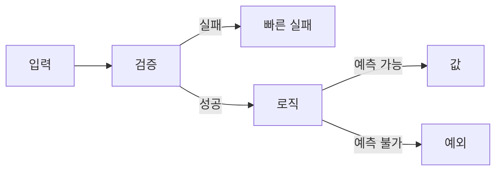

# 오류 처리

> Clean Code 101 시리즈 (6/10)


## 이 글에서 다룰 문제

오류 처리 코드가 비즈니스 로직보다 길어지면 코드는 더 이상 읽히지 않습니다.

> 오류 처리는 일급 시민이지만, 주연이 되어서는 안 된다.

## 전체 흐름


검증은 위에서, 예외는 통제 불가일 때만.

## Before/After

**Before**

```python
def fetch(url):
    try:
        ...
    except Exception:
        return None  # 모든 오류를 삼킴
```

**After**

```python
class FetchError(Exception): ...

def fetch(url):
    try:
        return _http_get(url)
    except TimeoutError as e:
        raise FetchError(f"timeout: {url}") from e
```

오류는 의미를 가진 채 위로 전달됩니다.

## 견고한 오류 처리 5단계

### 1단계 — 빠른 실패

```python
# 1_fail_fast.py
def transfer(amount):
    if amount <= 0:
        raise ValueError("amount must be positive")
    ...
```

잘못된 입력은 즉시 차단합니다.

### 2단계 — 값으로서의 오류

```python
# 2_result.py
from dataclasses import dataclass
@dataclass
class Result:
    ok: bool
    value: object = None
    error: str = ""

def parse_int(s):
    try: return Result(True, int(s))
    except ValueError as e: return Result(False, error=str(e))
```

호출자가 분기할 수 있는 상황은 값으로.

### 3단계 — 예외 체인

```python
# 3_chain.py
class ConfigError(Exception): ...

def load_config(path):
    try:
        with open(path) as f: return f.read()
    except FileNotFoundError as e:
        raise ConfigError(f"missing config: {path}") from e
```

`from e`로 원인을 보존합니다.

### 4단계 — 재시도 + 백오프

```python
# 4_retry.py
import time, random
def with_retry(fn, attempts=3):
    for i in range(attempts):
        try: return fn()
        except TimeoutError:
            if i == attempts - 1: raise
            time.sleep((2 ** i) + random.random())
```

지수 백오프 + jitter.

### 5단계 — 경계에서만 catch

```python
# 5_boundary.py
def handle_request(req):
    try:
        return business_logic(req)
    except ValueError as e:
        return {"status": 400, "error": str(e)}
    except Exception:
        return {"status": 500, "error": "internal"}
```

핸들러 같은 외부 경계에서만 광범위 catch.

## 이 코드에서 주목할 점

- 검증과 처리가 분리되어 있습니다.
- 도메인 예외 클래스로 의미를 부여합니다.
- 재시도는 멱등할 때만 안전합니다.

## 자주 하는 실수 5가지

1. **빈 except.** 모든 정보를 잃습니다.
2. **`Exception`을 무차별 catch.** 디버깅 불가.
3. **로그만 찍고 계속 진행.** 잘못된 상태 누적.
4. **재시도 무한 루프.** 시스템을 죽입니다.
5. **예외로 흐름 제어.** 비싸고 읽기 어렵습니다.

## 실무에서는 이렇게 쓰입니다

API 서버는 핸들러가 경계입니다. 도메인 로직은 예외를 던지고, 핸들러가 HTTP 응답으로 변환합니다. 멱등 작업만 자동 재시도합니다.

## 체크리스트

- [ ] 입력 검증이 함수 위에 있나?
- [ ] 도메인 예외 타입이 있나?
- [ ] except가 너무 광범위하지 않나?
- [ ] 원인(`from e`)을 보존했나?
- [ ] 재시도가 멱등 영역에서만 일어나나?

## 정리 및 다음 단계

오류는 일급 시민으로 다루되 주연은 아닙니다. 다음 글에서는 오해받기 쉬운 도구 — 주석과 문서 — 를 다룹니다.

<!-- toc:begin -->
- [Clean Code란 무엇인가?](./01-what-is-clean-code.md)
- [이름 짓기](./02-naming.md)
- [함수 작게 만들기](./03-small-functions.md)
- [조건문 줄이기](./04-simplifying-conditionals.md)
- [중복 제거](./05-removing-duplication.md)
- **오류 처리 (현재 글)**
- 주석과 문서화 (예정)
- 테스트 가능한 코드 (예정)
- 리팩토링 기초 (예정)
- 좋은 코드 리뷰 기준 (예정)
<!-- toc:end -->

## 참고 자료

- [Clean Code (Ch. 7 Error Handling)](https://www.oreilly.com/library/view/clean-code-a/9780136083238/)
- [Joel Spolsky — Exceptions](https://www.joelonsoftware.com/2003/10/13/13/)
- [Google SRE — Handling Overload](https://sre.google/sre-book/handling-overload/)
- [AWS — Exponential Backoff and Jitter](https://aws.amazon.com/builders-library/timeouts-retries-and-backoff-with-jitter/)
