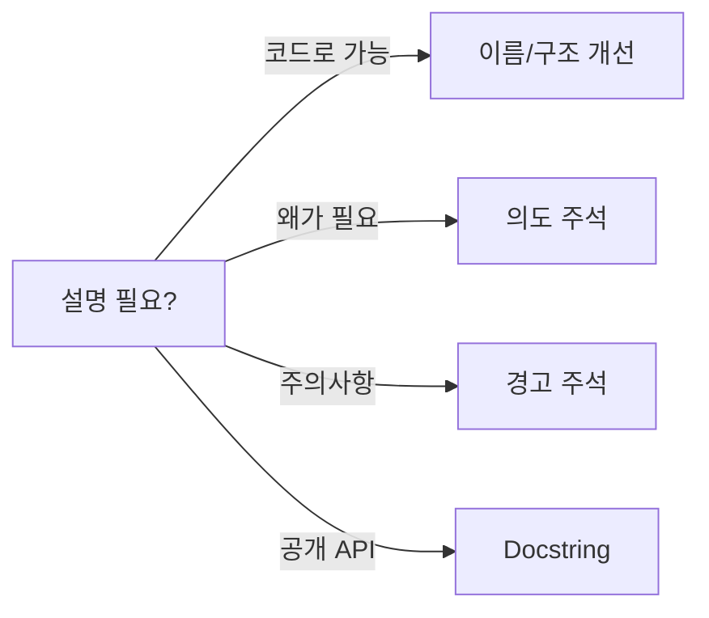

# 주석과 문서화

> Clean Code 101 시리즈 (7/10)


## 이 글에서 다룰 문제

주석은 거짓이 됩니다. 코드는 변하지만 주석은 따라오지 않기 때문입니다.

> 가장 좋은 주석은 필요 없는 주석이다.

## 전체 흐름


설명이 필요하면 먼저 코드 자체를 고쳐 봅니다.

## Before/After

**Before**

```python
# i를 1 증가시킨다
i = i + 1

# 사용자 목록
def gu(): ...
```

**After**

```python
def get_active_users(): ...
```

이름이 주석을 대체합니다.

## 도움이 되는 문서화 5단계

### 1단계 — 의도 주석

```python
# 1_intent.py
# 결제 게이트웨이가 가끔 200을 반환하면서 본문에 에러를 담는다.
# 그래서 status 대신 body.status를 본다.
def is_paid(resp):
    return resp.json().get("status") == "PAID"
```

코드만 봐서는 알 수 없는 외부 사정을 적습니다.

### 2단계 — 경고 주석

```python
# 2_warning.py
# WARNING: 이 함수는 IO를 동반합니다. 트랜잭션 안에서 호출하지 마세요.
def upload_invoice(path): ...
```

호출자가 다칠 수 있는 지점에 둡니다.

### 3단계 — Docstring

```python
# 3_doc.py
def discount(price: int, rate: float) -> int:
    """할인 적용 후 가격을 반환합니다.

    Args:
        price: 정수 원 단위 가격.
        rate: 0~1 범위의 할인율.

    Returns:
        반올림된 정수 가격.

    Raises:
        ValueError: rate가 범위를 벗어난 경우.
    """
    if not 0 <= rate <= 1:
        raise ValueError("rate out of range")
    return int(price * (1 - rate))
```

공개 함수에는 docstring을 둡니다.

### 4단계 — README 헤더

```markdown
<!-- 4_readme.md -->
# checkout-service

5초 내 응답하는 결제 도메인 서비스.

- Run: `make run`
- Test: `make test`
- Env vars: `GATEWAY_URL`, `SECRET_KEY`
```

처음 보는 사람이 30초에 적응할 수 있게.

### 5단계 — TODO에 책임자

```python
# 5_todo.py
# TODO(yeongseon, 2026-06-01): retry 정책을 backoff로 교체.
def retry_simple(): ...
```

TODO에는 사람과 기한을 함께 둡니다.

## 이 코드에서 주목할 점

- 코드가 "무엇"을, 주석이 "왜"를 설명합니다.
- Docstring은 사용 계약을 명시합니다.
- TODO는 추적 가능합니다.

## 자주 하는 실수 5가지

1. **코드 그대로 옮긴 주석.** "i를 1 증가시킨다" 같은 잡음.
2. **오래된 주석 방치.** 거짓이 됩니다.
3. **TODO 익명/무기한.** 영원히 남습니다.
4. **모든 함수에 형식적 docstring.** 정보가 없습니다.
5. **주석에 비밀/경로 노출.** 보안/이전성 모두 손상.

## 실무에서는 이렇게 쓰입니다

좋은 팀은 공개 API에는 docstring을 강제하고 내부 함수에는 의도 주석만 허용합니다. 모든 TODO에는 이슈 링크가 달립니다.

## 체크리스트

- [ ] 코드 자체로 설명이 충분한가?
- [ ] 주석이 "왜"를 설명하는가?
- [ ] 공개 함수에 docstring이 있나?
- [ ] TODO에 사람과 기한이 있나?
- [ ] 오래된 주석이 코드와 일치하나?

## 정리 및 다음 단계

좋은 주석은 적고 정확합니다. 다음 글에서는 코드의 운명을 결정짓는 — 테스트 가능한 코드 — 를 다룹니다.

<!-- toc:begin -->
- [Clean Code란 무엇인가?](./01-what-is-clean-code.md)
- [이름 짓기](./02-naming.md)
- [함수 작게 만들기](./03-small-functions.md)
- [조건문 줄이기](./04-simplifying-conditionals.md)
- [중복 제거](./05-removing-duplication.md)
- [오류 처리](./06-error-handling.md)
- **주석과 문서화 (현재 글)**
- 테스트 가능한 코드 (예정)
- 리팩토링 기초 (예정)
- 좋은 코드 리뷰 기준 (예정)
<!-- toc:end -->

## 참고 자료

- [Clean Code (Ch. 4 Comments)](https://www.oreilly.com/library/view/clean-code-a/9780136083238/)
- [PEP 257 — Docstring Conventions](https://peps.python.org/pep-0257/)
- [Google Python Style Guide — Comments](https://google.github.io/styleguide/pyguide.html#38-comments-and-docstrings)
- [Write the Docs — Documentation Guide](https://www.writethedocs.org/guide/)
