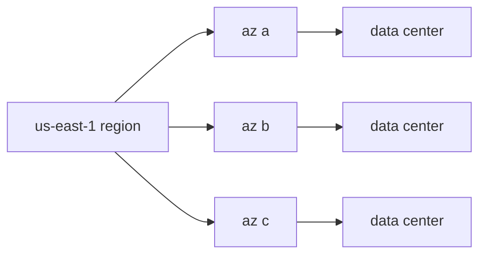

# Region과 Availability Zone

> Cloud Computing 101 시리즈 (3/10)

<!-- a-grade-intro:begin -->

**핵심 질문**: *왜 같은 AWS 인데도 한 리전이 죽으면* *우리 서비스가 같이 멈출까* 요?

> *Region 은 *지리적 위치*, *AZ 는 *물리적으로 격리된 데이터센터 묶음*. *AZ 분산* 이 *고가용성* 의 *기본 단위* 입니다.*

<!-- a-grade-intro:end -->

## 이 글에서 배울 것

- *Region* vs *AZ* vs *Edge*
- *Multi-AZ* 의 의미
- *Multi-Region* 시점
- *지연 vs 가용성*
- 흔한 함정 5가지

## 왜 중요한가

*1개 AZ* 에 다 두면 *데이터센터 화재* 한 번에 *서비스 정지*. *분산* 이 *가용성* 의 *전제*.

## 개념 한눈에 보기



## 핵심 용어 정리

- **Region**: *대륙/도시 단위* 위치.
- **AZ**: *리전 내 물리 격리* 데이터센터.
- **Edge**: *CDN* 의 *말단* 지점.
- **RTT**: *왕복 지연*. *물리 거리* 와 비례.
- **Failover**: *AZ/Region* 전환.

## Before/After

**Before**: *EC2 1대* 가 *az a* 에 있고 *RDS* 도 *az a*.

**After**: *EC2* 는 *a/b/c*, *RDS* 는 *Multi-AZ*.

## 실습: Python으로 가용 AZ 조회

### 1단계 — 클라이언트

```python
import boto3
ec2 = boto3.client("ec2", region_name="us-east-1")
```

### 2단계 — AZ 목록

```python
def list_azs():
    res = ec2.describe_availability_zones()
    return [z["ZoneName"] for z in res["AvailabilityZones"]]

print(list_azs())
```

### 3단계 — 리전 목록

```python
def list_regions():
    res = boto3.client("ec2").describe_regions()
    return [r["RegionName"] for r in res["Regions"]]

print(list_regions())
```

### 4단계 — RTT 추정 (의사 코드)

```python
def estimate_rtt(km: float) -> float:
    # 광케이블 ~200,000 km/s, 왕복 + 라우터 오버헤드
    return (km / 200_000) * 2 * 1000 * 1.5  # ms
```

### 5단계 — 분산 배치 결정

```python
def placement(azs: list[str], replicas: int) -> list[str]:
    return [azs[i % len(azs)] for i in range(replicas)]

print(placement(["a", "b", "c"], 5))
```

## 이 코드에서 주목할 점

- *AZ 이름* 은 *계정마다 다름* (실제 매핑 다를 수 있음).
- *RTT* 는 *물리 한계*.
- *분산 배치* 는 *간단한 라운드로빈*.

## 자주 하는 실수 5가지

1. ***단일 AZ* 만 사용.**
2. ***Multi-Region* 으로 *지연만 늘림*.**
3. ***DB Failover 테스트 미실시*.**
4. ***리전 끼리 데이터 동기 무시*.**
5. ***엣지 캐시* 미활용.**

## 실무에서는 이렇게 쓰입니다

*결제 서비스* 는 *Multi-AZ*, *전세계 CDN* 은 *Edge*, *재해 복구* 는 *Multi-Region*.

## 시니어 엔지니어는 이렇게 생각합니다

- *AZ 분산* 은 *기본*.
- *Multi-Region* 은 *비용 + 복잡성* 의 *큰 결정*.
- *엣지* 는 *읽기* 에 강함.
- *Failover 훈련* 을 *주기적*.
- *지연 vs 일관성* 은 *사업 결정*.

## 체크리스트

- [ ] *AZ 분산* 적용.
- [ ] *Failover* 자동.
- [ ] *RTO/RPO* 정의.
- [ ] *재해 훈련* 연 1회 이상.

## 연습 문제

1. *서울 → 도쿄* 를 *Multi-Region* 으로 만들 때 *데이터 동기 옵션* 두 가지를 적으세요.
2. *Edge 캐시* 가 *동적 페이지* 에 *부적합한 이유* 를 설명하세요.
3. *AZ 한 개* 만 쓰는 *합리적 이유* 가 있다면 무엇일까요?

## 정리 및 다음 단계

위치를 정했으니 *무엇을 돌릴지* 가 다음입니다. 다음 글은 *Compute*.

<!-- toc:begin -->
- [Cloud Computing이란 무엇인가?](./01-what-is-cloud-computing.md)
- [IaaS, PaaS, SaaS](./02-iaas-paas-saas.md)
- **Region과 Availability Zone (현재 글)**
- Compute (예정)
- Storage (예정)
- Network (예정)
- Identity와 Security (예정)
- Monitoring (예정)
- Cost Management (예정)
- Cloud Architecture 기초 (예정)
<!-- toc:end -->

## 참고 자료

- [AWS — Regions and AZs](https://docs.aws.amazon.com/AWSEC2/latest/UserGuide/using-regions-availability-zones.html)
- [Google Cloud — geography and regions](https://cloud.google.com/about/locations)
- [Azure — regions](https://learn.microsoft.com/azure/reliability/availability-zones-overview)
- [Cloudflare — what is a CDN](https://www.cloudflare.com/learning/cdn/what-is-a-cdn/)
