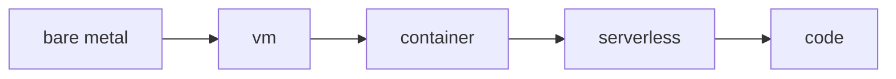

# Compute

> Cloud Computing 101 시리즈 (4/10)

<!-- a-grade-intro:begin -->

**핵심 질문**: *VM*, *컨테이너*, *Lambda* 중 *언제 무엇을* 써야 할까요?

> *Compute 는 *코드를 실행하는 자원* 의 총칭. *제어 vs 자동화* 트레이드오프로 *VM/컨테이너/서버리스* 를 선택합니다.*

<!-- a-grade-intro:end -->

## 이 글에서 배울 것

- *컴퓨트 4가지* (VM / 컨테이너 / 서버리스 / 베어메탈)
- *Auto Scaling* 의 의미
- *예약/온디맨드/스팟*
- *인스턴스 타입* 읽기
- 흔한 함정 5가지

## 왜 중요한가

*컴퓨트 선택* 이 *비용 60%* 와 *운영 부하* 를 결정합니다.

## 개념 한눈에 보기



## 핵심 용어 정리

- **EC2**: AWS *VM* 서비스.
- **AMI**: *VM 이미지*.
- **Auto Scaling Group**: *수요 기반 인스턴스 관리*.
- **Spot**: *남는 용량* 을 *할인* 으로.
- **Reserved**: *1~3년 약정* 할인.

## Before/After

**Before**: *피크* 에 맞춘 *상시 큰 서버* (낭비).

**After**: *Auto Scaling* 으로 *수요* 따라 *늘고/줄고*.

## 실습: boto3로 EC2 인스턴스 다루기

### 1단계 — 클라이언트

```python
import boto3
ec2 = boto3.client("ec2", region_name="us-east-1")
```

### 2단계 — 인스턴스 시작 (예시)

```python
def launch(ami: str, type_: str = "t3.micro"):
    res = ec2.run_instances(
        ImageId=ami, InstanceType=type_, MinCount=1, MaxCount=1,
    )
    return res["Instances"][0]["InstanceId"]
```

### 3단계 — 상태 조회

```python
def status(instance_id: str):
    res = ec2.describe_instances(InstanceIds=[instance_id])
    return res["Reservations"][0]["Instances"][0]["State"]["Name"]
```

### 4단계 — 종료

```python
def terminate(instance_id: str):
    ec2.terminate_instances(InstanceIds=[instance_id])
```

### 5단계 — 인스턴스 타입 읽기

```python
def parse_type(t: str) -> dict:
    family, size = t.split(".")
    return {"family": family, "size": size}

print(parse_type("t3.micro"))
print(parse_type("m5.large"))
```

## 이 코드에서 주목할 점

- *AMI* 가 *VM 의 출생 사진*.
- *terminate* 는 *되돌릴 수 없음*.
- *인스턴스 타입* = *family.size*.

## 자주 하는 실수 5가지

1. ***스팟* 을 *DB* 에 사용.**
2. ***Auto Scaling* 미설정 → *피크에 다운*.**
3. ***예약* 을 *유연성 없이* 과도 구매.**
4. ***인스턴스 정지 = 비용 0* 오해.**
5. ***로깅 없이* 인스턴스 종료 → *증거 손실*.**

## 실무에서는 이렇게 쓰입니다

*웹* 은 *On-demand + ASG*, *배치* 는 *Spot*, *DB* 는 *예약*, *비결정 워크로드* 는 *Lambda*.

## 시니어 엔지니어는 이렇게 생각합니다

- *워크로드 ≠ 인스턴스*. *워크로드 → 적합 컴퓨트*.
- *Auto Scaling* 은 *기본*.
- *Spot* 은 *재시작 가능* 한 곳에.
- *예약* 은 *기준 부하* 만큼만.
- *서버리스* 는 *비용 < 인력 시간*.

## 체크리스트

- [ ] 워크로드 별 *컴퓨트 매핑*.
- [ ] *ASG* 적용 가능 여부.
- [ ] *예약/스팟* 비율 평가.
- [ ] *종료 정책* 문서.

## 연습 문제

1. *Lambda* 의 *최대 실행 시간 한계* 가 가져오는 *설계 제약* 을 적으세요.
2. *Spot* 사용 시 *graceful shutdown* 을 어떻게 구현할까요?
3. *t3 vs m5* 차이를 *워크로드 관점* 에서 설명하세요.

## 정리 및 다음 단계

컴퓨트는 *움직임*, 다음은 *저장*. 다음 글은 *Storage* 입니다.

<!-- toc:begin -->
- [Cloud Computing이란 무엇인가?](./01-what-is-cloud-computing.md)
- [IaaS, PaaS, SaaS](./02-iaas-paas-saas.md)
- [Region과 Availability Zone](./03-region-and-availability-zone.md)
- **Compute (현재 글)**
- Storage (예정)
- Network (예정)
- Identity와 Security (예정)
- Monitoring (예정)
- Cost Management (예정)
- Cloud Architecture 기초 (예정)
<!-- toc:end -->

## 참고 자료

- [AWS EC2 사용자 가이드](https://docs.aws.amazon.com/AWSEC2/latest/UserGuide/concepts.html)
- [AWS Auto Scaling](https://docs.aws.amazon.com/autoscaling/)
- [AWS — Spot Instances](https://docs.aws.amazon.com/AWSEC2/latest/UserGuide/using-spot-instances.html)
- [AWS Lambda 개요](https://docs.aws.amazon.com/lambda/latest/dg/welcome.html)
