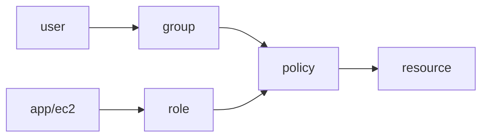

# Identity와 Security

> Cloud Computing 101 시리즈 (7/10)


## 이 글에서 다룰 문제

*보안 사고* 의 *대부분* 은 *과도한 권한* 과 *방치된 키* 에서 시작됩니다. *IAM* 이 *제대로 잡히면* 사고의 *반경* 이 줄어듭니다.

## 전체 흐름


## Before/After

**Before**: *액세스 키* 를 *코드 하드코딩* → *유출 사고*.

**After**: *EC2 Role* 부착 + *임시 토큰* 자동 갱신.

## 최소 권한 정책

### 1단계 — 클라이언트

```python
import boto3, json
iam = boto3.client("iam")
```

### 2단계 — 정책 문서

```python
policy = {
    "Version": "2012-10-17",
    "Statement": [{
        "Effect": "Allow",
        "Action": ["s3:GetObject"],
        "Resource": "arn:aws:s3:::my-bucket/*",
    }],
}
```

### 3단계 — 정책 생성

```python
def create_policy(name, doc):
    res = iam.create_policy(
        PolicyName=name, PolicyDocument=json.dumps(doc),
    )
    return res["Policy"]["Arn"]
```

### 4단계 — 역할 생성 + 신뢰

```python
trust = {
    "Version": "2012-10-17",
    "Statement": [{
        "Effect": "Allow",
        "Principal": {"Service": "ec2.amazonaws.com"},
        "Action": "sts:AssumeRole",
    }],
}

def create_role(name):
    res = iam.create_role(
        RoleName=name, AssumeRolePolicyDocument=json.dumps(trust),
    )
    return res["Role"]["Arn"]
```

### 5단계 — 부착

```python
def attach(role_name, policy_arn):
    iam.attach_role_policy(RoleName=role_name, PolicyArn=policy_arn)
```

## 이 코드에서 주목할 점

- *Role* 은 *신뢰 정책* 과 *권한 정책* *두 개* 가 필요.
- *Resource* 는 *최대한 좁게*.
- *Action* 은 *와일드카드* 를 피하기.

## 자주 하는 실수 5가지

1. ***Action* 에 *\** 부여.**
2. ***액세스 키* 를 *Git 커밋*.**
3. ***루트 계정* 으로 *일상 작업*.**
4. ***MFA* 미적용.**
5. ***키 회전* 없음.**

## 실무에서는 이렇게 쓰입니다

*EC2 Role* 로 *S3 접근*, *KMS* 로 *데이터 암호화*, *AWS SSO* 로 *직원 로그인*, *MFA* 는 *모든 사용자 필수*.

## 체크리스트

- [ ] *루트* MFA 활성.
- [ ] *키 회전* 일정 존재.
- [ ] *Role* 우선 사용.
- [ ] *CloudTrail* 활성.

## 정리 및 다음 단계

권한이 잡혔으면 *무슨 일이 일어나는지* 가 다음 질문입니다. 다음 글은 *Monitoring*.

<!-- toc:begin -->
- [Cloud Computing이란 무엇인가?](./01-what-is-cloud-computing.md)
- [IaaS, PaaS, SaaS](./02-iaas-paas-saas.md)
- [Region과 Availability Zone](./03-region-and-availability-zone.md)
- [Compute](./04-compute.md)
- [Storage](./05-storage.md)
- [Network](./06-network.md)
- **Identity와 Security (현재 글)**
- Monitoring (예정)
- Cost Management (예정)
- Cloud Architecture 기초 (예정)
<!-- toc:end -->

## 참고 자료

- [AWS IAM 사용자 가이드](https://docs.aws.amazon.com/IAM/latest/UserGuide/introduction.html)
- [IAM 모범 사례](https://docs.aws.amazon.com/IAM/latest/UserGuide/best-practices.html)
- [AWS KMS](https://docs.aws.amazon.com/kms/latest/developerguide/overview.html)
- [AWS CloudTrail](https://docs.aws.amazon.com/awscloudtrail/latest/userguide/cloudtrail-user-guide.html)
