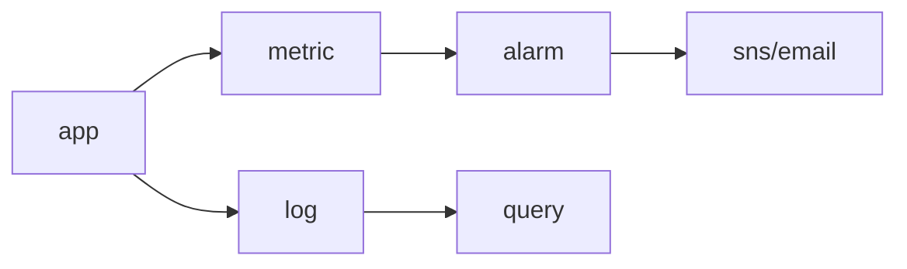

# Monitoring

> Cloud Computing 101 시리즈 (8/10)

<!-- a-grade-intro:begin -->

**핵심 질문**: *메트릭*, *로그*, *트레이스* 는 *언제* *어떤* 도구로 봐야 할까요?

> *모니터링 은 *수치(메트릭)*, *문자(로그)*, *흐름(트레이스)* 의 *3축* 으로 시스템 상태를 *관측 가능* 하게 만드는 일입니다.*

<!-- a-grade-intro:end -->

## 이 글에서 배울 것

- *Metric*, *Log*, *Trace* 의 차이
- *CloudWatch* 기본
- *알람* 과 *통보 (SNS)*
- *대시보드* 구성
- 흔한 함정 5가지

## 왜 중요한가

*모니터링 없이* 운영하면 *고객* 이 *장애* 를 먼저 알게 됩니다. *알람* 한 줄이 *밤잠* 을 지킵니다.

## 개념 한눈에 보기



## 핵심 용어 정리

- **Metric**: *수치* 시계열 (CPU, 응답시간).
- **Log**: *문자* 이벤트 (요청, 에러).
- **Trace**: *분산 호출* 의 *흐름* (X-Ray).
- **Alarm**: *임계값* 을 넘으면 *알림*.
- **SLO**: *목표* (예: 99.9%).

## Before/After

**Before**: *오류* 는 *고객 문의* 로 발견.

**After**: *5xx* 비율 *임계값* 초과 시 *Slack 알림*.

## 실습: CloudWatch 알람

### 1단계 — 클라이언트

```python
import boto3
cw = boto3.client("cloudwatch")
sns = boto3.client("sns")
```

### 2단계 — 토픽 만들기

```python
def create_topic(name):
    res = sns.create_topic(Name=name)
    return res["TopicArn"]
```

### 3단계 — 구독 (이메일)

```python
def subscribe(topic_arn, email):
    sns.subscribe(
        TopicArn=topic_arn, Protocol="email", Endpoint=email,
    )
```

### 4단계 — CPU 알람

```python
def cpu_alarm(name, instance_id, topic_arn):
    cw.put_metric_alarm(
        AlarmName=name,
        Namespace="AWS/EC2",
        MetricName="CPUUtilization",
        Dimensions=[{"Name": "InstanceId", "Value": instance_id}],
        Statistic="Average",
        Period=60, EvaluationPeriods=5,
        Threshold=80.0, ComparisonOperator="GreaterThanThreshold",
        AlarmActions=[topic_arn],
    )
```

### 5단계 — 사용자 정의 메트릭

```python
def emit(value):
    cw.put_metric_data(
        Namespace="MyApp",
        MetricData=[{"MetricName": "OrdersPerMin", "Value": value}],
    )
```

## 이 코드에서 주목할 점

- *Period* 와 *EvaluationPeriods* 가 *민감도* 결정.
- *사용자 정의 메트릭* 은 *비즈니스 지표* 에 활용.
- *Topic* 으로 *수신자* 분리.

## 자주 하는 실수 5가지

1. ***모든 것* 에 알람 → *알람 피로*.**
2. ***로그* 만 있고 *메트릭* 없음.**
3. ***임계값* 이 *너무 민감* / *둔감*.**
4. ***로그 보존 기간* 무한 → 비용.**
5. ***대시보드* 가 *너무 복잡* 해 *읽히지 않음*.**

## 실무에서는 이렇게 쓰입니다

*ALB* 5xx 비율, *RDS* 연결 수, *Lambda* 에러율, *주문 생성* 분당 카운트 → *대시보드* + *알람* + *Slack/PagerDuty*.

## 시니어 엔지니어는 이렇게 생각합니다

- *알람* 은 *행동 가능* 해야 한다.
- *SLO* 가 *알람 임계값* 을 정한다.
- *로그* 는 *질문* 하는 도구.
- *대시보드* 는 *최소* 로.
- *정전 훈련* 으로 *알람* 을 검증.

## 체크리스트

- [ ] *핵심 메트릭* 알람 존재.
- [ ] *로그 보존* 정책 설정.
- [ ] *대시보드* 1개 이상 운영.
- [ ] *온콜* 통보 경로 점검.

## 연습 문제

1. *Metric* 과 *Log* 의 *차이* 를 한 줄로.
2. *CPU 80% 5분 연속* 알람의 *Period/EvaluationPeriods* 를 적으세요.
3. *알람 피로* 를 줄이는 *방법* 을 한 가지 들어 보세요.

## 정리 및 다음 단계

관측이 잡혔으면 *비용* 도 봐야 합니다. 다음 글은 *Cost Management*.

<!-- toc:begin -->
- [Cloud Computing이란 무엇인가?](./01-what-is-cloud-computing.md)
- [IaaS, PaaS, SaaS](./02-iaas-paas-saas.md)
- [Region과 Availability Zone](./03-region-and-availability-zone.md)
- [Compute](./04-compute.md)
- [Storage](./05-storage.md)
- [Network](./06-network.md)
- [Identity와 Security](./07-identity-and-security.md)
- **Monitoring (현재 글)**
- Cost Management (예정)
- Cloud Architecture 기초 (예정)
<!-- toc:end -->

## 참고 자료

- [AWS CloudWatch 사용자 가이드](https://docs.aws.amazon.com/AmazonCloudWatch/latest/monitoring/WhatIsCloudWatch.html)
- [CloudWatch Logs Insights](https://docs.aws.amazon.com/AmazonCloudWatch/latest/logs/AnalyzingLogData.html)
- [AWS X-Ray](https://docs.aws.amazon.com/xray/latest/devguide/aws-xray.html)
- [Google SRE Book — Monitoring](https://sre.google/sre-book/monitoring-distributed-systems/)
