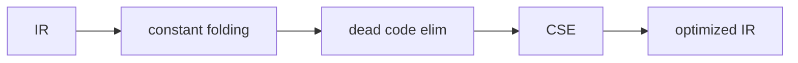

# optimization 기초

> Compilers 101 시리즈 (7/10)


## 이 글에서 다룰 문제

같은 알고리즘이라도 컴파일러가 잘 줄여 주면 10배 빠르거나 1/10 크기가 됩니다. 동시에 잘못된 optimization은 프로그램의 의미를 바꿔 버립니다 — 가장 무서운 버그입니다. 그래서 optimizer를 보면 컴파일러의 신뢰성이 어디서 오는지가 보입니다.

> "더 빠르게 + 의미는 그대로." 이 두 줄을 동시에 지키는 게 optimizer입니다.

## 전체 흐름


각 단계는 IR을 입력으로 받아 IR을 내놓습니다. 모든 pass는 의미를 보존해야 합니다.

## Before/After

**Before — 순진한 IR**

```text
t1 = 2 * 3
t2 = 1 + t1
t3 = t2
return t3
```

**After — 최적화 후**

```text
return 7
```

같은 결과지만, 명령어 수가 4 → 1.

## 작은 optimizer

### 1단계 — IR 인스트럭션 표현

```python
# 1_inst.py
# (op, dst, src1, src2) 튜플로 다룬다
code = [
    ("LOAD", "t1", 2, None),
    ("LOAD", "t2", 3, None),
    ("*",    "t3", "t1", "t2"),
    ("LOAD", "t4", 1, None),
    ("+",    "t5", "t4", "t3"),
    ("RET",  None, "t5", None),
]
```

평탄한 리스트 위에서 모든 변환을 합니다.

### 2단계 — constant folding

```python
# 2_fold.py
def fold(code):
    consts = {}
    out = []
    for op, dst, a, b in code:
        if op == "LOAD" and isinstance(a, int):
            consts[dst] = a; out.append((op, dst, a, b)); continue
        if op in "+-*/" and a in consts and b in consts:
            v = {"+":consts[a]+consts[b],"-":consts[a]-consts[b],
                 "*":consts[a]*consts[b],"/":consts[a]//consts[b]}[op]
            consts[dst] = v
            out.append(("LOAD", dst, v, None))
        else:
            out.append((op, dst, a, b))
    return out
```

상수 환경(`consts`)을 들고 다니면서, 양쪽 피연산자가 상수인 산술을 즉시 계산합니다.

### 3단계 — dead code elimination

```python
# 3_dce.py
def dce(code):
    used = set()
    # 마지막부터 거꾸로 used를 모은다
    for op, dst, a, b in reversed(code):
        if op == "RET":
            used.add(a)
        else:
            if dst in used:
                if isinstance(a, str): used.add(a)
                if isinstance(b, str): used.add(b)
    # 한 번 더 순회해 살아 있는 것만 남긴다
    return [(op, dst, a, b) for op, dst, a, b in code
            if op == "RET" or dst in used]
```

뒤에서 앞으로 use 정보를 모은 뒤, 안 쓰이는 dst의 명령어를 버립니다.

### 4단계 — pass 묶기

```python
# 4_pipeline.py
def optimize(code):
    code = fold(code)
    code = dce(code)
    return code

for inst in optimize(code): print(inst)
```

pass를 함수 합성으로 묶습니다. 같은 pass를 두 번 돌리면 더 줄어들 수도 있습니다 (fixed point).

### 5단계 — common subexpression 직관

```python
# 5_cse.py
# 같은 우항이 두 번 나오면 한 번만 계산
# t1 = a + b
# t2 = a + b   <- 같은 식
# 의 두 번째 줄을 t2 = t1 로 바꾼다
```

해시 테이블 `(op, src1, src2) → dst`을 들고 다니면 매우 단순합니다. SSA에서 특히 깔끔합니다.

## 이 코드에서 주목할 점

- 모든 pass는 IR → IR 변환입니다.
- 각 pass는 작고 단순합니다 (몇십 줄).
- pass의 순서가 결과 품질에 영향을 줍니다.
- pass를 fixed point까지 돌리는 패턴이 흔합니다.

## 자주 하는 실수 5가지

1. **side effect를 무시한 dead code elimination을 한다.** I/O 호출은 결과를 안 써도 살려야 합니다.
2. **부동소수점에서 마음대로 fold한다.** 결합법칙이 깨지는 경우가 있어 결과가 달라집니다.
3. **분기를 무시한 CSE를 한다.** 다른 basic block에서는 같은 식이 다른 값일 수 있습니다.
4. **pass 순서를 의식하지 않는다.** fold 다음 dce 순서가 보통 잘 동작.
5. **한 번 도는 데서 멈춘다.** fold가 더 많은 dead code를 만들고, dce가 더 많은 fold 기회를 만듭니다.

## 실무에서는 이렇게 쓰입니다

LLVM은 수십 개의 pass를 가지고 있고, 컴파일 옵션(`-O2`, `-O3`)이 곧 어떤 pass를 어떤 순서로 도는가입니다. JIT 컴파일러는 hot path만 골라 더 공격적인 optimization을 적용합니다. profile-guided optimization(PGO)은 실제 실행 정보를 기반으로 pass를 적용합니다.

## 체크리스트

- [ ] 의미 보존이 optimizer의 절대 규칙임을 받아들였는가?
- [ ] constant folding을 한 페이지 안에 짤 수 있는가?
- [ ] dead code elimination이 use 분석에서 나온다는 사실을 답할 수 있는가?
- [ ] pass의 순서가 결과에 영향을 주는 이유를 설명할 수 있는가?
- [ ] CSE가 SSA에서 왜 더 단순한지 직관이 있는가?

## 정리 및 다음 단계

Optimization은 IR 위에서 일어나는 의미 보존 변환의 연속입니다. 다음 글에서는 마침내 이 IR을 진짜 기계어로 바꾸는 — code generation — 단계를 살펴봅니다.

<!-- toc:begin -->
- [컴파일러란 무엇인가?](./01-what-is-a-compiler.md)
- [lexical analysis](./02-lexical-analysis.md)
- [parsing과 AST](./03-parsing-and-ast.md)
- [semantic analysis](./04-semantic-analysis.md)
- [symbol table과 scope](./05-symbol-table-and-scope.md)
- [intermediate representation](./06-intermediate-representation.md)
- **optimization 기초 (현재 글)**
- code generation (예정)
- JIT vs AOT (예정)
- 작은 인터프리터 만들어 보기 (예정)
<!-- toc:end -->

## 참고 자료

- [Compiler optimization (Wikipedia)](https://en.wikipedia.org/wiki/Optimizing_compiler)
- [Constant folding (Wikipedia)](https://en.wikipedia.org/wiki/Constant_folding)
- [Dead code elimination (Wikipedia)](https://en.wikipedia.org/wiki/Dead-code_elimination)
- [LLVM Passes](https://llvm.org/docs/Passes.html)
