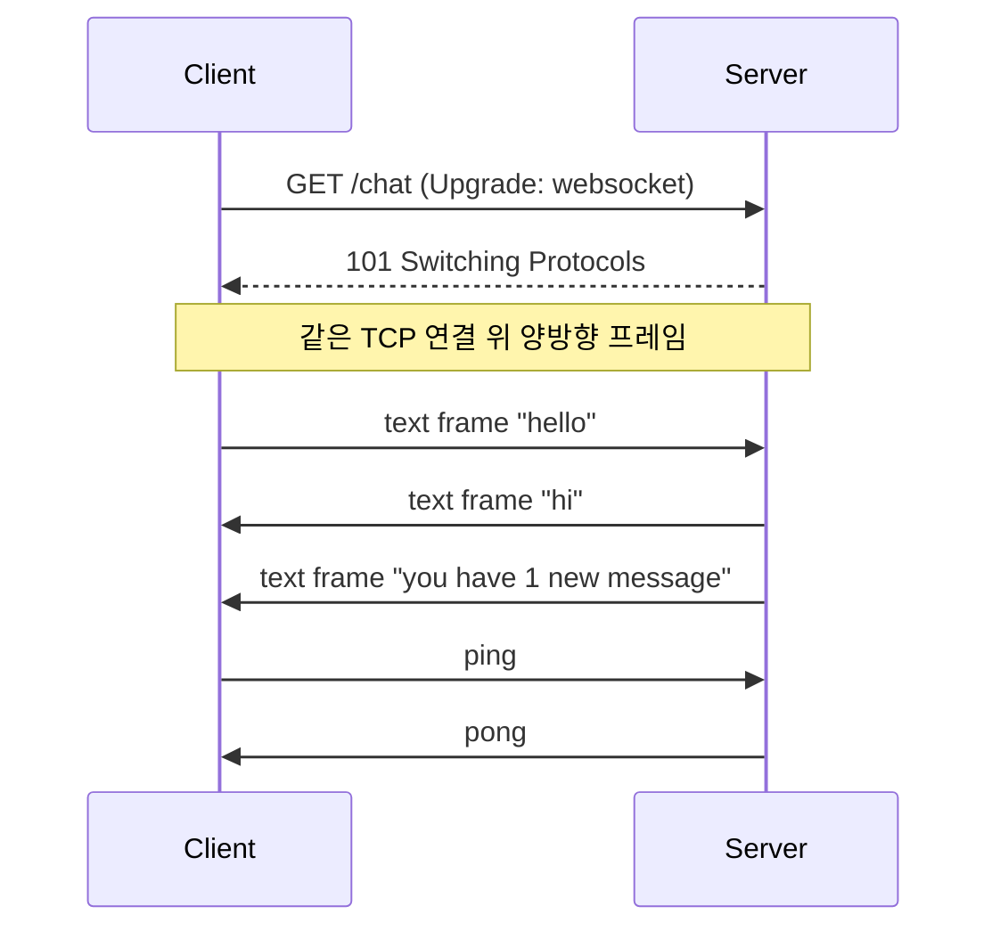

# WebSocket과 실시간 통신

> Computer Networks 101 시리즈 (9/10)


## 이 글에서 다룰 문제

대시보드, 채팅, 게임, 금융 시세, 실시간 협업 — 모두 "서버가 먼저 말을 거는" 모델 위에서 동작합니다. HTTP만으로 이 일을 흉내 내려면 폴링과 long-polling으로 자원을 쥐어짜야 합니다. WebSocket을 이해하면 어디까지가 진짜 실시간이 필요한 영역이고, 어디부터는 그냥 자주 갱신하는 정도로 충분한지 구분할 수 있습니다.

> "실시간"이라는 말은 보통 "지연이 사람의 인내심보다 짧다"는 뜻입니다. 200ms면 충분한 화면에 WebSocket을 쓰면 비용만 늘어납니다.

## 전체 흐름


핵심은 **101 Switching Protocols**입니다. HTTP 요청으로 시작한 연결이 응답 후에는 더 이상 HTTP가 아니라 WebSocket 프레임 스트림으로 동작합니다.

## Before/After

**Before — 5초마다 폴링**

```python
# client.py — 5초마다 새 메시지가 있는지 묻는 단순 폴링
import time, requests

last_id = 0
while True:
    resp = requests.get(f"https://api.example.com/messages?since={last_id}")
    for msg in resp.json():
        print(msg["text"])
        last_id = max(last_id, msg["id"])
    time.sleep(5)
```

새 메시지가 없을 때도 매 5초마다 요청이 갑니다. 메시지가 와도 최대 5초 늦게 보입니다.

**After — WebSocket으로 즉시 받기**

```python
# client.py — websockets 라이브러리 사용
import asyncio
import websockets

async def listen():
    async with websockets.connect("wss://api.example.com/messages") as ws:
        async for raw in ws:  # 서버가 보낸 순간 즉시 도착
            print(raw)

asyncio.run(listen())
```

이제 클라이언트는 묻지 않습니다. 서버가 새 이벤트를 만들 때 바로 보냅니다.

## WebSocket 에코 서버를 단계별로 만들기

### 1단계 — 의존성 설치

```bash
python3 -m venv .venv
source .venv/bin/activate
pip install websockets
```

`websockets`는 표준 `asyncio`로 동작하는 잘 알려진 WebSocket 라이브러리입니다.

### 2단계 — 가장 단순한 에코 서버

```python
# server.py
import asyncio
import websockets

async def echo(ws):
    async for message in ws:
        await ws.send(f"echo: {message}")

async def main():
    async with websockets.serve(echo, "127.0.0.1", 8765):
        print("listening on ws://127.0.0.1:8765")
        await asyncio.Future()  # 영원히 대기

asyncio.run(main())
```

`async for message in ws`가 핵심입니다. 클라이언트가 프레임을 보낼 때마다 한 번씩 깨어납니다.

### 3단계 — 직접 메시지 보내 보기

다른 터미널에서 `websocat`이나 짧은 파이썬 클라이언트로 테스트합니다.

```python
# client.py
import asyncio, websockets

async def main():
    async with websockets.connect("ws://127.0.0.1:8765") as ws:
        await ws.send("hello")
        print(await ws.recv())  # → echo: hello
        await ws.send("world")
        print(await ws.recv())  # → echo: world

asyncio.run(main())
```

같은 연결로 두 번 주고받았다는 점이 중요합니다. 매 메시지마다 새로 연결하지 않습니다.

### 4단계 — 핑/퐁으로 죽은 연결 감지

```python
# server.py — keepalive 옵션 추가
async with websockets.serve(
    echo, "127.0.0.1", 8765,
    ping_interval=20,   # 20초마다 ping
    ping_timeout=20,    # 20초 안에 pong 안 오면 끊음
):
    await asyncio.Future()
```

NAT나 로드밸런서가 조용한 연결을 끊는 것을 막고, 끊긴 연결을 빨리 알아챕니다.

### 5단계 — 브로드캐스트로 채팅 흉내

```python
# server.py
import asyncio, websockets

CLIENTS = set()

async def chat(ws):
    CLIENTS.add(ws)
    try:
        async for message in ws:
            # 모두에게 전달 (자기 자신 포함)
            await asyncio.gather(*[c.send(message) for c in CLIENTS])
    finally:
        CLIENTS.discard(ws)

async def main():
    async with websockets.serve(chat, "127.0.0.1", 8765):
        await asyncio.Future()

asyncio.run(main())
```

이제 두 클라이언트를 띄우고 한쪽에서 보내면 다른 쪽에 그대로 도착합니다. 상태(`CLIENTS`)가 이 프로세스의 메모리에 있다는 점에 주의하세요. 다음 절에서 이 한계를 이야기합니다.

## 이 코드에서 주목할 점

- 핸드셰이크는 표준 HTTP지만, 응답 후에는 같은 소켓이 다른 프로토콜로 바뀝니다.
- 프레임은 가볍습니다. 매번 헤더를 다시 보내지 않으므로 작은 메시지를 자주 주고받기에 유리합니다.
- 서버의 `CLIENTS` 집합은 **이 프로세스 안에서만** 유효합니다. 인스턴스가 두 개로 늘어나면 채팅이 절반만 도달합니다.
- 핑/퐁은 사용자 메시지가 아닙니다. 사용자에게 보일 일이 없는 keepalive입니다.

## 자주 하는 실수 5가지

1. **폴링이면 충분한 곳에 WebSocket을 넣는다.** 30초마다 갱신해도 되는 화면이라면 단순한 HTTP가 더 싸고 디버그하기 쉽습니다.
2. **상태를 인스턴스 메모리에만 둔다.** 서버가 두 대가 되는 순간 메시지가 같은 인스턴스에 붙은 클라이언트에게만 갑니다. 메시지 버스(Redis pub/sub 등)가 필요합니다.
3. **재연결을 클라이언트에 맡기지 않는다.** 모바일은 자주 끊깁니다. 지수 백오프로 재연결하고, 마지막으로 본 이벤트 ID를 다시 보내 누락분을 보충해야 합니다.
4. **백프레셔를 무시한다.** 송신 큐가 무한히 커지면 메모리가 폭발합니다. `await ws.send(...)`의 대기 시간을 모니터링하고, 느린 클라이언트는 끊어 내야 합니다.
5. **L7 프록시 설정을 잊는다.** NGINX 같은 프록시는 기본 idle timeout이 짧습니다. WebSocket용 location에는 `proxy_read_timeout`을 충분히 늘리고 `Upgrade`/`Connection` 헤더를 전달해야 합니다.

## 실무에서는 이렇게 쓰입니다

대규모 실시간 시스템은 **WebSocket gateway 계층**과 **메시지 버스**로 분리됩니다. gateway는 단순히 연결을 유지하면서 들어온 이벤트를 버스에 publish하고, 버스는 다른 gateway에 떠 있는 관련 클라이언트들에게 분배합니다. 이렇게 해야 gateway 인스턴스를 자유롭게 늘리고 줄일 수 있습니다.

배포도 다릅니다. 일반 HTTP 서비스는 새 버전을 띄우고 LB에서 트래픽을 옮기면 됩니다. 그러나 WebSocket은 **기존 연결을 끊지 않고 새 버전을 도입**해야 사용자 경험이 무너지지 않습니다. 보통 graceful drain으로 새 연결만 새 버전으로 보내고, 오래된 연결은 자연스럽게 종료될 때까지 기다립니다.

선택의 기준은 단순합니다. 서버가 **자주, 양방향으로** 보내야 하면 WebSocket. 서버가 한 방향으로 흘려보내기만 하면 SSE가 더 단순하고 HTTP/2와 잘 어울립니다. 가끔만 갱신해도 되면 polling으로도 충분합니다.

## 체크리스트

- [ ] 정말 실시간이 필요한가, 아니면 짧은 polling으로 충분한가?
- [ ] WebSocket / SSE / long-polling 중 무엇이 가장 단순한가?
- [ ] 핑/퐁과 idle timeout 값을 의식적으로 정했는가?
- [ ] 재연결과 메시지 누락 보충 전략이 있는가?
- [ ] 인스턴스가 늘어나도 메시지가 모든 관련 클라이언트에 가는가?
- [ ] 프록시(NGINX 등)에서 Upgrade 헤더와 timeout을 설정했는가?

## 정리 및 다음 단계

WebSocket은 "HTTP에서 시작해 더 이상 HTTP가 아니게 되는" 연결입니다. 양방향과 저오버헤드를 얻는 대신 오래 살아 있는 연결의 운영 부담을 받아들여야 합니다. 가장 흔한 함정은 **꼭 필요하지 않은 곳에 쓰는 것**과 **단일 인스턴스 메모리에 상태를 두는 것**입니다.

다음 글에서는 시리즈를 마무리하면서 — 네트워크가 평소처럼 동작하지 않을 때, 어디서부터 어떻게 들여다봐야 하는지 다룹니다.

<!-- toc:begin -->
- [네트워크란 무엇인가?](./01-what-is-a-network.md)
- [IP와 subnet](./02-ip-and-subnet.md)
- [TCP와 UDP](./03-tcp-and-udp.md)
- [DNS](./04-dns.md)
- [HTTP와 HTTPS](./05-http-and-https.md)
- [TLS 기초](./06-tls-basics.md)
- [라우팅과 NAT](./07-routing-and-nat.md)
- [Load Balancer](./08-load-balancer.md)
- **WebSocket과 실시간 통신 (현재 글)**
- 네트워크 문제 디버깅 (예정)
<!-- toc:end -->

## 참고 자료

- [RFC 6455 — The WebSocket Protocol](https://datatracker.ietf.org/doc/html/rfc6455)
- [MDN — Writing WebSocket servers](https://developer.mozilla.org/en-US/docs/Web/API/WebSockets_API/Writing_WebSocket_servers)
- [websockets (Python) Documentation](https://websockets.readthedocs.io/)
- [NGINX — WebSocket Proxying](https://nginx.org/en/docs/http/websocket.html)
