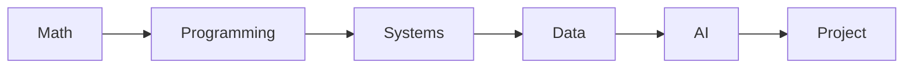

# 컴퓨터학과에서는 무엇을 배우는가

> 컴퓨터학과 전공 학습 가이드 101 시리즈 (1/10)

<!-- a-grade-intro:begin -->

**핵심 질문**: 컴퓨터학과 4년 동안 *결국* 무엇을 배우게 될까요?

> *수학*, *시스템*, *데이터*, *AI*, *프로젝트* 다섯 축이 *전공* 의 큰 그림입니다.

<!-- a-grade-intro:end -->

## 이 글에서 배울 것

- 전공 과목의 *큰 그림*
- *수학* 과 *프로그래밍* 의 비중
- *시스템* 과 *이론* 의 균형
- *프로젝트* 의 역할
- 진로와의 *연결 고리*

## 왜 중요한가

전공 *지도* 가 있어야 *4년* 의 *시간 배분* 이 흔들리지 않습니다.

## 개념 한눈에 보기



## 핵심 용어 정리

- **major**: *전공*.
- **core course**: *필수* 과목.
- **elective**: *선택* 과목.
- **track**: *세부* 전공.
- **capstone**: *졸업* 작품.

## Before/After

**Before**: 과목 이름만 외운다.

**After**: 과목의 *역할* 과 *연결* 을 이해한다.

## 실습: 전공 지도 그리기

### 1단계 — 영역 정의

```python
areas = ["math", "programming", "systems", "data", "ai", "project"]
```

### 2단계 — 학년별 배치

```python
plan = {1: ["math", "programming"], 2: ["systems"], 3: ["data", "ai"], 4: ["project"]}
```

### 3단계 — 학점 배분

```python
credits = {a: 6 for a in areas}
```

### 4단계 — 비중 점검

```python
total = sum(credits.values())  # 36
```

### 5단계 — 부족 영역 확인

```python
weak = [a for a, c in credits.items() if c < 6]
```

## 이 코드에서 주목할 점

- 과목은 *영역* 으로 묶인다.
- *학년* 별 *순서* 가 있다.
- *학점* 합이 *균형* 을 보여준다.

## 자주 하는 실수 5가지

1. ***필수* 과목을 *마지막 학기* 로 미룬다.**
2. ***이론* 과 *실습* 을 *둘 중 하나만* 선택한다.**
3. ***수학* 비중을 *과소평가* 한다.**
4. ***프로젝트* 를 *학점* 으로만 본다.**
5. ***진로* 와 *과목* 을 연결하지 않는다.**

## 실무에서는 이렇게 쓰입니다

채용 공고의 *직무 요건* 은 결국 *전공 과목* 의 *조합* 입니다.

## 시니어 엔지니어는 이렇게 생각합니다

- *수학* 은 *오래* 남는다.
- *언어* 는 *바뀐다*.
- *시스템* 은 *기본기*.
- *데이터* 는 *공통*.
- *프로젝트* 는 *증거*.

## 체크리스트

- [ ] 영역 *목록* 작성.
- [ ] 학년별 *배치*.
- [ ] 학점 *균형*.
- [ ] 부족 영역 *보강*.

## 연습 문제

1. *필수* 과목 한 줄 정의.
2. *트랙* 한 줄 정의.
3. *졸업 작품* 의 의미 한 줄.

## 정리 및 다음 단계

다음 글은 *1학년 과목 이해하기* 입니다.

<!-- toc:begin -->
- **컴퓨터학과에서는 무엇을 배우는가 (현재 글)**
- 1학년 과목 이해하기 (예정)
- 자료구조와 알고리즘 (예정)
- 시스템 과목 이해하기 (예정)
- 데이터베이스와 네트워크 (예정)
- AI와 데이터사이언스 (예정)
- 프로젝트 과목 (예정)
- 전공 공부 방법 (예정)
- 포트폴리오로 연결하기 (예정)
- 졸업 전 갖춰야 할 역량 (예정)
<!-- toc:end -->

## 참고 자료

- [ACM Computing Curricula 2020](https://www.acm.org/binaries/content/assets/education/curricula-recommendations/cc2020.pdf)
- [MIT EECS Undergraduate Curriculum](https://www.eecs.mit.edu/academics/undergraduate-programs/)
- [Stanford CS Major Requirements](https://cs.stanford.edu/degrees/undergrad/)
- [Open Source Society University](https://github.com/ossu/computer-science)
