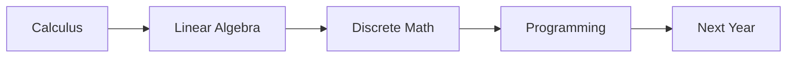

# 1학년 과목 이해하기

> 컴퓨터학과 전공 학습 가이드 101 시리즈 (2/10)


## 이 글에서 다룰 문제

1학년 *기초* 가 *알고리즘*, *AI*, *시스템* 모든 과목의 *기반* 이 됩니다.

## 전체 흐름


## Before/After

**Before**: 1학년 과목이 *진로* 와 멀어 보인다.

**After**: 모든 *상위 과목* 의 *뿌리* 라는 게 보인다.

## 1학년 과목 매트릭스

### 1단계 — 과목 목록

```python
courses = ["calculus", "linalg", "discrete", "intro_prog"]
```

### 2단계 — 상위 과목 매핑

```python
maps = {"calculus": "ml", "linalg": "ml", "discrete": "algorithms", "intro_prog": "all"}
```

### 3단계 — 주당 학습 시간

```python
hours = {c: 6 for c in courses}
```

### 4단계 — 실습 비중

```python
labs = {"intro_prog": 4, "discrete": 1}
```

### 5단계 — 약점 표시

```python
weak = [c for c, h in hours.items() if h < 5]
```

## 이 코드에서 주목할 점

- *과목* 마다 *상위* 연결이 있다.
- *학습 시간* 이 *기초 체력* 이다.
- *실습* 시간이 별도로 잡힌다.

## 자주 하는 실수 5가지

1. ***출석* 만 채우고 *복습* 안 한다.**
2. ***수학* 과목을 *암기* 로 끝낸다.**
3. ***언어* 를 바꿔 가며 *기초* 를 미룬다.**
4. ***실습 과제* 를 *마감 직전* 에 시작한다.**
5. ***질문* 을 *교수님* 께 안 한다.**

## 실무에서는 이렇게 쓰입니다

코드 리뷰에서 *대수* 와 *논리* 가 흔들리면 *상위 작업* 도 무너집니다.

## 체크리스트

- [ ] 과목 *연결*.
- [ ] *학습 시간* 확보.
- [ ] *실습* 비중.
- [ ] *약점* 보강.

## 정리 및 다음 단계

다음 글은 *자료구조와 알고리즘* 입니다.

<!-- toc:begin -->
- [컴퓨터학과에서는 무엇을 배우는가](./01-what-cs-majors-learn.md)
- **1학년 과목 이해하기 (현재 글)**
- 자료구조와 알고리즘 (예정)
- 시스템 과목 이해하기 (예정)
- 데이터베이스와 네트워크 (예정)
- AI와 데이터사이언스 (예정)
- 프로젝트 과목 (예정)
- 전공 공부 방법 (예정)
- 포트폴리오로 연결하기 (예정)
- 졸업 전 갖춰야 할 역량 (예정)
<!-- toc:end -->

## 참고 자료

- [MIT 6.0001 Introduction to Computer Science](https://ocw.mit.edu/courses/6-0001-introduction-to-computer-science-and-programming-in-python-fall-2016/)
- [3Blue1Brown - Essence of Linear Algebra](https://www.3blue1brown.com/topics/linear-algebra)
- [Discrete Math - Trevor Cohn](https://www.cs.cmu.edu/~rwh/discrete-math/)
- [Khan Academy Calculus](https://www.khanacademy.org/math/calculus-1)
