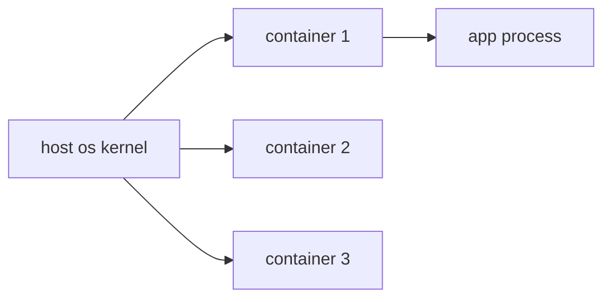

# Container란 무엇인가?

> Containers 101 시리즈 (1/10)


## 이 글에서 다룰 문제

*컨테이너* 는 *2013년 이후* *배포* 의 *기본 단위* 입니다. *모르면* 현대 *DevOps* 에 *진입할 수 없습니다*.

## 전체 흐름


## Before/After

**Before**: *서버* 에 *직접 설치* → *환경 차이* 로 *깨짐*.

**After**: *이미지* 한 개 → *어디서나* *동일하게* 실행.

## 첫 컨테이너 실행

### 1단계 — 버전 확인

```python
import subprocess

def docker_version():
    res = subprocess.run(["docker", "--version"], capture_output=True, text=True)
    return res.stdout.strip()
```

### 2단계 — 이미지 pull

```python
def pull(image):
    subprocess.run(["docker", "pull", image], check=True)
```

### 3단계 — 컨테이너 실행

```python
def run_nginx():
    subprocess.run(
        ["docker", "run", "-d", "-p", "8080:80", "--name", "web", "nginx:latest"],
        check=True,
    )
```

### 4단계 — 상태 확인

```python
def ps():
    res = subprocess.run(["docker", "ps"], capture_output=True, text=True)
    return res.stdout
```

### 5단계 — 정리

```python
def cleanup(name):
    subprocess.run(["docker", "rm", "-f", name], check=True)
```

## 이 코드에서 주목할 점

- *-d* 는 *백그라운드* 실행.
- *-p 8080:80* 은 *호스트:컨테이너* 포트 매핑.
- *--name* 으로 *식별자* 부여.

## 자주 하는 실수 5가지

1. ***포트 매핑* 누락 → *접근 불가*.**
2. ***컨테이너* 와 *이미지* 혼동.**
3. ***cleanup* 안 해서 *디스크 가득*.**
4. ***root* 로 컨테이너 실행.**
5. ***로컬에선 되는데* 라는 신화 유지.**

## 실무에서는 이렇게 쓰입니다

*개발자* 는 *Docker Desktop* 에서 *동일 이미지* 빌드, *CI* 가 *registry* 푸시, *프로덕션* 은 *Kubernetes* 에서 동일 이미지 실행.

## 체크리스트

- [ ] *Docker* 설치 확인.
- [ ] *이미지/컨테이너* 차이 설명 가능.
- [ ] *port mapping* 이해.
- [ ] *cleanup 명령* 숙지.

## 정리 및 다음 단계

이미지가 *템플릿* 이라면 *내부 구조* 를 봐야 합니다. 다음 글은 *Image와 Layer*.

<!-- toc:begin -->
- **Container란 무엇인가? (현재 글)**
- Image와 Layer (예정)
- Runtime (예정)
- Dockerfile (예정)
- Volume (예정)
- Network (예정)
- Registry (예정)
- Container Security (예정)
- Container와 VM 차이 (예정)
- 실전 컨테이너 앱 만들기 (예정)
<!-- toc:end -->

## 참고 자료

- [Docker 공식 문서](https://docs.docker.com/)
- [OCI Image Spec](https://github.com/opencontainers/image-spec)
- [Linux namespaces](https://man7.org/linux/man-pages/man7/namespaces.7.html)
- [cgroups v2](https://www.kernel.org/doc/Documentation/admin-guide/cgroup-v2.rst)
