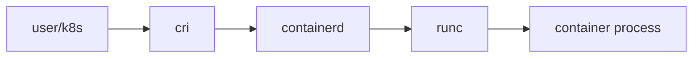

# Runtime

> Containers 101 시리즈 (3/10)

<!-- a-grade-intro:begin -->

**핵심 질문**: *Docker* 와 *containerd*, *runc* 는 *왜 따로* 존재할까요?

> *컨테이너 런타임 은 *고수준 API (Docker)*, *데몬 (containerd)*, *저수준 실행기 (runc)* 의 *3계층* 으로 분리되어 있습니다.*

<!-- a-grade-intro:end -->

## 이 글에서 배울 것

- *고수준 vs 저수준 런타임*
- *Docker → containerd → runc* 흐름
- *CRI* 의 역할
- *Kubernetes* 와의 관계
- 흔한 함정 5가지

## 왜 중요한가

*Kubernetes 1.24* 부터 *dockershim* 이 제거되었습니다. *런타임 계층* 을 *모르면* *디버깅* 이 *불가능* 합니다.

## 개념 한눈에 보기



## 핵심 용어 정리

- **Docker**: *고수준 사용자 도구* + 데몬.
- **containerd**: *컨테이너 라이프사이클* 관리 데몬.
- **runc**: *OCI* 표준 *저수준 실행기*.
- **CRI**: *Kubernetes* 가 *런타임* 과 통신하는 *인터페이스*.
- **OCI**: *Open Container Initiative* 표준.

## Before/After

**Before**: *Docker* 만 있으면 된다고 생각.

**After**: *containerd*, *runc*, *CRI* 의 *역할* 을 구분.

## 실습: containerd 직접 다루기

### 1단계 — 클라이언트 (의사 코드)

```python
import subprocess

def ctr_version():
    res = subprocess.run(["ctr", "version"], capture_output=True, text=True)
    return res.stdout
```

### 2단계 — 이미지 pull

```python
def ctr_pull(image):
    subprocess.run(["ctr", "image", "pull", image], check=True)
```

### 3단계 — 컨테이너 만들기

```python
def ctr_run(image, name):
    subprocess.run(
        ["ctr", "run", "-d", image, name],
        check=True,
    )
```

### 4단계 — 목록

```python
def ctr_list():
    res = subprocess.run(["ctr", "containers", "ls"], capture_output=True, text=True)
    return res.stdout
```

### 5단계 — 정리

```python
def ctr_kill(name):
    subprocess.run(["ctr", "task", "kill", name])
    subprocess.run(["ctr", "container", "rm", name])
```

## 이 코드에서 주목할 점

- *ctr* 는 *containerd* 의 *디버그용* CLI.
- *task* 와 *container* 가 *분리* 됨.
- *Kubernetes* 는 *crictl* 을 사용.

## 자주 하는 실수 5가지

1. ***Docker* 만 익히고 *containerd* 무시.**
2. ***K8s* 에서 *docker* CLI 로 디버깅 시도.**
3. ***런타임 버전* 을 *호스트 OS* 와 일치시키지 않음.**
4. ***rootless* 런타임 옵션 무시.**
5. ***runc* 의 *seccomp* 기본값 무지.**

## 실무에서는 이렇게 쓰입니다

*K8s 노드* 는 *containerd*, *디버깅* 은 *crictl*, *로컬 개발* 은 *Docker Desktop*, *embedded* 환경은 *podman* 등 다양.

## 시니어 엔지니어는 이렇게 생각합니다

- *런타임 계층* 을 *알면* *장애 절반*.
- *Docker = 사용자 도구*, *containerd = 운영 도구*.
- *OCI* 가 *호환성* 의 핵심.
- *rootless* 가 *가능* 하면 *기본*.
- *런타임 변경* 은 *클러스터 영향*.

## 체크리스트

- [ ] *containerd* 와 *runc* 차이 설명 가능.
- [ ] *CRI* 의 역할 이해.
- [ ] *crictl* 도구 인지.
- [ ] *OCI 표준* 인지.

## 연습 문제

1. *runc* 와 *containerd* 의 *책임 차이* 한 줄로.
2. *K8s* 가 *dockershim* 을 제거한 *이유* 한 가지.
3. *crictl* 을 *언제* 사용하는지 한 줄로.

## 정리 및 다음 단계

런타임이 *이미지를 실행* 하려면 *이미지를 만들* 줄 알아야 합니다. 다음 글은 *Dockerfile*.

<!-- toc:begin -->
- [Container란 무엇인가?](./01-what-is-a-container.md)
- [Image와 Layer](./02-image-and-layer.md)
- **Runtime (현재 글)**
- Dockerfile (예정)
- Volume (예정)
- Network (예정)
- Registry (예정)
- Container Security (예정)
- Container와 VM 차이 (예정)
- 실전 컨테이너 앱 만들기 (예정)
<!-- toc:end -->

## 참고 자료

- [containerd 공식 문서](https://containerd.io/docs/)
- [runc 저장소](https://github.com/opencontainers/runc)
- [Kubernetes CRI](https://kubernetes.io/docs/concepts/architecture/cri/)
- [OCI 표준](https://opencontainers.org/)
