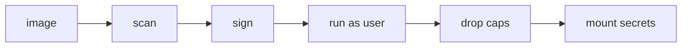

# Container Security

> Containers 101 시리즈 (8/10)

<!-- a-grade-intro:begin -->

**핵심 질문**: *컨테이너* 가 *격리* 되어 있다고 해서 *안전* 한 것일까요?

> *컨테이너 보안* 은 *최소 권한*, *이미지 신뢰*, *런타임 정책* 의 *세 축* 으로 만듭니다.

<!-- a-grade-intro:end -->

## 이 글에서 배울 것

- *non-root* 의 의미
- *capabilities* 와 *seccomp*
- *이미지 스캔*
- *시크릿* 처리
- *서명 이미지* 강제

## 왜 중요한가

*기본 설정* 의 컨테이너는 *root* 로 동작하고 *과도한 권한* 을 갖기 쉽습니다. *보안 사고* 의 *시작점* 이 됩니다.

## 개념 한눈에 보기



## 핵심 용어 정리

- **non-root**: *USER 1000* 처럼 *일반 사용자* 로 실행.
- **capability**: *root 권한* 을 *조각* 낸 단위.
- **seccomp**: *syscall 화이트리스트*.
- **image scanning**: *CVE 검사*.
- **secret**: *환경변수* 가 아닌 *전용 저장소*.

## Before/After

**Before**: *root + 모든 권한* 으로 실행.

**After**: *non-root + 최소 capability + seccomp* 로 *공격면 축소*.

## 실습: 안전한 컨테이너 실행

### 1단계 — 이미지 스캔

```python
import subprocess

def scan(image):
    res = subprocess.run(
        ["trivy", "image", "--severity", "HIGH,CRITICAL", image],
        capture_output=True, text=True,
    )
    return res.returncode == 0
```

### 2단계 — non-root 강제

```python
def run_nonroot(image):
    subprocess.run([
        "docker", "run", "--rm", "-d",
        "--user", "1000:1000", image,
    ], check=True)
```

### 3단계 — capability 드롭

```python
def run_min_caps(image):
    subprocess.run([
        "docker", "run", "--rm", "-d",
        "--cap-drop=ALL", "--cap-add=NET_BIND_SERVICE", image,
    ], check=True)
```

### 4단계 — read-only fs

```python
def run_readonly(image):
    subprocess.run([
        "docker", "run", "--rm", "-d",
        "--read-only", "--tmpfs", "/tmp", image,
    ], check=True)
```

### 5단계 — 시크릿 마운트

```python
def run_with_secret(image, secret_path):
    subprocess.run([
        "docker", "run", "--rm", "-d",
        "-v", f"{secret_path}:/run/secrets/db_pw:ro", image,
    ], check=True)
```

## 이 코드에서 주목할 점

- *--user* 로 *root 회피*.
- *--cap-drop=ALL* 후 *필요한 것만* 추가.
- *시크릿* 은 *볼륨* 으로 마운트.

## 자주 하는 실수 5가지

1. ***root* 로 실행 후 *내부* 만 신뢰.**
2. ***시크릿* 을 *환경 변수* 로 노출.**
3. ***이미지 스캔* 없이 *프로덕션* 배포.**
4. ***privileged* 컨테이너 *남용*.**
5. ***서명 검증* 미적용으로 *교체 공격*.**

## 실무에서는 이렇게 쓰입니다

*Kubernetes PodSecurity* 와 *admission controller* 가 *non-root, no privileged, signed only* 정책을 *런타임* 에서 강제합니다.

## 시니어 엔지니어는 이렇게 생각합니다

- *기본값* 은 *위험* 이다.
- *capability* 는 *명시 추가* 만.
- *시크릿* 은 *전용 시스템* 으로.
- *스캔* 은 *CI 게이트* 에 포함.
- *서명* 은 *공급망 신뢰* 의 시작.

## 체크리스트

- [ ] *non-root* 사용자.
- [ ] *cap-drop=ALL* 후 최소 추가.
- [ ] *read-only* 파일시스템.
- [ ] *시크릿* 은 볼륨/시크릿 매니저.

## 연습 문제

1. *capability* 가 *왜* 필요한지 한 줄로.
2. *seccomp* 의 *역할* 한 줄로.
3. *signed image* 가 *막아 주는 공격* 한 가지.

## 정리 및 다음 단계

보안 원칙이 잡혔으면 *컨테이너* 와 *VM* 의 *근본 차이* 를 정리할 차례입니다. 다음 글은 *Container와 VM 차이*.

<!-- toc:begin -->
- [Container란 무엇인가?](./01-what-is-a-container.md)
- [Image와 Layer](./02-image-and-layer.md)
- [Runtime](./03-runtime.md)
- [Dockerfile](./04-dockerfile.md)
- [Volume](./05-volume.md)
- [Network](./06-network.md)
- [Registry](./07-registry.md)
- **Container Security (현재 글)**
- Container와 VM 차이 (예정)
- 실전 컨테이너 앱 만들기 (예정)
<!-- toc:end -->

## 참고 자료

- [Docker security](https://docs.docker.com/engine/security/)
- [Kubernetes Pod Security Standards](https://kubernetes.io/docs/concepts/security/pod-security-standards/)
- [Trivy](https://aquasecurity.github.io/trivy/)
- [seccomp profiles](https://docs.docker.com/engine/security/seccomp/)
