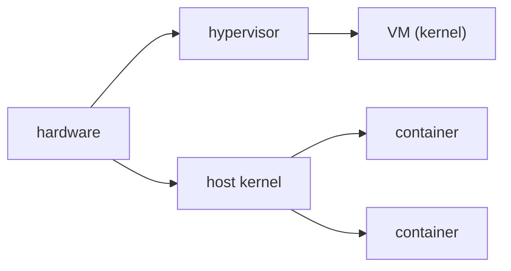

# Containers vs VMs

> Containers 101 시리즈 (9/10)


## 이 글에서 다룰 문제

*용도에 맞는 격리* 를 선택해야 *비용* 과 *보안* 이 함께 잡힙니다. *둘은 경쟁* 이 아니라 *보완* 관계입니다.

## 전체 흐름


## Before/After

**Before**: *모든 워크로드* 를 *VM* 으로만 운영 → *느리고 비싸다*.

**After**: *서비스* 는 *컨테이너*, *멀티 테넌트* 는 *VM/microVM* 으로 *분리*.

## 같은 앱을 두 가지로 비교

### 1단계 — 컨테이너로 실행

```python
import subprocess, time

def run_container(image):
    t = time.time()
    subprocess.run(["docker", "run", "--rm", "-d", image], check=True)
    return time.time() - t
```

### 2단계 — VM으로 실행 (개념)

```python
def run_vm(image_path):
    t = time.time()
    subprocess.run([
        "qemu-system-x86_64", "-m", "1024", "-hda", image_path,
        "-display", "none", "-daemonize",
    ], check=True)
    return time.time() - t
```

### 3단계 — 메모리 사용 비교

```python
def mem_usage(pid):
    res = subprocess.run(
        ["ps", "-o", "rss=", "-p", str(pid)],
        capture_output=True, text=True, check=True,
    )
    return int(res.stdout.strip())
```

### 4단계 — 시작 시간 비교

```python
def compare(image, vm_image):
    return {
        "container_sec": run_container(image),
        "vm_sec": run_vm(vm_image),
    }
```

### 5단계 — 보고

```python
def report(stats):
    print(f"container={stats['container_sec']:.2f}s vm={stats['vm_sec']:.2f}s")
```

## 이 코드에서 주목할 점

- *컨테이너* 는 *밀리초~초* 단위 시작.
- *VM* 은 *초~분* 단위 시작.
- *측정* 은 *재현 가능* 하게 자동화.

## 자주 하는 실수 5가지

1. **모든 것을 *컨테이너* 로 → *멀티 테넌트* 격리 부족.**
2. **모든 것을 *VM* 으로 → *비용 폭증*.**
3. ***컨테이너 = 보안* 으로 단정.**
4. ***Mac/Win Docker* 가 *VM* 을 *숨긴 점* 망각.**
5. ***커널 의존* 워크로드를 *컨테이너* 강제.**

## 실무에서는 이렇게 쓰입니다

*AWS Fargate / Lambda* 는 *Firecracker microVM* 위에 *컨테이너* 를 올려 *컨테이너 속도* 와 *VM 격리* 를 *동시에* 얻습니다.

## 체크리스트

- [ ] *서비스 격리* 는 *컨테이너*.
- [ ] *테넌트 격리* 는 *VM/microVM*.
- [ ] *보안 등급* 명시.
- [ ] *시작 시간 SLA* 측정.

## 정리 및 다음 단계

지금까지 배운 모든 개념을 *하나의 앱* 에 *적용* 할 차례입니다. 다음 글은 *실전 컨테이너 앱 만들기*.

<!-- toc:begin -->
- [Container란 무엇인가?](./01-what-is-a-container.md)
- [Image와 Layer](./02-image-and-layer.md)
- [Runtime](./03-runtime.md)
- [Dockerfile](./04-dockerfile.md)
- [Volume](./05-volume.md)
- [Network](./06-network.md)
- [Registry](./07-registry.md)
- [Container Security](./08-container-security.md)
- **Container와 VM 차이 (현재 글)**
- 실전 컨테이너 앱 만들기 (예정)
<!-- toc:end -->

## 참고 자료

- [What is a container? (Docker)](https://www.docker.com/resources/what-container/)
- [Firecracker](https://firecracker-microvm.github.io/)
- [Kata Containers](https://katacontainers.io/)
- [gVisor](https://gvisor.dev/)
