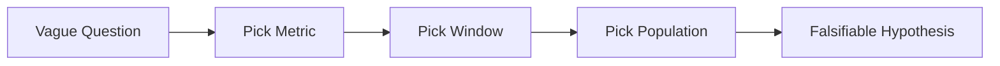

# 문제를 데이터 문제로 바꾸기

> Data Science 101 시리즈 (2/10)

<!-- a-grade-intro:begin -->

**핵심 질문**: *“왜 매출이 떨어졌지?”* 같은 *막연한 질문* 을 *어떻게 데이터로 풀 수 있는 형태* 로 바꿀까요?

> *질문이 *측정 가능* 해질 때, 데이터는 *대답* 한다.*

<!-- a-grade-intro:end -->

## 이 글에서 배울 것

- *비즈니스 질문 → 데이터 질문* 변환 5단계
- *측정 가능* 한 *지표* 를 *고르는 법*
- *가설* 을 *반증 가능* 하게 적는 법
- *5단계* 프레이밍 실습
- 흔한 함정 5가지

## 왜 중요한가

질문이 *흐릿* 하면 *어떤 데이터* 를 봐야 할지 *고를 수 없습니다*. *프레이밍* 은 *분석의 절반* 입니다.

> *정확한 질문 한 줄이 *3주의 분석* 을 줄인다.*

## 개념 한눈에 보기



## 핵심 용어 정리

- **Metric**: *수치* 로 잴 수 있는 *지표*. 예: DAU, conversion rate.
- **Window**: 분석 기간. 예: *지난 30일*.
- **Population**: 분석 대상자 *집합*. 예: *유료 구독자*.
- **Hypothesis**: *반증 가능* 한 가설.
- **Counterfactual**: *반대 시나리오*. *“만약 캠페인이 없었다면?”*.

## Before/After

**Before**: *“왜 매출이 떨어졌지?”* → *어디서부터 봐야 할지* 모른다.

**After**: *“최근 30일간 *유료 구독자* 의 *월 매출* 이 *전월 대비 5% 이상 감소* 했는가?”* → 데이터 한 번에 답.

## 실습: 5단계 프레이밍

### 1단계 — 막연한 질문 적기

```text
"매출이 떨어진 것 같다"
```

### 2단계 — Metric 고르기

```text
metric = monthly_revenue
```

### 3단계 — Window 고르기

```text
window = last 30 days vs previous 30 days
```

### 4단계 — Population 좁히기

```text
population = paid subscribers (excluding trials)
```

### 5단계 — 반증 가능한 문장으로

```text
"지난 30일간 유료 구독자의 월 매출이 전월 대비 5% 이상 감소했다."
```

## 이 코드에서 주목할 점

- *Metric* 이 *분석의 중심축*.
- *Window* 와 *population* 이 *비교* 를 *공정* 하게 만든다.
- 가설은 *반증 가능* 해야 *데이터가 답* 할 수 있다.

## 자주 하는 실수 5가지

1. ***Metric* 을 *나중에* 정한다.** 분석이 *길을 잃는다*.
2. **Window 가 *기간마다 다르다*.** 비교가 *불공정*.
3. **Population 이 *바뀐다*.** 트렌드가 *섞인다*.
4. **가설이 *반증 불가능*.** *“성장하고 있다”* 는 *증명* 도 *반증* 도 어렵다.
5. ***여러 질문* 을 *한 번에* 묻는다.** 답이 *섞인다*.

## 실무에서는 이렇게 쓰입니다

PM 이 *모호한 요청* 을 보내면, 데이터팀은 *5단계 프레이밍* 으로 *명확* 하게 다시 적어 답합니다. *PR 리뷰* 처럼 *질문 리뷰* 를 합니다.

## 시니어 엔지니어는 이렇게 생각합니다

- *Metric* 을 *처음에* 정한다.
- *Window/population* 을 *문서* 에 적는다.
- *반증 가능성* 을 *항상* 점검한다.
- *질문 리뷰* 를 *코드 리뷰* 만큼 중요하게 여긴다.
- *답이 안 나오면* 질문을 *다시 쓴다*.

## 체크리스트

- [ ] *Metric, window, population* 을 적을 수 있다.
- [ ] *반증 가능한 가설* 을 쓸 수 있다.
- [ ] *Counterfactual* 의 의미를 안다.
- [ ] *모호한 요청* 을 *질문 리뷰* 로 다듬을 수 있다.

## 연습 문제

1. *“이탈이 늘었다”* 를 5단계로 *프레이밍* 해 보세요.
2. *반증 불가능한 가설* 3개를 적고, *반증 가능* 하게 고쳐 보세요.
3. 같은 metric 에 대해 *서로 다른 window* 가 *결과를 어떻게 바꾸는지* 적어 보세요.

## 정리 및 다음 단계

데이터로 *답할 수 있는 질문* 만이 *분석* 의 출발입니다. 다음 글에서는 그 질문에 *필요한 데이터를 모으는 법* 을 살펴봅니다.

<!-- toc:begin -->
- [Data Science란 무엇인가?](./01-what-is-data-science.md)
- **문제를 데이터 문제로 바꾸기 (현재 글)**
- 데이터 수집 (예정)
- 데이터 정제 (예정)
- 탐색적 데이터 분석 (예정)
- 시각화 (예정)
- 모델링 (예정)
- 평가 (예정)
- 결과 해석 (예정)
- 데이터 프로젝트 전체 흐름 (예정)
<!-- toc:end -->

## 참고 자료

- [Google — Rules of Machine Learning (Rule #1)](https://developers.google.com/machine-learning/guides/rules-of-ml)
- [Cassie Kozyrkov — How to Ask Smart Questions](https://kozyrkov.medium.com/)
- [Stitch Fix — A/B Testing Lessons](https://multithreaded.stitchfix.com/)
- [Andrew Gelman — Statistical Modeling Blog](https://statmodeling.stat.columbia.edu/)
