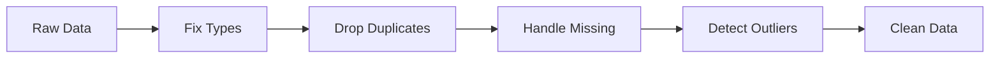

# 데이터 정제

> Data Science 101 시리즈 (4/10)


## 이 글에서 다룰 문제

*Garbage in, garbage out*. *모델* 이 아무리 좋아도 *입력이 더러우면* 결과는 *쓰레기* 입니다. 정제는 *검증* 의 단계입니다.

> *정제는 *분석의 보험* 이다.*

## 전체 흐름


## Before/After

**Before**: `signup_at` 컬럼이 *문자열* 이라 *날짜 비교* 가 *틀린 결과*.

**After**: `pd.to_datetime` 으로 변환 후 *비교* 가 *정확*.

## 5단계 정제

### 1단계 — 타입 정리

```python
import pandas as pd
df = pd.read_csv("users.csv")
df["signup_at"] = pd.to_datetime(df["signup_at"], errors="coerce")
df["amount"] = pd.to_numeric(df["amount"], errors="coerce")
```

### 2단계 — 중복 제거

```python
print("before:", len(df))
df = df.drop_duplicates(subset=["user_id"], keep="last")
print("after :", len(df))
```

### 3단계 — 결측 처리

```python
# 결측 비율 확인
print(df.isna().mean().sort_values(ascending=False).head())

# 전략: 핵심 컬럼은 drop, 보조 컬럼은 채움
df = df.dropna(subset=["user_id", "signup_at"])
df["country"] = df["country"].fillna("UNKNOWN")
```

### 4단계 — 이상치 탐지

```python
q1, q3 = df["amount"].quantile([0.25, 0.75])
iqr = q3 - q1
lower, upper = q1 - 1.5 * iqr, q3 + 1.5 * iqr
df["amount_flag"] = ~df["amount"].between(lower, upper)
print(df["amount_flag"].mean())
```

### 5단계 — 검증 리포트

```python
report = {
    "rows": len(df),
    "nulls": df.isna().sum().to_dict(),
    "outlier_rate": float(df["amount_flag"].mean()),
}
print(report)
```

## 이 코드에서 주목할 점

- *타입 정리* 가 *모든 정제의 출발*.
- *결측 비율* 을 *먼저* 본다.
- *이상치* 는 *제거가 아니라 *flag* 부터 시작.

## 자주 하는 실수 5가지

1. ***결측* 을 *0* 으로 채운다.** 평균이 *왜곡*.
2. ***중복* 을 *조용히* 지운다.** *왜* 생겼는지 *모른다*.
3. ***이상치* 를 *바로* 삭제.** *진짜 신호* 일 수 있다.
4. ***타입 변환 실패* 를 *무시*.** `errors="raise"` 로 *드러내자*.
5. ***정제 단계* 를 *문서* 에 적지 않는다.** 재현이 *불가능*.

## 실무에서는 이렇게 쓰입니다

데이터팀은 정제 단계를 *Great Expectations* 같은 *검증 도구* 로 *테스트* 합니다. CI 에서 *데이터 품질 알람* 이 울리면 *파이프라인이 멈춥니다*.

## 체크리스트

- [ ] *결측/중복/이상치/타입* 을 *순서대로* 본다.
- [ ] *Imputation* 전략을 설명할 수 있다.
- [ ] *IQR* 의 의미를 안다.
- [ ] *검증 리포트* 를 만든다.

## 정리 및 다음 단계

정제는 *조용한 노동* 이지만 *분석의 모든 결론* 을 떠받칩니다. 다음 글에서는 깨끗해진 데이터를 *탐색* 하는 *EDA* 를 살펴봅니다.

<!-- toc:begin -->
- [Data Science란 무엇인가?](./01-what-is-data-science.md)
- [문제를 데이터 문제로 바꾸기](./02-problem-to-data-problem.md)
- [데이터 수집](./03-data-collection.md)
- **데이터 정제 (현재 글)**
- 탐색적 데이터 분석 (예정)
- 시각화 (예정)
- 모델링 (예정)
- 평가 (예정)
- 결과 해석 (예정)
- 데이터 프로젝트 전체 흐름 (예정)
<!-- toc:end -->

## 참고 자료

- [pandas — Working with Missing Data](https://pandas.pydata.org/docs/user_guide/missing_data.html)
- [Great Expectations — Data Quality Tests](https://docs.greatexpectations.io/docs/)
- [Wikipedia — Interquartile Range](https://en.wikipedia.org/wiki/Interquartile_range)
- [Tidy Data — Hadley Wickham](https://vita.had.co.nz/papers/tidy-data.pdf)
