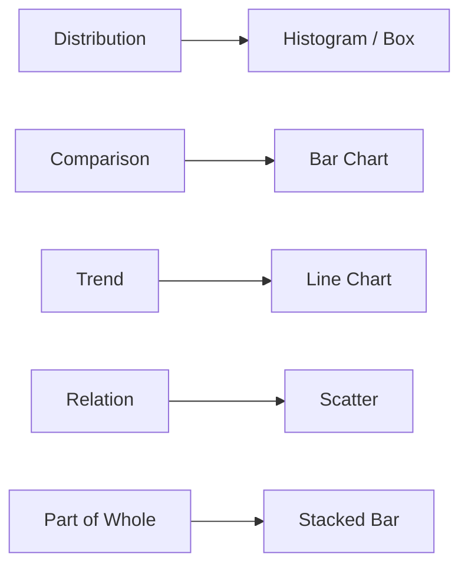

# 시각화

> Data Science 101 시리즈 (6/10)

<!-- a-grade-intro:begin -->

**핵심 질문**: *어떤 메시지* 에 *어떤 차트* 를 써야 *오해 없이* 전달될까요?

> *좋은 그림 한 장은 *3페이지의 글* 보다 빠르다.*

<!-- a-grade-intro:end -->

## 이 글에서 배울 것

- *5가지 메시지 * 에 *대응* 하는 *차트*
- *축, 색, 라벨* 의 기본 원칙
- *오해를 부르는* 그래프 패턴
- 5단계 시각화 실습
- 흔한 함정 5가지

## 왜 중요한가

데이터는 *그림으로 봐야 빠릅니다*. 잘못된 차트는 *잘못된 결정* 을 부릅니다. *메시지 → 차트* 매핑을 익히면 *오해의 절반* 이 사라집니다.

> *시각화는 *분석의 마지막 한 줄* 이다.*

## 개념 한눈에 보기



## 핵심 용어 정리

- **Encoding**: 데이터를 *위치/길이/색* 에 *대응* 시키는 방법.
- **Scale**: *선형/로그* 등 *축의 척도*.
- **Faceting**: *작은 차트 여러 개* 로 *비교*.
- **Annotation**: *주석/하이라이트*.
- **Colorblind-safe**: *색약 친화* 팔레트.

## Before/After

**Before**: *3D 파이 차트* 로 *비율* 을 보여줘 *비교 불가능*.

**After**: *수평 막대 차트* 로 *정확한 비교*.

## 실습: 5단계 시각화

### 1단계 — 분포 (Histogram)

```python
import matplotlib.pyplot as plt
df["amount"].plot.hist(bins=30, title="amount distribution")
plt.show()
```

### 2단계 — 비교 (Bar)

```python
df.groupby("country")["amount"].sum().sort_values().plot.barh(title="revenue by country")
plt.show()
```

### 3단계 — 추세 (Line)

```python
df.groupby("order_date")["amount"].sum().plot(title="daily revenue")
plt.show()
```

### 4단계 — 관계 (Scatter + facet)

```python
import seaborn as sns
sns.relplot(data=df.sample(2000), x="quantity", y="amount", col="country", col_wrap=3)
```

### 5단계 — 주석/색

```python
ax = df.groupby("order_date")["amount"].sum().plot()
ax.axvline(pd.Timestamp("2026-04-01"), color="red", linestyle="--", label="campaign")
ax.legend()
```

## 이 코드에서 주목할 점

- *메시지 → 차트* 매핑이 *우선*.
- *축의 척도* 가 *해석* 을 *바꾼다*.
- *주석* 은 *말로 설명* 할 시간을 *줄여준다*.

## 자주 하는 실수 5가지

1. ***3D 차트* 사용.** *비교* 가 *어려워* 진다.
2. ***이중 축* 남용.** *오독* 의 *원인*.
3. ***색* 만으로 *카테고리* 구분.** *색약* 사용자에게 *불친절*.
4. **축 *0 에서 시작* 하지 않은 *bar*.** 차이가 *과장*.
5. ***라벨* 없는 차트.** *재사용 불가*.

## 실무에서는 이렇게 쓰입니다

분석가는 *Tableau / Looker* 의 차트와 *Python* 의 차트를 *함께* 씁니다. *대시보드* 는 *주간 리포트* 의 *기본 단위*.

## 시니어 엔지니어는 이렇게 생각합니다

- *메시지* 를 먼저 적고, *차트* 를 고른다.
- *축/라벨* 을 *반드시* 채운다.
- *colorblind-safe* 팔레트를 *기본*.
- *주석* 으로 *맥락* 을 함께 보여준다.
- *대시보드* 는 *3개 화면* 안에 *결정* 까지.

## 체크리스트

- [ ] *5가지 메시지 → 차트* 매핑을 안다.
- [ ] *축/라벨* 의 중요성을 안다.
- [ ] *colorblind-safe* 팔레트를 안다.
- [ ] *주석* 으로 *해석* 을 돕는다.

## 연습 문제

1. *동일 데이터* 를 *3가지 차트* 로 그려보고 *어떤 것이 가장 명확* 한지 적어 보세요.
2. *오해를 부르는* 차트 1개를 *교정* 해 보세요.
3. *대시보드 한 페이지* 를 *3개 차트* 로 설계해 보세요.

## 정리 및 다음 단계

시각화는 *분석을 결정으로 옮기는 다리* 입니다. 다음 글에서는 데이터로 *예측* 을 시도하는 *모델링* 에 들어갑니다.

<!-- toc:begin -->
- [Data Science란 무엇인가?](./01-what-is-data-science.md)
- [문제를 데이터 문제로 바꾸기](./02-problem-to-data-problem.md)
- [데이터 수집](./03-data-collection.md)
- [데이터 정제](./04-data-cleaning.md)
- [탐색적 데이터 분석](./05-exploratory-data-analysis.md)
- **시각화 (현재 글)**
- 모델링 (예정)
- 평가 (예정)
- 결과 해석 (예정)
- 데이터 프로젝트 전체 흐름 (예정)
<!-- toc:end -->

## 참고 자료

- [matplotlib — Tutorials](https://matplotlib.org/stable/tutorials/index.html)
- [seaborn — Tutorial](https://seaborn.pydata.org/tutorial.html)
- [Cole Knaflic — Storytelling with Data](https://www.storytellingwithdata.com/)
- [Tableau — Visual Best Practices](https://www.tableau.com/learn/articles/data-visualization-tips)
