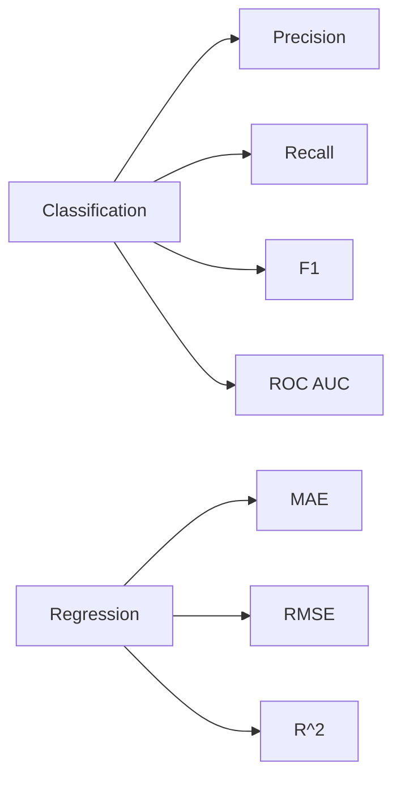

# 평가

> Data Science 101 시리즈 (8/10)

<!-- a-grade-intro:begin -->

**핵심 질문**: *정확도* 가 *높다* 는 게 *정말 좋은 모델* 일까요? *어떤 지표* 를 *언제* 써야 할까요?

> *지표를 고르는 일은 *문제를 정의하는 일* 과 같다.*

<!-- a-grade-intro:end -->

## 이 글에서 배울 것

- *정확도* 가 *속이는* 경우
- 분류: *Precision/Recall/F1/ROC AUC*
- 회귀: *MAE/RMSE/R²*
- 5단계 평가 실습
- 흔한 함정 5가지

## 왜 중요한가

지표가 *문제와 어긋나면* 모델은 *잘못된 방향* 으로 학습합니다. *비즈니스 비용* 을 *지표* 에 *반영* 해야 *결정* 이 *맞아 떨어집니다*.

> *지표는 *최적화 대상* 이며 *조심해서 골라야* 한다.*

## 개념 한눈에 보기



## 핵심 용어 정리

- **Confusion Matrix**: TP/FP/FN/TN 표.
- **Precision**: *예측이 양성* 일 때 *맞은 비율*.
- **Recall**: *실제 양성* 중 *잡아낸 비율*.
- **F1**: P와 R 의 *조화 평균*.
- **ROC AUC**: *임계값* 과 *무관* 한 *분리력*.

## Before/After

**Before**: 사기 탐지에서 *accuracy 99%* 로 만족. 하지만 *recall 5%* — *대부분 놓침*.

**After**: *recall* 을 주 지표로 삼고 *F1 / cost* 를 *부가* 로 본다.

## 실습: 5단계 평가

### 1단계 — Confusion matrix

```python
from sklearn.metrics import confusion_matrix
cm = confusion_matrix(y_test, y_pred)
print(cm)
```

### 2단계 — Precision/Recall/F1

```python
from sklearn.metrics import precision_score, recall_score, f1_score
print(precision_score(y_test, y_pred))
print(recall_score(y_test, y_pred))
print(f1_score(y_test, y_pred))
```

### 3단계 — ROC AUC

```python
from sklearn.metrics import roc_auc_score
proba = model.predict_proba(X_test)[:, 1]
print(roc_auc_score(y_test, proba))
```

### 4단계 — 회귀 지표

```python
from sklearn.metrics import mean_absolute_error, mean_squared_error, r2_score
import numpy as np

print("MAE :", mean_absolute_error(y_test, y_pred))
print("RMSE:", np.sqrt(mean_squared_error(y_test, y_pred)))
print("R^2 :", r2_score(y_test, y_pred))
```

### 5단계 — 비용 행렬 반영

```python
# False negative 가 false positive 보다 5배 비싸다
cost = 5 * cm[1, 0] + 1 * cm[0, 1]
print("expected cost:", cost)
```

## 이 코드에서 주목할 점

- *Confusion matrix* 가 *모든 분류 지표의 뿌리*.
- *Probability* 기반 지표 (ROC AUC) 는 *임계값 독립*.
- *비즈니스 비용* 을 *직접* 계산해 *지표* 로 둔다.

## 자주 하는 실수 5가지

1. ***accuracy* 만 본다.** 불균형에서 *기만적*.
2. ***단일 임계값* 만 본다.** *ROC* 를 함께 본다.
3. ***RMSE* 만 본다.** *이상치* 에 *지나치게 민감*.
4. ***test set* 에서 *임계값* 을 *튜닝*.** *데이터 누수*.
5. ***비용* 을 *지표* 에 *반영하지 않음*.** 결정과 *어긋남*.

## 실무에서는 이렇게 쓰입니다

데이터팀은 *주 지표* 와 *가드레일 지표* 를 *함께* 둡니다. 예: 주 = *recall*, 가드 = *precision >= 0.7*.

## 시니어 엔지니어는 이렇게 생각합니다

- *지표* 는 *문제와 함께* 정한다.
- *비용 행렬* 을 *명문화*.
- *주 지표* 와 *가드레일* 을 *분리*.
- *임계값* 은 *validation* 에서 결정.
- *지표 변경* 도 *PR 리뷰*.

## 체크리스트

- [ ] *Precision/Recall/F1* 의 차이를 안다.
- [ ] *ROC AUC* 의 의미를 안다.
- [ ] *MAE/RMSE/R²* 의 차이를 안다.
- [ ] *비용 행렬* 을 만들 수 있다.

## 연습 문제

1. *불균형 데이터* 에서 *accuracy 와 recall* 이 *어긋나는* 사례를 만들어 보세요.
2. *ROC 곡선* 을 그려 *임계값* 변화에 따른 *trade-off* 를 보세요.
3. *비용 행렬* 을 *지표* 로 만들어 *최적 임계값* 을 골라 보세요.

## 정리 및 다음 단계

평가는 *문제와 모델의 대화* 입니다. 다음 글에서는 결과를 *어떻게 해석* 해 *결정* 으로 옮길지 살펴봅니다.

<!-- toc:begin -->
- [Data Science란 무엇인가?](./01-what-is-data-science.md)
- [문제를 데이터 문제로 바꾸기](./02-problem-to-data-problem.md)
- [데이터 수집](./03-data-collection.md)
- [데이터 정제](./04-data-cleaning.md)
- [탐색적 데이터 분석](./05-exploratory-data-analysis.md)
- [시각화](./06-visualization.md)
- [모델링](./07-modeling.md)
- **평가 (현재 글)**
- 결과 해석 (예정)
- 데이터 프로젝트 전체 흐름 (예정)
<!-- toc:end -->

## 참고 자료

- [scikit-learn — Model Evaluation](https://scikit-learn.org/stable/modules/model_evaluation.html)
- [Google — Classification Metrics](https://developers.google.com/machine-learning/crash-course/classification)
- [Wikipedia — ROC AUC](https://en.wikipedia.org/wiki/Receiver_operating_characteristic)
- [Aurelien Geron — Hands-On ML](https://github.com/ageron/handson-ml3)
