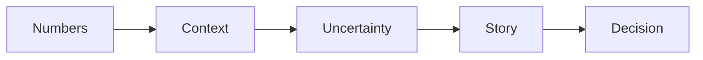

# 결과 해석

> Data Science 101 시리즈 (9/10)

<!-- a-grade-intro:begin -->

**핵심 질문**: 분석 결과를 *어떻게* *결정으로* 옮길까요? *결과를 부풀리지 않고* *과소평가하지 않는* 길은?

> *해석은 *숫자* 와 *맥락* 을 *겹치는* 일이다.*

<!-- a-grade-intro:end -->

## 이 글에서 배울 것

- *결과 → 결정* 5단계
- *불확실성* 을 *함께* 보고하는 법
- *인지 편향* 5가지
- 5단계 해석 실습
- 흔한 함정 5가지

## 왜 중요한가

해석이 *과장* 되면 *잘못된 결정* 을 부르고, *과소* 면 *기회* 를 놓칩니다. *불확실성* 을 *함께* 적는 것이 *신뢰* 의 시작입니다.

> *좋은 해석은 *단정하지 않으면서도 결정 가능* 하다.*

## 개념 한눈에 보기



## 핵심 용어 정리

- **Confidence Interval**: *추정값* 의 *불확실성 구간*.
- **Effect Size**: *차이의 크기* (단순 유의성보다 중요).
- **Practical Significance**: *비즈니스적으로 의미있는* 차이.
- **Cherry-picking**: 유리한 결과만 *고르는* 함정.
- **Survivorship Bias**: *살아남은 것* 만 보는 편향.

## Before/After

**Before**: *“정확도가 5% 올랐어요!”* — 어디서, 누구에게, 얼마나 자주?

**After**: *“유료 사용자 (60K) 대상, 7일 평균 정확도 89% → 91% (95% CI ±0.8%, n=14)”*.

## 실습: 5단계 해석

### 1단계 — 숫자 정확히 적기

```text
A/B test result: conversion 3.2% (control) vs 3.6% (variant)
n = 50,000 per arm
```

### 2단계 — 신뢰구간 함께

```text
delta = +0.4pp (95% CI: +0.2pp ~ +0.6pp)
```

### 3단계 — 효과 크기 평가

```text
relative lift = +12.5%
```

### 4단계 — 맥락 추가

```text
campaign window: 2 weeks; segment: paid users; device: desktop only
```

### 5단계 — 결정으로

```text
Decision: roll out to 100% paid desktop users; monitor for 2 more weeks.
```

## 이 코드에서 주목할 점

- *숫자* 와 *맥락* 은 *짝* 으로 적는다.
- *신뢰구간* 이 *결정의 위험* 을 *수치화*.
- *결정 문장* 으로 *닫는다*.

## 자주 하는 실수 5가지

1. ***p-value* 만 본다.** *효과 크기* 가 *작을* 수 있다.
2. ***단일 segment* 결과를 *전체* 로 일반화.** *분산* 무시.
3. ***긍정적인 결과만* 보고.** Cherry-picking.
4. ***불확실성* 을 *숨김*.** *과신* 의 결정.
5. ***결정 문장* 없이 *리포트 종료*.** 행동이 *없다*.

## 실무에서는 이렇게 쓰입니다

데이터팀의 *주간 리뷰* 는 *숫자 → 맥락 → 신뢰구간 → 결정* 의 *템플릿* 을 따릅니다. *Pre-registration* (사전 가설 등록) 으로 *cherry-picking* 을 막습니다.

## 시니어 엔지니어는 이렇게 생각합니다

- *불확실성* 을 *부끄러워* 하지 않는다.
- *결정* 으로 *반드시* 닫는다.
- *효과 크기* 를 *p-value* 보다 본다.
- *segment* 를 *분리* 해 *분산* 을 본다.
- *리뷰 템플릿* 을 *팀 자산* 으로.

## 체크리스트

- [ ] *신뢰구간* 을 적는다.
- [ ] *효과 크기* 를 본다.
- [ ] *segment* 를 *분리* 한다.
- [ ] *결정 문장* 을 적는다.

## 연습 문제

1. *과거 분석 한 개* 를 *5단계* 로 *재해석* 해 보세요.
2. *p-value 0.04, 효과 0.1%* 인 결과를 어떻게 보고할지 적어 보세요.
3. *Cherry-picking* 을 *방지* 할 *팀 규칙* 3가지를 적어 보세요.

## 정리 및 다음 단계

해석은 *분석을 결정* 으로 옮기는 *마지막 다리* 입니다. 다음 글에서는 *처음부터 끝까지* 한 *데이터 프로젝트* 의 *전체 흐름* 을 따라가 봅니다.

<!-- toc:begin -->
- [Data Science란 무엇인가?](./01-what-is-data-science.md)
- [문제를 데이터 문제로 바꾸기](./02-problem-to-data-problem.md)
- [데이터 수집](./03-data-collection.md)
- [데이터 정제](./04-data-cleaning.md)
- [탐색적 데이터 분석](./05-exploratory-data-analysis.md)
- [시각화](./06-visualization.md)
- [모델링](./07-modeling.md)
- [평가](./08-evaluation.md)
- **결과 해석 (현재 글)**
- 데이터 프로젝트 전체 흐름 (예정)
<!-- toc:end -->

## 참고 자료

- [Andrew Gelman — Statistical Modeling Blog](https://statmodeling.stat.columbia.edu/)
- [Kahneman — Thinking, Fast and Slow](https://us.macmillan.com/books/9780374533557/thinkingfastandslow)
- [Stitch Fix — A/B Testing Lessons](https://multithreaded.stitchfix.com/)
- [Microsoft — Trustworthy Online Experiments](https://exp-platform.com/)
