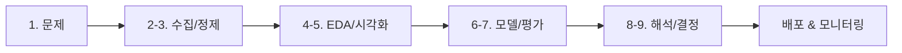

# 데이터 프로젝트 전체 흐름

> Data Science 101 시리즈 (10/10)

<!-- a-grade-intro:begin -->

**핵심 질문**: 지금까지 배운 *9단계* 를 *하나의 프로젝트* 로 *연결* 하면 어떤 모습일까요?

> *마지막 에피소드는 *조립* 의 시간이다.*

<!-- a-grade-intro:end -->

## 이 글에서 배울 것

- *이탈 예측* 프로젝트 *전체 흐름*
- 9단계가 *한 흐름* 으로 *연결* 되는 모습
- 각 단계의 *산출물* 과 *결정 포인트*
- 5단계 미니 프로젝트 실습
- 흔한 함정 5가지

## 왜 중요한가

부분만 보면 *조각* 이지만, 처음부터 끝까지 한 번 따라가면 *큰 그림* 이 보입니다. *조립* 을 한 번 해 본 사람은 *어떤 도메인* 에서도 *같은 흐름* 을 적용할 수 있습니다.

> *전체를 한 번 만들어 본 사람은 다음 프로젝트가 빠르다.*

## 개념 한눈에 보기



## 핵심 용어 정리

- **Churn Prediction**: *이탈 예측* — 어떤 사용자가 *서비스를 떠날지* 예측.
- **Baseline**: *비교 기준* 이 되는 *단순 모델*.
- **Feature**: 모델의 *입력 신호*.
- **Threshold**: 확률을 *결정* 으로 바꾸는 *기준값*.
- **Decision**: 분석을 *행동* 으로 닫는 *문장*.

## Before/After

**Before**: *“이탈이 늘고 있어요”* — 누가, 얼마나, 왜?

**After**: *“30일 내 이탈 위험 상위 10% 사용자 (3,200명) 에게 *재참여 캠페인* 을 보낸다 — 예상 이탈 감소 12% (95% CI ±3%)”*

## 실습: 5단계 미니 프로젝트

### 1단계 — 문제 정의

```text
Q: "이탈을 어떻게 줄일 수 있을까?"
→ "30일 내 이탈할 사용자 상위 10%를 예측해 캠페인 대상으로."
Decision: 캠페인 대상자 리스트
```

### 2단계 — 데이터와 정제

```python
import pandas as pd
df = pd.read_csv("events.csv", parse_dates=["ts"])
df = df.dropna(subset=["user_id"]).drop_duplicates(["user_id", "ts"])
```

### 3단계 — EDA & 피처

```python
features = (
    df.groupby("user_id")
      .agg(sessions=("ts", "count"),
           last_seen=("ts", "max"),
           plan=("plan", "last"))
)
features["days_since_last"] = (pd.Timestamp("2026-05-01") - features["last_seen"]).dt.days
```

### 4단계 — 모델 & 평가

```python
from sklearn.linear_model import LogisticRegression
from sklearn.metrics import roc_auc_score

X, y = features[["sessions", "days_since_last"]], features["churned_30d"]
model = LogisticRegression().fit(X, y)
print("AUC:", roc_auc_score(y, model.predict_proba(X)[:, 1]))
```

### 5단계 — 해석 & 결정

```text
Top 10% 위험군 = 3,200명
예상 이탈 감소 = 12% (95% CI ±3%)
Decision: 이번 주 금요일 재참여 캠페인 발송
Owner: Growth team / Review: 2주 후
```

## 이 코드에서 주목할 점

- *문제 → 결정* 까지 *한 흐름* 이 *닫힌다*.
- *Baseline (Logistic)* 에서 시작 — *복잡한 모델* 은 나중.
- *Decision 문장* 으로 *결과를 행동* 으로 옮긴다.

## 자주 하는 실수 5가지

1. ***도구* 부터 고른다.** *문제* 를 먼저.
2. ***예쁜 모델* 에 집착.** *Baseline* 을 *건너뛴다*.
3. ***평가 지표* 를 *프로젝트 끝* 에 정한다.** *시작* 에 정해야 *드리프트* 가 없다.
4. ***결정 오너* 가 *없다*.** 분석이 *서랍* 으로 사라진다.
5. ***모니터링* 을 *잊는다*.** 모델은 *시간* 과 함께 *낡는다*.

## 실무에서는 이렇게 쓰입니다

데이터팀은 *프로젝트 1쪽 문서* (문제, 지표, 데이터, 베이스라인, 결정 오너) 를 만들고 *2주 스프린트* 로 굴립니다. 모델은 *Airflow / dbt / MLflow* 같은 파이프라인으로 *재현 가능* 하게 묶고, *대시보드* 와 *알림* 으로 *드리프트* 를 봅니다.

## 시니어 엔지니어는 이렇게 생각합니다

- *문제 → 결정* 의 *짧은 루프* 를 만든다.
- *Baseline* 을 *존중* 한다.
- *Owner* 를 *반드시* 적는다.
- *모니터링* 을 *Day 1* 부터 설계한다.
- *재현 가능성* 을 *코드* 로 보장한다.

## 체크리스트

- [ ] *문제 한 줄* 을 적는다.
- [ ] *Baseline* 을 *돌린다*.
- [ ] *Decision 문장* 을 *닫는다*.
- [ ] *Owner* 와 *리뷰 일자* 를 적는다.

## 연습 문제

1. *주변 서비스* 하나로 *5단계* 미니 프로젝트를 *기획* 해 보세요.
2. 위 churn 예시에서 *Baseline* 보다 더 좋은 *피처* 3개를 제안하세요.
3. *모델 드리프트* 를 *2가지 지표* 로 정의해 보세요.

## 정리 및 다음 단계

이 시리즈는 *문제 → 데이터 → 모델 → 결정* 의 *한 흐름* 을 *조립* 하는 여정이었습니다. 다음 단계로 *Statistics 101*, *Machine Learning 101*, *MLOps 101* 시리즈에서 *각 단계를 더 깊이* 다룹니다.

<!-- toc:begin -->
- [Data Science란 무엇인가?](./01-what-is-data-science.md)
- [문제를 데이터 문제로 바꾸기](./02-problem-to-data-problem.md)
- [데이터 수집](./03-data-collection.md)
- [데이터 정제](./04-data-cleaning.md)
- [탐색적 데이터 분석](./05-exploratory-data-analysis.md)
- [시각화](./06-visualization.md)
- [모델링](./07-modeling.md)
- [평가](./08-evaluation.md)
- [결과 해석](./09-result-interpretation.md)
- **데이터 프로젝트 전체 흐름 (현재 글)**
<!-- toc:end -->

## 참고 자료

- [Google — People + AI Research Guidebook](https://pair.withgoogle.com/guidebook/)
- [scikit-learn — Common Pitfalls and Recommended Practices](https://scikit-learn.org/stable/common_pitfalls.html)
- [Made With ML — End-to-End ML Course](https://madewithml.com/)
- [Full Stack Deep Learning](https://fullstackdeeplearning.com/)
