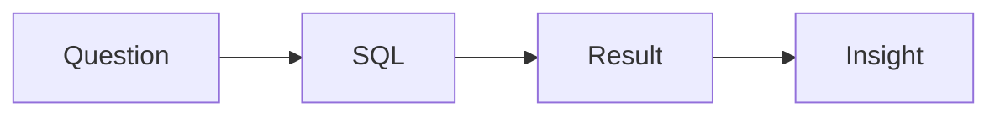

# SQL과 분석 인터뷰

> Data Science Career 101 시리즈 (5/10)

<!-- a-grade-intro:begin -->

**핵심 질문**: *SQL* 과 *분석* *인터뷰* 는 *어떻게* *준비* *하나요*?

> *질문 분해*, *조인*, *집계*, *윈도우*, *해석*.

<!-- a-grade-intro:end -->

## 이 글에서 배울 것

- *SQL* *핵심* 패턴
- *분석* *질문* 분해
- *지표* *정의*
- *결과* *해석*
- *모의* *연습*

## 왜 중요한가

*SQL* 은 *모든* *데이터* *직무* 의 *공통어* 입니다.

## 개념 한눈에 보기



## 핵심 용어 정리

- **JOIN**: *결합*.
- **GROUP BY**: *집계*.
- **window function**: *윈도우 함수*.
- **CTE**: *공통 테이블 식*.
- **funnel**: *깔때기* 분석.

## Before/After

**Before**: "*SELECT *** 만 *쓴다*."

**After**: "*문제* 를 *분해* *하고* *CTE* 로 *읽기 쉽게* *적는다*."

## 실습: 5문제 패턴

### 1단계 — 단일 테이블 집계

```sql
SELECT date, COUNT(*) AS dau
FROM events
WHERE event = 'login'
GROUP BY date
ORDER BY date;
```

### 2단계 — JOIN

```sql
SELECT u.country, COUNT(o.id) AS orders
FROM users u
LEFT JOIN orders o ON o.user_id = u.id
GROUP BY u.country;
```

### 3단계 — 윈도우 함수

```sql
SELECT user_id, amount,
       SUM(amount) OVER (PARTITION BY user_id ORDER BY ts) AS cum
FROM payments;
```

### 4단계 — 깔때기

```sql
WITH steps AS (
  SELECT user_id,
         MAX(CASE WHEN step='visit' THEN 1 ELSE 0 END) AS s1,
         MAX(CASE WHEN step='signup' THEN 1 ELSE 0 END) AS s2,
         MAX(CASE WHEN step='purchase' THEN 1 ELSE 0 END) AS s3
  FROM funnel GROUP BY user_id
)
SELECT SUM(s1), SUM(s2), SUM(s3) FROM steps;
```

### 5단계 — 해석 한 문장

```text
"전환율은 X에서 Y로 떨어졌고, 가설은 Z."
```

## 이 코드에서 주목할 점

- *CTE* 가 *가독성* 을 *높입니다*.
- *지표* *정의* 가 *결론* 을 *바꿉니다*.
- *해석* 이 *마무리* 입니다.

## 자주 하는 실수 5가지

1. ***SELECT *** 남발.**
2. ***NULL* 처리 *누락*.**
3. ***시간대* 무시.**
4. ***지표* *정의* 가 *모호*.**
5. ***해석* 이 *없다*.**

## 실무에서는 이렇게 쓰입니다

기업 분석 인터뷰는 *SQL 1문제 + 분석 케이스 1건* 이 일반적입니다.

## 시니어 엔지니어는 이렇게 생각합니다

- *지표* *정의* 가 *먼저*.
- *CTE* 가 *동료 친화적*.
- *해석* 이 *가치*.
- *NULL* 을 *기억*.
- *시간대* 를 *명시*.

## 체크리스트

- [ ] *JOIN* 4종.
- [ ] *윈도우* 3종.
- [ ] *깔때기* 1건.
- [ ] *해석* 한 문장.

## 연습 문제

1. *CTE* 한 줄 정의.
2. *funnel* *예* 한 줄.
3. *지표 정의* 의 *기준* 한 줄.

## 정리 및 다음 단계

다음 글은 *ML 인터뷰* 입니다.

<!-- toc:begin -->
- [데이터 직무란 무엇인가](./01-what-is-data-career.md)
- [분석가 vs 사이언티스트 vs 엔지니어](./02-analyst-scientist-engineer.md)
- [학습 경로 설계](./03-learning-path.md)
- [데이터 포트폴리오](./04-data-portfolio.md)
- **SQL과 분석 인터뷰 (현재 글)**
- ML 인터뷰 (예정)
- 케이스 인터뷰 (예정)
- 첫 직장 적응 (예정)
- 도메인 전문성 쌓기 (예정)
- 시니어 데이터 직무로 가는 길 (예정)
<!-- toc:end -->

## 참고 자료

- [Mode SQL Tutorial](https://mode.com/sql-tutorial/)
- [LeetCode SQL](https://leetcode.com/studyplan/top-sql-50/)
- [Window Functions](https://www.postgresql.org/docs/current/tutorial-window.html)
- [Trustworthy Online Controlled Experiments](https://experimentguide.com/)
