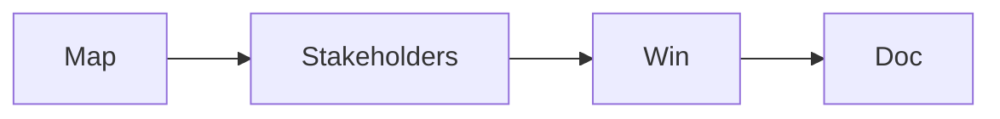

# 첫 직장 적응

> Data Science Career 101 시리즈 (8/10)

<!-- a-grade-intro:begin -->

**핵심 질문**: *첫 90일* 을 *어떻게* *보내야* *하나요*?

> *데이터*, *사람*, *지표*, *작은 승리*, *문서*.

<!-- a-grade-intro:end -->

## 이 글에서 배울 것

- *온보딩 30/60/90*
- *데이터 지도* 그리기
- *이해관계자* 파악
- *작은 승리* 만들기
- *문서* 습관

## 왜 중요한가

*첫 90일* 의 *행동* 이 *평판* 의 *씨앗* 입니다.

## 개념 한눈에 보기



## 핵심 용어 정리

- **data map**: *데이터 지도*.
- **stakeholder**: *이해관계자*.
- **quick win**: *빠른 성과*.
- **postmortem**: *사후 회고*.
- **decision log**: *결정 기록*.

## Before/After

**Before**: "*티켓* 만 *받아* *처리*."

**After**: "*지도*, *지표*, *문서* 가 *남는다*."

## 실습: 90일 계획

### 1단계 — 0~30일: 듣기

```text
- 1:1 10건
- 데이터 카탈로그 정리
- 핵심 대시보드 5개 학습
```

### 2단계 — 31~60일: 작은 승리

```text
- 1개 분석 또는 모델 미니 PoC
- 1개 SQL 효율화
```

### 3단계 — 61~90일: 의제 제안

```text
- 분기 의제 1개 제안
- 측정 계획 포함
```

### 4단계 — 데이터 지도

```markdown
| Source | Owner | Freshness | Use |
```

### 5단계 — 결정 기록

```text
- 결정 / 대안 / 근거 / 영향
```

## 이 코드에서 주목할 점

- *듣기* 가 *영향력* 의 *기초*.
- *작은 승리* 가 *신뢰*.
- *문서* 가 *복리*.

## 자주 하는 실수 5가지

1. ***즉시* *큰* *제안*.**
2. ***이해관계자* 무시.**
3. ***데이터* 출처 *모른다*.**
4. ***대시보드* 만 *고친다*.**
5. ***문서* 가 *없다*.**

## 실무에서는 이렇게 쓰입니다

매니저는 90일 *체크인* 으로 *적응 정도* 를 *확인* 합니다.

## 시니어 엔지니어는 이렇게 생각합니다

- *듣기* 가 *전략*.
- *지도* 가 *자산*.
- *작은 승리* 가 *증명*.
- *결정 기록* 이 *문화*.
- *겸손* 이 *자라는* *길*.

## 체크리스트

- [ ] 1:1 10건.
- [ ] *데이터 지도* 1장.
- [ ] *작은 승리* 1건.
- [ ] *결정 기록* 양식.

## 연습 문제

1. *quick win* 한 줄 정의.
2. *stakeholder* *예* 한 줄.
3. *결정 기록* *기준* 한 줄.

## 정리 및 다음 단계

다음 글은 *도메인 전문성 쌓기* 입니다.

<!-- toc:begin -->
- [데이터 직무란 무엇인가](./01-what-is-data-career.md)
- [분석가 vs 사이언티스트 vs 엔지니어](./02-analyst-scientist-engineer.md)
- [학습 경로 설계](./03-learning-path.md)
- [데이터 포트폴리오](./04-data-portfolio.md)
- [SQL과 분석 인터뷰](./05-sql-and-analytics-interview.md)
- [ML 인터뷰](./06-ml-interview.md)
- [케이스 인터뷰](./07-case-interview.md)
- **첫 직장 적응 (현재 글)**
- 도메인 전문성 쌓기 (예정)
- 시니어 데이터 직무로 가는 길 (예정)
<!-- toc:end -->

## 참고 자료

- [The First 90 Days](https://hbr.org/books/watkins)
- [The Manager's Path](https://www.oreilly.com/library/view/the-managers-path/9781491973882/)
- [DAMA Data Management](https://www.dama.org/)
- [DACI decision framework](https://www.atlassian.com/team-playbook/plays/daci)
