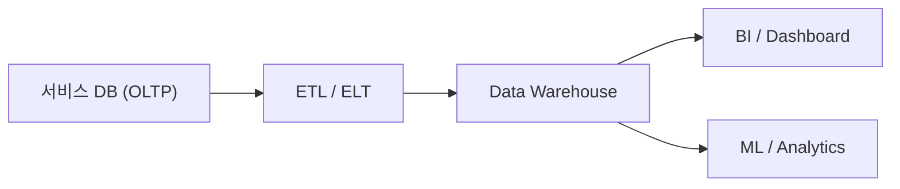

# Data Warehouse란 무엇인가?

> Data Warehouse 101 시리즈 (1/10)

<!-- a-grade-intro:begin -->

**핵심 질문**: *서비스 DB* 만으로는 *왜 분석이 안 될까요*? *분석 전용 저장소* 는 무엇이 다를까요?

> *Data Warehouse 는 *답을 빨리 내기 위한* 저장소다.*

<!-- a-grade-intro:end -->

## 이 글에서 배울 것

- *Data Warehouse* 의 정의와 *목적*
- *서비스 DB* 와의 차이
- *분석 전용 저장소* 가 필요한 이유
- 첫 분석 쿼리 5단계
- 흔한 함정 5가지

## 왜 중요한가

서비스가 커지면 *주문 한 건* 을 처리하는 DB 와 *어제 매출 합계* 를 묻는 DB 의 *요구가 갈라집니다*. 같은 테이블에서 두 가지를 동시에 하면 *서비스가 느려지고 분석도 느려집니다*. *분리* 가 *답* 입니다.

> *분석은 분석대로, 운영은 운영대로 — 길을 나눠야 한다.*

## 개념 한눈에 보기



## 핵심 용어 정리

- **OLTP**: *Online Transaction Processing*. 주문, 결제 같은 *짧은 트랜잭션*.
- **OLAP**: *Online Analytical Processing*. *큰 범위* 의 *집계 분석*.
- **Data Warehouse**: 여러 소스의 *분석용 데이터* 를 모아 둔 *중앙 저장소*.
- **ETL / ELT**: 원본 데이터를 *추출, 변환, 적재* 하는 파이프라인.
- **BI**: *Business Intelligence*. 데이터로 *의사결정* 을 돕는 도구.

## Before/After

**Before**: 서비스 DB 에서 *6개월 매출* 을 집계하려다 *프로덕션이 느려진다*.

**After**: Warehouse 한 번 적재 후 *수십 초* 안에 *원하는 단면* 을 뽑는다.

## 실습: 첫 분석 쿼리 5단계

### 1단계 — 사실 테이블 만들기

```sql
CREATE TABLE fact_orders (
    order_id BIGINT,
    user_id BIGINT,
    amount NUMERIC(12, 2),
    order_date DATE
);
```

### 2단계 — 데이터 적재

```sql
INSERT INTO fact_orders VALUES
    (1, 100, 25000, '2026-01-15'),
    (2, 100, 18000, '2026-02-03'),
    (3, 200, 42000, '2026-02-10');
```

### 3단계 — 월별 매출

```sql
SELECT date_trunc('month', order_date) AS month,
       SUM(amount) AS revenue
FROM fact_orders
GROUP BY 1
ORDER BY 1;
```

### 4단계 — 사용자별 합계

```sql
SELECT user_id, SUM(amount) AS total
FROM fact_orders
GROUP BY user_id;
```

### 5단계 — 상위 고객

```sql
SELECT user_id, SUM(amount) AS total
FROM fact_orders
GROUP BY user_id
ORDER BY total DESC
LIMIT 10;
```

## 이 코드에서 주목할 점

- *집계* 가 *기본 단위* 다. 한 줄을 보지 않는다.
- *날짜* 는 *분석의 축* 이다. 항상 *기준 컬럼* 으로 둔다.
- *원본* 을 건드리지 않고 *복사본* 을 분석한다.

## 자주 하는 실수 5가지

1. **서비스 DB 에서 *바로* 분석 쿼리 돌린다.** *프로덕션 장애* 의 *흔한 원인*.
2. **모든 테이블을 *그대로* 복사.** Warehouse 는 *목적에 맞게 재설계* 한다.
3. **시간 컬럼 *없이* 적재.** 나중에 *시계열 분석* 이 안 된다.
4. **변환을 *적재 전에 끝내려* 한다.** 일단 *원본을 보존* 하고 변환은 *Warehouse 안* 에서.
5. **Warehouse 를 *실시간* 으로 만들려 한다.** *분 단위 신선도* 면 충분한 경우가 많다.

## 실무에서는 이렇게 쓰입니다

스타트업에서는 *Postgres* 한 대를 *replica* 로 두고 시작하기도 합니다. 규모가 커지면 *BigQuery, Snowflake, Redshift* 같은 *전용 엔진* 으로 옮깁니다. *대시보드, 리포트, ML feature 추출* 모두 Warehouse 를 *시작점* 으로 합니다.

## 시니어 엔지니어는 이렇게 생각합니다

- *분석 워크로드는 *서비스와 분리* 한다.*
- *원본을 보존* 한다. 변환은 *재실행 가능* 해야 한다.
- *날짜* 와 *식별자* 는 *모든 사실의 축* 이다.
- *Schema 변경 비용* 을 *적재 시점* 에 미리 본다.
- *Warehouse 비용* 은 *쿼리 패턴* 으로 결정된다.

## 체크리스트

- [ ] *OLTP* 와 *OLAP* 의 차이를 안다.
- [ ] *분리가 왜 필요한지* 설명할 수 있다.
- [ ] *ETL / ELT* 의 단계를 말할 수 있다.
- [ ] *Warehouse* 의 *기준 컬럼* 을 안다.

## 연습 문제

1. *서비스 DB* 와 *Warehouse* 의 차이를 *세 줄* 로 정리해 보세요.
2. *어제 매출* 을 구하는 쿼리를 작성해 보세요.
3. *Warehouse* 가 *없는* 회사의 *불편* 을 세 가지 적어 보세요.

## 정리 및 다음 단계

Warehouse 는 *분석을 위한 별도 저장소* 입니다. 다음 글에서는 *OLTP* 와 *OLAP* 의 차이를 더 자세히 봅니다.

<!-- toc:begin -->
- **Data Warehouse란 무엇인가? (현재 글)**
- OLTP와 OLAP (예정)
- Fact와 Dimension (예정)
- Star Schema (예정)
- Partition과 Clustering (예정)
- ETL과 ELT (예정)
- BI와 Dashboard (예정)
- Data Mart (예정)
- 성능 최적화 (예정)
- Warehouse 설계 예제 (예정)
<!-- toc:end -->

## 참고 자료

- [Kimball Group — Data Warehouse Concepts](https://www.kimballgroup.com/data-warehouse-business-intelligence-resources/)
- [BigQuery — What Is a Data Warehouse?](https://cloud.google.com/learn/what-is-a-data-warehouse)
- [Snowflake — Data Warehouse Guide](https://www.snowflake.com/guides/what-data-warehouse/)
- [AWS — Data Warehouse Concepts](https://aws.amazon.com/data-warehouse/)
