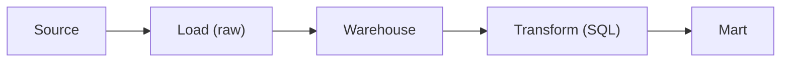

# ETL과 ELT

> Data Warehouse 101 시리즈 (6/10)

<!-- a-grade-intro:begin -->

**핵심 질문**: *변환* 을 *적재 전에* 할까요, *후에* 할까요? 답은 *Warehouse 의 힘* 이 *어떻게 변했는지* 에 달려 있습니다.

> *예전엔 *전처리 후 적재* 였다. 지금은 *적재 후 SQL 변환* 이다.*

<!-- a-grade-intro:end -->

## 이 글에서 배울 것

- *ETL* 과 *ELT* 의 차이
- 변환을 *어디서* 하는 게 좋은지
- 현대 Warehouse 가 *ELT* 로 기우는 이유
- 5단계 파이프라인 실습
- 흔한 함정 5가지

## 왜 중요한가

Warehouse 의 *컴퓨팅 비용* 이 싸지면서 *원본을 그대로 적재* 하고 *SQL 로 변환* 하는 방식이 *기본* 이 됐습니다. 변환 코드가 *SQL* 로 *버전 관리* 되고, *재실행이 쉽고*, *디버깅* 이 *수월합니다*.

> *변환을 SQL 안으로 끌어들여라. 가시성과 재현성이 같이 따라온다.*

## 개념 한눈에 보기



## 핵심 용어 정리

- **ETL**: Extract → Transform → Load. 변환을 *적재 전* 에.
- **ELT**: Extract → Load → Transform. 변환을 *적재 후* 에.
- **Staging**: 원본을 *그대로 보존* 하는 *첫 레이어*.
- **dbt**: SQL 기반 *변환 도구* — 모델을 *테스트와 함께* 관리.
- **Idempotent**: 여러 번 실행해도 *결과가 같다*.

## Before/After

**Before**: ETL 도중 *변환 실패* 로 *재처리가 복잡*. 원본은 *이미 사라졌다*.

**After**: 원본을 *staging* 에 보존하고 *SQL 변환* 만 다시 돌린다. *재실행 30분*.

## 실습: 파이프라인 5단계

### 1단계 — 원본 적재

```sql
COPY raw.orders
FROM 's3://bucket/orders/2026-05-04/'
FORMAT AS PARQUET;
```

### 2단계 — Staging 모델

```sql
CREATE OR REPLACE TABLE staging.orders AS
SELECT
    order_id::BIGINT AS order_id,
    user_id::BIGINT AS user_id,
    amount::NUMERIC(12, 2) AS amount,
    created_at::TIMESTAMP AS created_at
FROM raw.orders;
```

### 3단계 — 변환 모델

```sql
CREATE OR REPLACE TABLE marts.fact_orders AS
SELECT
    order_id,
    user_id,
    amount,
    DATE(created_at) AS order_date
FROM staging.orders
WHERE amount > 0;
```

### 4단계 — 테스트

```sql
-- 음수 금액이 없어야 한다
SELECT COUNT(*) AS bad
FROM marts.fact_orders
WHERE amount <= 0;
```

### 5단계 — 재실행

```sql
-- 원본은 그대로, 변환만 다시
TRUNCATE marts.fact_orders;
INSERT INTO marts.fact_orders SELECT ...;
```

## 이 코드에서 주목할 점

- *원본 → staging → mart* 3단 구조.
- 변환은 *SQL 한 파일* 에 모인다.
- 재실행이 *idempotent* 하다.

## 자주 하는 실수 5가지

1. **원본을 *덮어쓰기* 한다.** *과거 시점 재현* 이 *불가능*.
2. **변환을 *Python 함수* 안에 숨긴다.** *가시성* 이 *떨어지고 디버깅 어려움*.
3. **테스트 *없이* 적재.** 잘못된 데이터가 *대시보드에 노출*.
4. **재실행이 *결과를 바꾼다*.** Idempotent 하지 않으면 *신뢰가 깨진다*.
5. **모든 변환을 *한 모델* 에 넣는다.** *작은 모델* 로 *나누는* 것이 *유지보수에 유리*.

## 실무에서는 이렇게 쓰입니다

*Fivetran/Airbyte* 로 적재, *dbt* 로 변환, *Airflow/Dagster* 로 스케줄 — 이 조합이 *현재의 표준* 입니다. 변환은 *SQL 모델* 로 *Git* 에 올라갑니다.

## 시니어 엔지니어는 이렇게 생각합니다

- *원본을 *법률 기록처럼* 보존한다.*
- *변환은 *SQL 한 파일* 에 모은다.*
- *모든 모델은 *테스트* 와 함께 산다.*
- *Idempotency* 는 *재현 가능성* 의 다른 이름.
- *Pipeline 도 *버전 관리* 한다.*

## 체크리스트

- [ ] *ETL* 과 *ELT* 의 차이를 안다.
- [ ] *Staging* 의 역할을 안다.
- [ ] *Idempotent* 의 의미를 안다.
- [ ] 변환에 *테스트* 를 붙일 수 있다.

## 연습 문제

1. *ETL* 이 *더 나은 경우* 를 적어 보세요.
2. *Staging 없는* 파이프라인의 위험을 *3가지* 적어 보세요.
3. *Idempotent* 하지 않은 변환 예시를 적어 보세요.

## 정리 및 다음 단계

ELT 는 *SQL 의 시대* 가 만든 모양입니다. 다음 글에서는 변환된 데이터를 *사람에게 보여주는* 방법 — *BI 와 대시보드* 를 봅니다.

<!-- toc:begin -->
- [Data Warehouse란 무엇인가?](./01-what-is-data-warehouse.md)
- [OLTP와 OLAP](./02-oltp-and-olap.md)
- [Fact와 Dimension](./03-fact-and-dimension.md)
- [Star Schema](./04-star-schema.md)
- [Partition과 Clustering](./05-partition-and-clustering.md)
- **ETL과 ELT (현재 글)**
- BI와 Dashboard (예정)
- Data Mart (예정)
- 성능 최적화 (예정)
- Warehouse 설계 예제 (예정)
<!-- toc:end -->

## 참고 자료

- [dbt — What Is dbt?](https://docs.getdbt.com/docs/introduction)
- [Fivetran — ELT vs ETL](https://www.fivetran.com/blog/elt-vs-etl)
- [Airbyte — Modern Data Stack](https://airbyte.com/blog/modern-data-stack)
- [Designing Data-Intensive Applications](https://dataintensive.net/)
