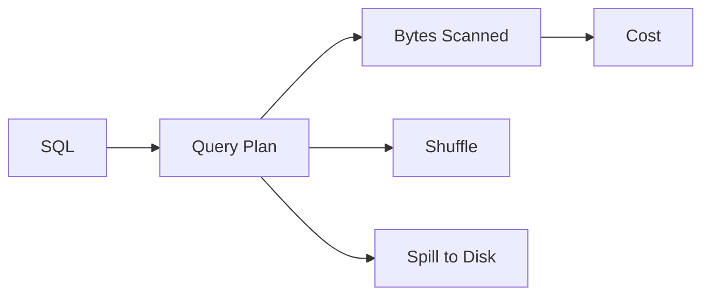

# 성능 최적화

> Data Warehouse 101 시리즈 (9/10)


## 이 글에서 다룰 문제

Warehouse 는 *읽은 만큼* 돈을 받습니다. *동일한 답* 을 *더 적은 바이트* 로 얻으면 *비용도 시간도* 같이 줄어듭니다. *플랜 을 읽는* 습관이 *최적화의 시작* 입니다.

> *측정 없는 최적화는 *짐작* 이다. 플랜을 먼저 본다.*

## 전체 흐름


## Before/After

**Before**: `SELECT *` 로 *전체 컬럼* 을 읽어 *수십 GB* 스캔. 비용 *$5*.

**After**: 필요한 *4개 컬럼* 만 읽어 *수백 MB* 스캔. 비용 *$0.05*.

## 최적화 5단계

### 1단계 — 컬럼 좁히기

```sql
-- Before
SELECT * FROM fact_orders WHERE order_date = '2026-05-04';

-- After
SELECT order_id, user_key, amount
FROM fact_orders
WHERE order_date = '2026-05-04';
```

### 2단계 — Partition pruning 보장

```sql
-- 함수 없이 직접 비교
WHERE order_date BETWEEN '2026-05-01' AND '2026-05-31'
```

### 3단계 — 사전 집계 사용

```sql
CREATE MATERIALIZED VIEW mv_daily_revenue AS
SELECT order_date, SUM(amount) AS revenue
FROM fact_orders
GROUP BY order_date;
```

### 4단계 — Approximate aggregate

```sql
-- 정확도 99% 면 충분한 경우
SELECT APPROX_COUNT_DISTINCT(user_key) AS active_users
FROM fact_orders
WHERE order_date >= CURRENT_DATE - 30;
```

### 5단계 — 큰 조인은 *작은 쪽 broadcast*

```sql
-- BigQuery 힌트 예시 (개념)
SELECT /*+ BROADCAST(d) */ f.amount, d.country
FROM fact_orders f
JOIN dim_user d ON d.user_key = f.user_key;
```

## 이 코드에서 주목할 점

- *컬럼* 을 좁히는 게 *가장 큰 절약*.
- *Partition pruning* 이 깨지지 않도록 한다.
- 자주 쓰는 결과는 *미리 계산*.

## 자주 하는 실수 5가지

1. **`SELECT *` 를 *습관처럼* 쓴다.** *비용이 컬럼 수에 비례*.
2. ***함수* 를 *partition key* 에 씌운다.** Pruning 깨짐.
3. ***COUNT(DISTINCT)* 를 *대규모로* 사용.** *Approximate* 로 충분한 경우 많음.
4. ***Materialized view* 를 *갱신* 하지 않는다.** *오래된 답* 이 *대시보드에* 실린다.
5. ***인덱스* 에 의존.** Warehouse 는 *partition + clustering* 의 세상.

## 실무에서는 이렇게 쓰입니다

분석가는 *쿼리 플랜* 을 매일 봅니다. *비용 알람* 은 일정 임계값을 넘으면 *Slack* 에 옵니다. *반복되는 무거운 쿼리* 는 *materialized view* 로 *cache* 합니다.

## 체크리스트

- [ ] *쿼리 플랜* 을 읽을 수 있다.
- [ ] *Bytes scanned* 의 의미를 안다.
- [ ] *Materialized view* 의 trade-off 를 안다.
- [ ] *Approximate aggregate* 의 사용처를 안다.

## 정리 및 다음 단계

성능은 *측정에서 시작* 합니다. 다음 글에서는 *처음부터 끝까지* Warehouse 를 설계하는 *예제* 를 살펴봅니다.

<!-- toc:begin -->
- [Data Warehouse란 무엇인가?](./01-what-is-data-warehouse.md)
- [OLTP와 OLAP](./02-oltp-and-olap.md)
- [Fact와 Dimension](./03-fact-and-dimension.md)
- [Star Schema](./04-star-schema.md)
- [Partition과 Clustering](./05-partition-and-clustering.md)
- [ETL과 ELT](./06-etl-and-elt.md)
- [BI와 Dashboard](./07-bi-and-dashboard.md)
- [Data Mart](./08-data-mart.md)
- **성능 최적화 (현재 글)**
- Warehouse 설계 예제 (예정)
<!-- toc:end -->

## 참고 자료

- [BigQuery — Optimize Query Performance](https://cloud.google.com/bigquery/docs/best-practices-performance-overview)
- [Snowflake — Query Performance](https://docs.snowflake.com/en/user-guide/performance-query)
- [Use The Index, Luke](https://use-the-index-luke.com/)
- [Redshift — Query Tuning](https://docs.aws.amazon.com/redshift/latest/dg/c-query-performance.html)
