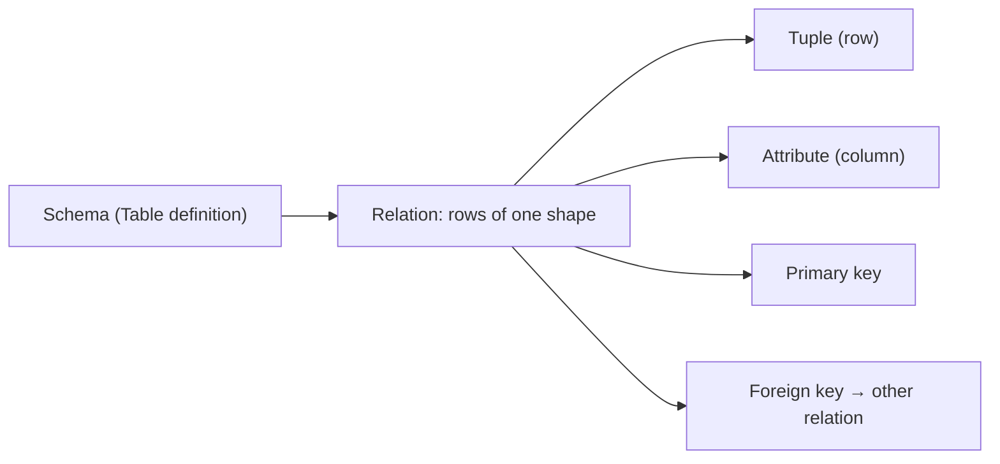

# 관계형 모델

> Database Systems 101 시리즈 (2/10)


## 이 글에서 다룰 문제

"테이블"과 "관계"를 같은 뜻으로 흐릿하게 쓰면, 정규화·인덱스·트랜잭션 같은 후속 주제가 모두 어딘가 어색해집니다. 모델을 한 번 정확히 잡고 가면 SQL은 그저 그 모델을 다루는 언어일 뿐이라는 사실이 보입니다.

> SQL은 절차형 언어가 아니라, 관계 위에 정의된 **연산**의 묶음입니다. 그래서 "어떻게"가 아니라 "무엇을"이라고 적습니다.

## 전체 흐름


테이블 한 개 = 관계 한 개. 그 안의 한 행 = 튜플. 한 칸 = 속성값. 키는 행을 유일하게 가리키는 속성(또는 속성 묶음)입니다.

## Before/After

**Before — 한 테이블에 다 욱여넣기**

```sql
CREATE TABLE orders (
    id        INTEGER PRIMARY KEY,
    user_name TEXT,
    user_email TEXT,
    product   TEXT,
    price     INTEGER
);
```

같은 사용자가 두 번 주문하면 이메일이 두 번 적힙니다. 한 사용자가 이메일을 바꾸면 모든 주문 행을 갱신해야 합니다. "한 사실은 한 곳에"라는 약속이 깨졌습니다.

**After — 관계로 분리**

```sql
CREATE TABLE users (
    id    INTEGER PRIMARY KEY,
    name  TEXT NOT NULL,
    email TEXT NOT NULL UNIQUE
);

CREATE TABLE orders (
    id      INTEGER PRIMARY KEY,
    user_id INTEGER NOT NULL REFERENCES users(id),
    product TEXT    NOT NULL,
    price   INTEGER NOT NULL CHECK (price >= 0)
);
```

사용자 한 명은 `users`에 한 번. 주문은 그 사용자를 외래키로 가리킵니다. 이메일을 바꾸려면 `users` 한 행만 갱신합니다.

## 관계형 모델로 작은 주문 시스템 만들기

### 1단계 — 두 테이블 정의

```python
# init.py
import sqlite3

DDL = """
PRAGMA foreign_keys = ON;

CREATE TABLE IF NOT EXISTS users (
    id    INTEGER PRIMARY KEY,
    name  TEXT NOT NULL,
    email TEXT NOT NULL UNIQUE
);

CREATE TABLE IF NOT EXISTS orders (
    id      INTEGER PRIMARY KEY,
    user_id INTEGER NOT NULL REFERENCES users(id),
    product TEXT    NOT NULL,
    price   INTEGER NOT NULL CHECK (price >= 0)
);
"""

with sqlite3.connect("shop.db") as db:
    db.executescript(DDL)
```

`PRAGMA foreign_keys = ON`을 잊지 마세요. SQLite는 기본이 꺼져 있습니다.

### 2단계 — 키 보장 직접 시험

```python
# keys.py
import sqlite3

with sqlite3.connect("shop.db") as db:
    db.execute("PRAGMA foreign_keys = ON")
    db.execute("INSERT INTO users (name, email) VALUES ('A', 'a@example.com')")
    try:
        db.execute("INSERT INTO users (name, email) VALUES ('B', 'a@example.com')")
    except sqlite3.IntegrityError as e:
        print("UNIQUE 위반:", e)
```

데이터베이스가 응용 코드보다 먼저 막아 줍니다.

### 3단계 — 외래키 무결성 시험

```python
# fk.py
import sqlite3

with sqlite3.connect("shop.db") as db:
    db.execute("PRAGMA foreign_keys = ON")
    try:
        db.execute(
            "INSERT INTO orders (user_id, product, price) VALUES (?, ?, ?)",
            (999, "milk", 3200),
        )
    except sqlite3.IntegrityError as e:
        print("FK 위반:", e)
```

존재하지 않는 사용자를 가리키는 주문은 들어오지 못합니다.

### 4단계 — 두 관계를 합치는 쿼리

```python
import sqlite3

with sqlite3.connect("shop.db") as db:
    rows = db.execute("""
        SELECT u.name, o.product, o.price
        FROM orders o
        JOIN users u ON u.id = o.user_id
        ORDER BY o.id
    """).fetchall()
    for r in rows:
        print(r)
```

응용은 "두 관계를 어떻게 합쳐 답을 만들지"만 적습니다. 인덱스 사용·조인 알고리즘 선택은 옵티마이저의 일입니다.

### 5단계 — 무결성 깨뜨리기 시도

```python
import sqlite3

with sqlite3.connect("shop.db") as db:
    db.execute("PRAGMA foreign_keys = ON")
    try:
        db.execute("DELETE FROM users WHERE email = 'a@example.com'")
    except sqlite3.IntegrityError as e:
        print("주문이 가리키고 있어 삭제 거부:", e)
```

참조 무결성이 데이터를 지킵니다. 응용 버그가 데이터를 망치는 1차 방어선입니다.

## 이 코드에서 주목할 점

- 모델의 핵심은 "한 사실은 한 곳에"입니다. 사용자 이메일은 `users`에만 있습니다.
- 키와 제약은 응용보다 빠르게 잘못된 데이터를 거절합니다.
- JOIN은 두 관계를 키로 합쳐 새 관계를 만드는 연산입니다.
- 옵티마이저는 같은 결과를 더 빠르게 만들 수 있는 자유를 갖습니다. 그래서 "어떻게"가 아니라 "무엇을"입니다.

## 자주 하는 실수 5가지

1. **외래키를 끄고 산다.** 잠깐의 편의 때문에 6개월 뒤 dangling reference로 새벽에 호출됩니다.
2. **모든 컬럼에 NULL을 허용한다.** "혹시 모르니"가 모이면 의미가 흐릿해지고 쿼리가 복잡해집니다. NULL은 의도여야 합니다.
3. **자연키를 기본키로 쓴다.** 이메일·전화번호는 바뀝니다. 변하지 않는 surrogate key(예: `INTEGER`)가 보통 더 안전합니다.
4. **이름과 코드 같은 "표시용" 데이터를 두 테이블에 중복 저장한다.** 한쪽만 바뀌는 순간 진실이 둘이 됩니다.
5. **JOIN을 무서워해 데이터를 응용에서 합친다.** N+1 쿼리가 되고, 옵티마이저의 도움을 못 받습니다.

## 실무에서는 이렇게 쓰입니다

대부분의 백엔드 모델링은 사람이 읽는 ER 다이어그램과 DDL 두 가지로 표현됩니다. 새 기능이 들어오면 먼저 다이어그램에 관계를 그려 보고, 그 다음에 SQL 마이그레이션을 만듭니다. 모델 단계에서 "한 사실은 한 곳에"가 깨지면 코드와 데이터가 동시에 망가집니다.

성능을 위해 의도적으로 **비정규화**를 하기도 합니다. 그러나 "성능 때문에 풀어 둔다"는 결정에는 항상 짝이 따릅니다 — 두 곳을 어떻게 동기화할 것인가, 어떤 쪽을 진실로 볼 것인가. 의도 없이 풀어 둔 비정규화는 그냥 데이터 불일치 폭탄입니다.

## 체크리스트

- [ ] 각 사실이 정확히 한 테이블에만 살고 있는가?
- [ ] 모든 테이블에 의미 있는 기본키가 있는가?
- [ ] 외래키 제약이 켜져 있고 실제로 검사되는가?
- [ ] NULL을 허용한 컬럼은 의도가 분명한가?
- [ ] 비정규화가 있다면 동기화 전략이 함께 정의돼 있는가?

## 정리 및 다음 단계

관계형 모델은 "테이블 = 같은 모양의 행들의 집합", "키로 행을 가리킨다", "외래키로 관계를 표현한다" 세 줄로 요약됩니다. 이 단순한 약속이 SQL의 모양과 DBMS의 보장을 만듭니다. 다음 글에서는 그 모델 위에서 실제로 일하는 언어 — SQL — 와, 한 줄의 SELECT가 어떻게 처리되는지를 살펴봅니다.

<!-- toc:begin -->
- [데이터베이스 시스템이란 무엇인가?](./01-what-is-a-database.md)
- **관계형 모델 (현재 글)**
- SQL과 쿼리 처리 (예정)
- 인덱스 (예정)
- 트랜잭션과 ACID (예정)
- isolation level (예정)
- 정규화와 모델링 (예정)
- 쿼리 최적화 (예정)
- 복제와 백업 (예정)
- OLTP와 OLAP (예정)
<!-- toc:end -->

## 참고 자료

- [Codd 1970 — A Relational Model of Data for Large Shared Data Banks](https://www.seas.upenn.edu/~zives/03f/cis550/codd.pdf)
- [PostgreSQL — Data Definition](https://www.postgresql.org/docs/current/ddl.html)
- [SQLite — Foreign Key Support](https://www.sqlite.org/foreignkeys.html)
- [Database System Concepts (Silberschatz)](https://www.db-book.com/)
