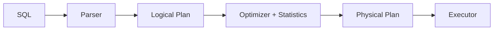

# 쿼리 최적화

> Database Systems 101 시리즈 (8/10)


## 이 글에서 다룰 문제

같은 SQL이 갑자기 느려지는 일은 거의 항상 "옵티마이저가 다른 계획을 골랐기 때문"입니다. 통계, 데이터 양, 인덱스 추가/삭제, 파라미터 sniffing이 그 트리거입니다. EXPLAIN을 읽지 못하면 이 문제는 추측만으로 다뤄야 합니다.

> 튜닝의 90%는 "옵티마이저가 무엇을 알고 무엇을 모르는가"를 이해하는 일입니다.

## 전체 흐름


같은 논리 계획에서 인덱스 스캔, 시퀀셜 스캔, 다양한 조인 알고리즘 등 여러 물리 계획이 나옵니다. 옵티마이저는 통계 기반 비용으로 이 중 하나를 고릅니다.

## Before/After

**Before — 통계가 낡아 풀스캔 선택**

```sql
EXPLAIN ANALYZE SELECT * FROM orders WHERE user_id = 7;
-- Seq Scan on orders ... (cost=... rows=50000) (actual rows=50)
```

**After — ANALYZE 실행 후 인덱스 사용**

```sql
ANALYZE orders;
EXPLAIN ANALYZE SELECT * FROM orders WHERE user_id = 7;
-- Index Scan using idx_user on orders ... (cost=... rows=60) (actual rows=50)
```

추정 행 수와 실제 행 수가 가까워지자 옵티마이저가 인덱스 계획으로 갈아탑니다.

## EXPLAIN으로 계획 읽기

### 1단계 — 데이터와 인덱스 준비

```python
# setup.py
import sqlite3, random

with sqlite3.connect("opt.db") as db:
    db.executescript("""
        DROP TABLE IF EXISTS orders;
        CREATE TABLE orders (
            id INTEGER PRIMARY KEY,
            user_id INTEGER NOT NULL,
            status TEXT NOT NULL,
            total INTEGER NOT NULL
        );
    """)
    rows = [
        (i, random.randint(1, 1000), random.choice(["paid","pending","cancelled"]), random.randint(1,1000))
        for i in range(1, 100001)
    ]
    db.executemany("INSERT INTO orders VALUES (?,?,?,?)", rows)
    db.execute("CREATE INDEX idx_user ON orders(user_id)")
    db.execute("ANALYZE")
```

### 2단계 — 단순 인덱스 스캔

```python
import sqlite3
with sqlite3.connect("opt.db") as db:
    plan = db.execute("EXPLAIN QUERY PLAN SELECT * FROM orders WHERE user_id=7").fetchall()
    for row in plan:
        print(row)
```

플랜에 `SEARCH orders USING INDEX idx_user`가 보이면 인덱스가 사용된 것입니다.

### 3단계 — JOIN 알고리즘 비교

```sql
EXPLAIN ANALYZE
SELECT u.email, count(*)
FROM users u
JOIN orders o ON o.user_id = u.id
GROUP BY u.email;
```

데이터 양과 인덱스에 따라 옵티마이저는 Nested Loop, Hash Join, Merge Join 중 하나를 고릅니다. "왜 이 조인을 골랐을까?"를 통계로 설명할 수 있어야 합니다.

### 4단계 — 통계 갱신의 효과 보기

```sql
-- 대량 INSERT 후
ANALYZE orders;
EXPLAIN ANALYZE SELECT * FROM orders WHERE user_id = 7;
```

ANALYZE는 옵티마이저가 보는 세상의 해상도를 높입니다. 정기적으로 자동 실행되지만, 큰 데이터 변화 후에는 수동 실행이 도움이 됩니다.

### 5단계 — 함수 호출이 인덱스를 죽이는 패턴

```sql
EXPLAIN ANALYZE SELECT * FROM users WHERE lower(email) = 'a@x.com';
-- Seq Scan (인덱스가 안 탐)

CREATE INDEX idx_users_email_lower ON users (lower(email));
EXPLAIN ANALYZE SELECT * FROM users WHERE lower(email) = 'a@x.com';
-- Index Scan
```

WHERE의 컬럼에 함수를 씌우면 일반 인덱스는 안 탑니다. 함수형 인덱스나 가공된 컬럼이 필요합니다.

## 이 코드에서 주목할 점

- 옵티마이저의 핵심 입력은 **통계**입니다. 통계가 낡으면 좋은 계획도 안 나옵니다.
- 추정 행 수와 실제 행 수의 큰 차이는 거의 항상 문제 신호입니다.
- 같은 쿼리도 데이터 분포가 바뀌면 다른 계획으로 갈 수 있습니다.
- WHERE의 함수 호출, 형 변환은 인덱스를 죽이는 가장 흔한 원인입니다.

## 자주 하는 실수 5가지

1. **EXPLAIN 없이 "느리다"고 말한다.** 추측 기반 튜닝은 거의 실패합니다.
2. **인덱스만 추가하고 ANALYZE를 안 한다.** 새 인덱스의 효과를 옵티마이저가 모릅니다.
3. **WHERE 컬럼에 함수를 씌운다.** `WHERE lower(email)=?` 같은 패턴은 인덱스를 죽입니다.
4. **`SELECT *`로 모든 컬럼을 가져온다.** 커버링 인덱스 기회를 잃고 네트워크 비용을 키웁니다.
5. **OR 조건과 IN을 혼동한다.** 옵티마이저가 다르게 다룹니다. EXPLAIN으로 확인합니다.

## 실무에서는 이렇게 쓰입니다

쿼리 튜닝의 표준 절차는 같습니다. (1) 가장 느린 쿼리를 식별한다 (slow query log, APM, `pg_stat_statements`), (2) 대표 쿼리에 EXPLAIN ANALYZE를 돌린다, (3) 추정과 실제의 차이를 보고 통계·인덱스·쿼리 모양을 조정한다, (4) 변경 전후를 측정한다.

서비스 운영 관점에서는 "회귀 감지"가 중요합니다. 평소 1ms이던 쿼리가 갑자기 100ms가 됐다면 통계 변화나 데이터 분포 변화가 있었을 가능성이 큽니다. 자동 통계, 인덱스 모니터링, 슬로우 쿼리 알람을 함께 운영합니다.

## 체크리스트

- [ ] 핵심 쿼리에 EXPLAIN ANALYZE를 한 번이라도 돌려봤는가?
- [ ] 통계가 정기적으로 갱신되는가?
- [ ] WHERE에 함수 호출·형 변환이 없는가?
- [ ] 슬로우 쿼리 로그를 모니터링하는가?
- [ ] 인덱스가 추가될 때 어떤 쿼리에 쓰이는지 기록하는가?

## 정리 및 다음 단계

옵티마이저는 통계 기반 비용 모델로 가능한 계획 중 하나를 고릅니다. EXPLAIN ANALYZE는 그 결정을 사후 검증하는 가장 신뢰할 만한 도구입니다. 다음 글에서는 한 대의 데이터베이스를 넘어 — 복제와 백업 — 으로 넘어갑니다. 동시에 빠르고 안전한 시스템을 만드는 두 축을 정리합니다.

<!-- toc:begin -->
- [데이터베이스 시스템이란 무엇인가?](./01-what-is-a-database.md)
- [관계형 모델](./02-relational-model.md)
- [SQL과 쿼리 처리](./03-sql-and-query-processing.md)
- [인덱스](./04-indexes.md)
- [트랜잭션과 ACID](./05-transactions-and-acid.md)
- [isolation level](./06-isolation-levels.md)
- [정규화와 모델링](./07-normalization-and-modeling.md)
- **쿼리 최적화 (현재 글)**
- 복제와 백업 (예정)
- OLTP와 OLAP (예정)
<!-- toc:end -->

## 참고 자료

- [PostgreSQL — Using EXPLAIN](https://www.postgresql.org/docs/current/using-explain.html)
- [PostgreSQL — Statistics Used by the Planner](https://www.postgresql.org/docs/current/planner-stats.html)
- [Use The Index, Luke!](https://use-the-index-luke.com/)
- [SQLite — The Next-Generation Query Planner](https://www.sqlite.org/queryplanner-ng.html)
