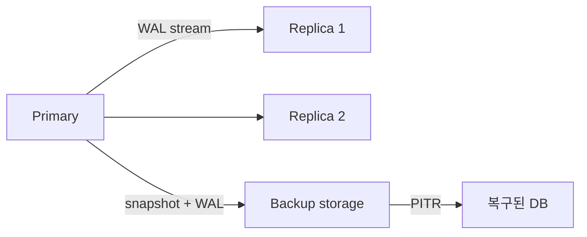

# 복제와 백업

> Database Systems 101 시리즈 (9/10)

<!-- a-grade-intro:begin -->

**핵심 질문**: 데이터베이스 한 대가 죽거나 디스크가 통째로 날아가도 서비스를 살아 있게 만들려면 무엇이 필요할까요?

> 복제는 살아 있는 노드 사이에서 데이터를 계속 같은 모양으로 유지하는 일이고, 백업은 시간을 거꾸로 돌릴 수 있는 보험입니다. 둘은 같은 문제(가용성·내구성)를 다른 시간 축에서 해결합니다. 어느 한 쪽만으로는 부족합니다.

<!-- a-grade-intro:end -->

## 이 글에서 배울 것

- 마스터-레플리카 복제의 동작과 역할
- 동기 복제와 비동기 복제의 트레이드오프
- 백업의 종류 — 풀, 증분, WAL 기반 PITR
- RPO/RTO를 어떻게 정의하는가

## 왜 중요한가

장애는 일어납니다. 디스크는 죽고, 사람이 잘못된 DELETE를 누르고, 리전이 통째로 다운됩니다. 복제와 백업은 "그 일이 일어났을 때 우리는 얼마를 잃고, 얼마 만에 복구할 수 있는가?"라는 질문에 미리 답하는 일입니다.

> 복원 절차를 한 번도 실행해 본 적이 없는 백업은 백업이 아닙니다.

## 개념 한눈에 보기



복제는 옆으로(공간), 백업은 뒤로(시간). 둘이 합쳐 가용성·내구성·복구를 만듭니다.

## 핵심 용어 정리

- **Primary/Replica**: 쓰기를 받는 노드와 그것을 따라가는 노드.
- **Sync vs Async Replication**: 커밋을 기다릴 때 레플리카 응답이 필요한지 아닌지.
- **PITR(Point-in-Time Recovery)**: 베이스 백업 + WAL을 재생해 임의의 시점으로 복구.
- **RPO(Recovery Point Objective)**: 받아들일 수 있는 데이터 손실량(시간).
- **RTO(Recovery Time Objective)**: 받아들일 수 있는 다운타임(시간).

## Before/After

**Before — 단일 인스턴스, 백업만**

- 디스크 장애 시 야간 백업까지 데이터 손실, 복구 30분.

**After — 레플리카 + 정기 PITR 백업**

- 자동 페일오버로 30초 내 쓰기 복귀.
- 잘못된 DELETE도 PITR로 5분 단위까지 되돌리기 가능.

같은 데이터에 두 가지 방어선을 갖춘 셈입니다.

## 실습: 복제와 PITR 흉내내기

### 1단계 — Primary 설정 (PostgreSQL)

```ini
# postgresql.conf
wal_level = replica
max_wal_senders = 10
archive_mode = on
archive_command = 'cp %p /var/lib/pgsql/wal_archive/%f'
```

WAL을 외부 저장소로 떠 보내는 설정입니다. PITR의 토대가 됩니다.

### 2단계 — Replica 만들기

```bash
pg_basebackup -h primary.host -D /var/lib/pgsql/replica -U replicator -P -X stream
```

기본 백업을 받고 스트리밍 복제를 시작합니다. Replica는 Primary의 WAL을 실시간으로 따라갑니다.

### 3단계 — 동기 복제 활성화

```ini
# postgresql.conf
synchronous_commit = on
synchronous_standby_names = 'replica1'
```

이제 Primary는 `replica1`이 WAL을 받았다고 응답할 때까지 COMMIT을 보류합니다. 데이터 손실 0이지만, 레플리카가 느리면 쓰기가 느려집니다.

### 4단계 — 베이스 백업과 WAL 보관

```bash
pg_basebackup -D /backup/base/$(date +%F) -Ft -z -P
ls /var/lib/pgsql/wal_archive | tail
```

베이스 백업은 시점 t0의 스냅샷, WAL 아카이브는 그 이후의 변경 이력입니다.

### 5단계 — 임의 시점으로 PITR

```ini
# recovery.conf 또는 postgresql.auto.conf
restore_command = 'cp /var/lib/pgsql/wal_archive/%f %p'
recovery_target_time = '2026-05-04 03:00:00'
```

베이스 백업을 풀고, WAL을 지정 시각까지 재생합니다. 잘못된 DELETE 직전으로 되돌릴 수 있습니다.

## 이 코드에서 주목할 점

- 복제는 보통 **WAL 스트리밍**으로 구현됩니다. 트랜잭션 로그가 곧 복제 채널입니다.
- 동기 복제는 데이터 손실을 줄이지만, 한 노드가 느려지면 전체가 느려집니다.
- PITR는 베이스 백업과 WAL을 **둘 다** 보관해야 가능합니다.
- "복원 시간"은 백업 크기, 네트워크 속도, WAL 양의 함수입니다.

## 자주 하는 실수 5가지

1. **레플리카를 백업으로 본다.** 잘못된 DELETE는 레플리카로도 즉시 전파됩니다.
2. **백업을 한 번도 복원해 본 적이 없다.** 복원 가능 여부는 시뮬레이션으로만 알 수 있습니다.
3. **RPO/RTO를 합의 없이 정한다.** 비즈니스 요구와 인프라 비용이 정렬돼야 합니다.
4. **동기 복제만 쓴다.** 한 레플리카가 느려지면 전체 쓰기가 멈춥니다. 보통 sync + async 조합으로 운영합니다.
5. **백업을 같은 리전, 같은 계정에만 둔다.** 리전·계정 단위 사고에 무방비입니다.

## 실무에서는 이렇게 쓰입니다

대부분의 OLTP 서비스는 "1 primary + N async replica + 정기 PITR 백업" 구조에서 출발합니다. 읽기 부하는 레플리카로 분산시키되, 즉시 일관성이 필요한 화면은 primary에서 읽습니다.

장애 대응은 사후가 아니라 사전 연습입니다. 페일오버 훈련, 백업 복원 훈련을 정기적으로 합니다. "백업이 있다"는 안심은 "어제 복원해 봤다"가 뒷받침할 때만 사실입니다.

## 시니어 엔지니어는 이렇게 생각합니다

- RPO/RTO를 숫자로 합의합니다 ("RPO 5분, RTO 30분").
- 복원 절차를 분기마다 한 번씩은 실제로 돌립니다.
- 백업은 다른 리전, 다른 계정에 보관합니다.
- 동기 복제 대상 노드의 헬스를 별도로 모니터링합니다.
- 페일오버는 자동화하되, 수동 절차도 문서화해 둡니다.

## 체크리스트

- [ ] RPO/RTO가 명시되어 있는가?
- [ ] 정기 백업과 WAL 아카이브가 모두 있는가?
- [ ] 백업을 다른 위치에 보관하는가?
- [ ] 마지막 복원 훈련이 6개월 이내인가?
- [ ] 페일오버 절차가 문서화·자동화되어 있는가?

## 연습 문제

1. 동기 복제와 비동기 복제 각각의 가장 큰 위험을 한 줄로 적어 보세요.
2. 잘못된 `DELETE FROM users` 쿼리가 실행됐습니다. 레플리카만 있다면 무엇이 가능하고 무엇이 불가능한지 적어 보세요.
3. RPO 0이 비현실적인 시스템이 많은 이유를 한 단락으로 설명하세요.

## 정리 및 다음 단계

복제는 공간 축에서 가용성을, 백업은 시간 축에서 내구성을 책임집니다. 둘이 합쳐져야 "장애에도 살아남는" 시스템이 됩니다. 다음 글에서는 같은 데이터지만 전혀 다른 워크로드 — OLTP와 OLAP — 의 차이와, 분석을 별도 시스템으로 분리하는 이유를 다룹니다.

<!-- toc:begin -->
- [데이터베이스 시스템이란 무엇인가?](./01-what-is-a-database.md)
- [관계형 모델](./02-relational-model.md)
- [SQL과 쿼리 처리](./03-sql-and-query-processing.md)
- [인덱스](./04-indexes.md)
- [트랜잭션과 ACID](./05-transactions-and-acid.md)
- [isolation level](./06-isolation-levels.md)
- [정규화와 모델링](./07-normalization-and-modeling.md)
- [쿼리 최적화](./08-query-optimization.md)
- **복제와 백업 (현재 글)**
- OLTP와 OLAP (예정)
<!-- toc:end -->

## 참고 자료

- [PostgreSQL — High Availability, Replication](https://www.postgresql.org/docs/current/high-availability.html)
- [PostgreSQL — Continuous Archiving and PITR](https://www.postgresql.org/docs/current/continuous-archiving.html)
- [Designing Data-Intensive Applications — Chapter 5](https://dataintensive.net/)
- [Google SRE Book — Backup and Disaster Recovery](https://sre.google/sre-book/data-integrity/)
