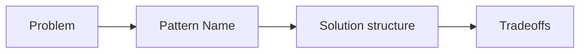

# 디자인 패턴이란 무엇인가?

> Design Patterns 101 시리즈 (1/10)


## 이 글에서 다룰 문제

패턴은 정답이 아니라 어휘입니다. "Strategy로 빼자"라는 한 마디에 동료가 같은 그림을 떠올릴 수 있다는 것 — 이것이 패턴의 가장 큰 가치입니다.

> 패턴은 코드보다 대화에서 먼저 빛난다.

## 전체 흐름


이름이 곧 풀이를 부른다.

## Before/After

**Before**

```python
# "if 종류로 분기" 가 곳곳에 흩어진다
if kind == "credit": process_credit(...)
elif kind == "paypal": process_paypal(...)
```

**After**

```python
# Strategy 패턴 한 줄로 정리
processor = PROCESSORS[kind]
processor.charge(...)
```

이름이 붙은 풀이로 의도를 표현.

## 패턴을 익히는 5단계

### 1단계 — 문제 인식

```python
# 1_problem.py
# 같은 분기/같은 객체 생성/같은 알림 흐름이 반복?
# 패턴이 등장할 무대.
```

문제부터 정의합니다.

### 2단계 — 패턴 이름 떠올리기

```python
# 2_name.py
# 분기? Strategy. 생성? Factory. 알림? Observer.
```

이름이 풀이를 끌어옵니다.

### 3단계 — 구조 그리기

```python
# 3_structure.py
# 클래스 다이어그램으로 한 번 그려본 뒤 코드.
```

구조를 먼저, 코드는 나중에.

### 4단계 — 작게 적용

```python
# 4_small.py
# 시스템 전체에 적용하지 말고 한 모듈에서.
```

작게 시도하고 효과를 검증.

### 5단계 — 트레이드오프 적기

```python
# 5_tradeoff.md
# - 얻은 것: 분기 제거, 확장 용이
# - 잃은 것: 클래스 수 증가
```

패턴은 항상 거래입니다.

## 이 코드에서 주목할 점

- 패턴은 코드를 바꾸기 전 *대화*를 바꿉니다.
- 모든 패턴은 트레이드오프를 가집니다.
- 적용 단위는 보통 작습니다.

## 자주 하는 실수 5가지

1. **모든 곳에 패턴 적용.** 단순 코드가 복잡해진다.
2. **이름만 외우고 문제는 모름.** 적용 시점을 놓친다.
3. **언어 특성 무시.** Python에서 Singleton을 강박적으로 만듦.
4. **트레이드오프 무시.** 클래스 폭발만 남음.
5. **패턴이 곧 정답이라 믿기.** 더 단순한 해법을 놓친다.

## 실무에서는 이렇게 쓰입니다

코드 리뷰의 공통 어휘로 가장 자주 쓰입니다 — "여기 Adapter 하나 두자", "Strategy로 빼자". 이름이 곧 합의입니다.

## 체크리스트

- [ ] 어떤 문제를 푸는지 한 줄로 적었는가?
- [ ] 어울리는 패턴 이름이 떠오르는가?
- [ ] 구조를 그림으로 그려봤는가?
- [ ] 트레이드오프를 적었는가?
- [ ] 더 단순한 해법은 없는가?

## 정리 및 다음 단계

패턴은 어휘입니다. 다음 글부터 GoF 23개를 세 그룹 — Creational, Structural, Behavioral — 으로 묶어 살펴봅니다.

<!-- toc:begin -->
- **디자인 패턴이란 무엇인가? (현재 글)**
- Creational 패턴 (예정)
- Structural 패턴 (예정)
- Behavioral 패턴 (예정)
- Strategy 패턴 (예정)
- Adapter 패턴 (예정)
- Observer 패턴 (예정)
- Factory와 의존성 주입 (예정)
- 패턴을 남용하지 않는 법 (예정)
- Python에 어울리는 패턴 (예정)
<!-- toc:end -->

## 참고 자료

- [Design Patterns: Elements of Reusable Object-Oriented Software (GoF)](https://en.wikipedia.org/wiki/Design_Patterns)
- [refactoring.guru — Design Patterns](https://refactoring.guru/design-patterns)
- [Patterns of Enterprise Application Architecture](https://martinfowler.com/eaaCatalog/)
- [Head First Design Patterns](https://www.oreilly.com/library/view/head-first-design/9781492077992/)
