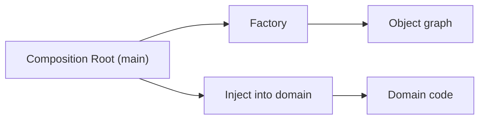

# Factory와 의존성 주입

> Design Patterns 101 시리즈 (8/10)

<!-- a-grade-intro:begin -->

**핵심 질문**: 객체는 *언제, 어디서, 누가* 만들어야 좋은가요?

> 도메인 안에서 만들지 말고, *외부 한 곳*에서 조립해 주입합니다. 그 자리가 Composition Root이고, 그 도구가 Factory와 DI입니다.

<!-- a-grade-intro:end -->

## 이 글에서 배울 것

- 생성 책임이 흩어졌을 때의 문제
- Factory의 역할
- DI(Dependency Injection)의 사고
- Composition Root란 무엇인가
- DI 컨테이너가 필요한 시점

## 왜 중요한가

도메인 코드 안에서 직접 객체를 만들면 그 도메인은 *어떻게 만들지*도 알게 됩니다. Factory와 DI는 "*무엇을* 쓰는지"와 "*어떻게* 만드는지"를 분리합니다.

> "사용"과 "조립"을 분리하면 테스트와 교체가 쉬워집니다.

## 개념 한눈에 보기



조립은 한 곳에, 사용은 여러 곳에.

## 핵심 용어 정리

- **Factory**: 생성 절차를 캡슐화한 객체/함수.
- **Dependency Injection**: 의존성을 외부에서 주입하는 기법.
- **Composition Root**: 객체 그래프를 조립하는 단일 진입점.
- **Constructor injection**: 생성자로 주입.
- **DI container**: 자동 조립 도구 (필요할 때만).

## Before/After

**Before**

```python
class OrderService:
    def __init__(self):
        self.repo = PostgresOrderRepo("dsn")
        self.mailer = SmtpMailer("smtp.example.com")
        self.bus = EventBus()
```

**After**

```python
class OrderService:
    def __init__(self, repo, mailer, bus):
        self.repo, self.mailer, self.bus = repo, mailer, bus
```

`OrderService`는 자기 친구를 *고르지* 않습니다.

## 실습: Factory와 DI를 익히는 5단계

### 1단계 — Factory 함수

```python
# 1_factory.py
def make_mailer(env):
    if env == "prod":
        return SmtpMailer("smtp.example.com")
    return InMemoryMailer()
```

생성 분기를 도메인 밖으로 꺼냅니다.

### 2단계 — 생성자 주입

```python
# 2_ctor.py
class OrderService:
    def __init__(self, repo, mailer):
        self.repo, self.mailer = repo, mailer
```

도메인은 *받은* 의존성으로 일합니다.

### 3단계 — Composition Root

```python
# 3_main.py
def main():
    repo = PostgresOrderRepo(os.environ["DSN"])
    mailer = make_mailer(os.environ["ENV"])
    service = OrderService(repo, mailer)
    service.run()

if __name__ == "__main__":
    main()
```

조립은 `main`(혹은 부트스트랩 함수) 한 곳에.

### 4단계 — 테스트에서의 주입

```python
# 4_test.py
def test_submit():
    repo = InMemoryOrderRepo()
    mailer = InMemoryMailer()
    svc = OrderService(repo, mailer)
    svc.submit(...)
    assert mailer.sent == 1
```

테스트는 `main`을 우회해 *직접* 조립합니다.

### 5단계 — DI 컨테이너 (선택)

```python
# 5_container.py
# 작은 손-말이 컨테이너 — 정말 필요할 때만 쓴다.
class Container:
    def __init__(self): self._reg = {}
    def register(self, key, factory): self._reg[key] = factory
    def get(self, key): return self._reg[key]()
```

대부분의 프로젝트에서는 *손으로* 조립하는 편이 더 단순합니다.

## 이 코드에서 주목할 점

- 도메인은 의존성을 *받기만* 합니다.
- 환경(prod/dev/test)별 차이는 Composition Root의 한 분기로.
- 테스트는 가짜 의존성을 *생성*해 주입합니다.

## 자주 하는 실수 5가지

1. **도메인이 환경 변수를 직접 읽음.** 조립 책임 누수.
2. **Factory가 비즈니스 로직 보유.** 생성과 정책 혼재.
3. **DI 컨테이너 남용.** 보이지 않는 마법으로 디버깅 난이도 폭발.
4. **순환 의존성을 컨테이너로 우회.** 설계 문제를 숨김.
5. **모든 클래스에 컨테이너 주입.** 단순한 일에 무거움.

## 실무에서는 이렇게 쓰입니다

FastAPI의 `Depends`, Spring의 `@Autowired`, Guice/Dagger, Django settings에서 백엔드 선택 — 모두 DI/Factory의 모양입니다. Composition Root 사고는 마이크로서비스 부트스트랩에서도 그대로 통합니다.

## 시니어 엔지니어는 이렇게 생각합니다

- "이 객체를 누가 만드는가?"를 항상 되묻는다.
- 조립은 *바깥*, 사용은 *안*.
- 컨테이너는 정말 클 때만.
- 환경별 차이는 Composition Root에서.
- Factory는 *생성만* — 정책은 도메인에.

## 체크리스트

- [ ] 도메인이 환경 변수를 직접 읽지 않는가?
- [ ] Composition Root가 *한 곳*에 있는가?
- [ ] Factory가 정책을 갖지 않는가?
- [ ] DI 컨테이너가 필요한 규모인지 검토했는가?
- [ ] 테스트가 자체적으로 조립할 수 있는가?

## 연습 문제

1. 환경 변수에 따라 다른 Mailer를 반환하는 Factory 작성.
2. `OrderService`를 생성자 주입으로 리팩터링하고 테스트 추가.
3. Composition Root에서 DB/메일러/이벤트버스를 *한 번에* 조립.

## 정리 및 다음 단계

Factory와 DI는 "조립과 사용"의 분리입니다. 다음 글은 패턴이 *해가 되는 순간* — 패턴을 남용하지 않는 법 — 을 봅니다.

<!-- toc:begin -->
- [디자인 패턴이란 무엇인가?](./01-what-are-design-patterns.md)
- [Creational 패턴](./02-creational-patterns.md)
- [Structural 패턴](./03-structural-patterns.md)
- [Behavioral 패턴](./04-behavioral-patterns.md)
- [Strategy 패턴](./05-strategy-pattern.md)
- [Adapter 패턴](./06-adapter-pattern.md)
- [Observer 패턴](./07-observer-pattern.md)
- **Factory와 의존성 주입 (현재 글)**
- 패턴을 남용하지 않는 법 (예정)
- Python에 어울리는 패턴 (예정)
<!-- toc:end -->

## 참고 자료

- [Factory Method (refactoring.guru)](https://refactoring.guru/design-patterns/factory-method)
- [Inversion of Control Containers and the Dependency Injection pattern (Martin Fowler)](https://martinfowler.com/articles/injection.html)
- [Composition Root (Mark Seemann)](https://blog.ploeh.dk/2011/07/28/CompositionRoot/)
- [FastAPI Dependencies](https://fastapi.tiangolo.com/tutorial/dependencies/)
