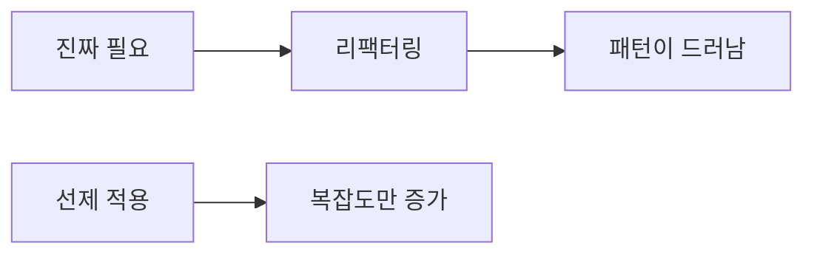

# 패턴을 남용하지 않는 법

> Design Patterns 101 시리즈 (9/10)


## 이 글에서 다룰 문제

미리 적용한 패턴은 잘못 적용된 패턴이 되기 쉽습니다. 단순한 코드가 자라면서 패턴이 *드러날 때* 적용해도 늦지 않습니다.

> 가장 좋은 추상화는 *나중에* 등장합니다.

## 전체 흐름


필요가 패턴을 *부른다*. 반대 방향은 위험합니다.

## Before/After

**Before (과한 적용)**

```python
# 단 한 가지 알고리즘인데 Strategy + Factory + Builder
class GreetStrategy: ...
class HelloStrategy(GreetStrategy): ...
class GreetFactory: ...
class GreetBuilder: ...
```

**After (단순)**

```python
def greet(name): return f"Hello, {name}"
```

지금 필요한 일은 한 줄짜리.

## 남용을 피하는 5단계

### 1단계 — 가장 단순한 코드부터

```python
# 1_simple.py
def discount(price, kind):
    return {"vip": price*0.7, "member": price*0.9}.get(kind, price)
```

분기 하나에 패턴은 사치.

### 2단계 — 변화가 *반복*될 때 추상화

```python
# 2_when_repeats.py
# 등급이 6개 이상으로 늘고, 등급별 정책이 추가될 때 — 그때 Strategy
class Discount: ...
```

세 번째 변경이 들어올 때 비로소 추상화.

### 3단계 — 추상화 대신 함수 분리

```python
# 3_extract.py
def vip_price(p): return p * 0.7
def member_price(p): return p * 0.9
```

함수 한 줄로도 의도가 충분히 보입니다.

### 4단계 — 기존 코드를 패턴으로 *발견*

```python
# 4_refactor_to_pattern.py
# 분기 5개가 비슷한 모양으로 자라면, 그제야 Strategy로 정리
```

리팩터링이 패턴을 *드러내게* 합니다.

### 5단계 — 패턴을 *지우는* 용기

```python
# 5_remove_pattern.py
# 사용처가 하나뿐이라면 Strategy/Factory를 다시 함수로 접는다.
```

쓰지 않는 추상화는 *부채*입니다.

## 이 코드에서 주목할 점

- 단순한 함수가 가장 강한 출발점입니다.
- 패턴은 *반복된 변화*가 정당화합니다.
- 추상화는 한 번 더 미룰 수 있습니다.

## 자주 하는 실수 5가지

1. **요구사항보다 빠른 추상화.** 미래를 *상상*해서 짜는 코드.
2. **이름만 패턴.** `XxxFactory`인데 그냥 `new`.
3. **Strategy 안에 if/elif.** 패턴이 분기를 흡수하지 못함.
4. **Decorator로 무한 래핑.** 디버깅 지옥.
5. **DI 컨테이너로 모든 것을 자동 조립.** 보이지 않는 의존성.

## 실무에서는 이렇게 쓰입니다

좋은 라이브러리는 *적은* 패턴을 *정확히* 씁니다. requests, FastAPI, pytest를 보면 거대한 추상화 대신 작은 합성으로 풉니다. 신입과 시니어의 차이는 패턴을 *얼마나 많이* 아는가가 아니라 *언제 미루는지*를 아는가입니다.

## 체크리스트

- [ ] 지금 정말 필요한 추상화인가?
- [ ] 변화가 세 번 이상 반복되었는가?
- [ ] 함수 분리로 충분하지 않은가?
- [ ] 패턴 이름이 *역할*을 정확히 가리키는가?
- [ ] 사용처가 하나뿐이라면 다시 접을 수 있는가?

## 정리 및 다음 단계

패턴은 *어휘*입니다. 마지막 글에서는 Python의 일급 함수, 모듈, Protocol 같은 도구가 GoF의 많은 패턴을 어떻게 자연스럽게 풀어내는지 — Pythonic 패턴 — 을 봅니다.

<!-- toc:begin -->
- [디자인 패턴이란 무엇인가?](./01-what-are-design-patterns.md)
- [Creational 패턴](./02-creational-patterns.md)
- [Structural 패턴](./03-structural-patterns.md)
- [Behavioral 패턴](./04-behavioral-patterns.md)
- [Strategy 패턴](./05-strategy-pattern.md)
- [Adapter 패턴](./06-adapter-pattern.md)
- [Observer 패턴](./07-observer-pattern.md)
- [Factory와 의존성 주입](./08-factory-and-di.md)
- **패턴을 남용하지 않는 법 (현재 글)**
- Python에 어울리는 패턴 (예정)
<!-- toc:end -->

## 참고 자료

- [YAGNI (Martin Fowler)](https://martinfowler.com/bliki/Yagni.html)
- [Refactoring to Patterns (Joshua Kerievsky)](https://www.industriallogic.com/xp/refactoring/)
- [Premature Abstraction (C2 wiki)](https://wiki.c2.com/?PrematureGeneralization)
- [Worse Is Better (Richard Gabriel)](https://www.dreamsongs.com/RiseOfWorseIsBetter.html)
