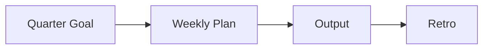

# 학습 계획 세우기

> Developer Career 101 시리즈 (3/10)

<!-- a-grade-intro:begin -->

**핵심 질문**: *바쁜* *일상* 속에서 *어떻게* *지속* *가능* 한 *학습* 을 *유지* 할까요?

> *분기 목표*, *주간 루틴*, *측정* 가능한 *결과*.

<!-- a-grade-intro:end -->

## 이 글에서 배울 것

- *분기 목표* 잡기
- *주간 루틴*
- *학습 자료* 선택
- *결과물* 만들기
- *회고* 하기

## 왜 중요한가

*계획* 없는 *학습* 은 *흩어집니다*.

## 개념 한눈에 보기



## 핵심 용어 정리

- **goal**: *목표*.
- **routine**: *주간* *반복*.
- **output**: *결과물*.
- **retro**: *회고*.
- **deliberate practice**: *의도적* *연습*.

## Before/After

**Before**: "*책* 만 *사고* *읽지* *않는다*."

**After**: "*분기* 마다 *결과물* 1개 를 *낸다*."

## 실습: 학습 루틴

### 1단계 — 분기 목표

```markdown
2026 Q2: Build a CLI tool in Rust
```

### 2단계 — 주간 루틴

```text
화/목 21:00-22:00 (60분)
토 09:00-11:00 (120분)
```

### 3단계 — 자료 선택

```text
- 1 책
- 1 코스
- 1 코드베이스
```

### 4단계 — 결과물

```text
- repo URL
- blog post
- talk slides
```

### 5단계 — 분기 회고

```markdown
- 달성: 90%
- 막힘: ownership
- 다음 분기: async/await 깊이
```

## 이 코드에서 주목할 점

- *목표* 는 *결과물* 로.
- *루틴* 은 *시간 블록*.
- *회고* 는 *수정* 의 *기회*.

## 자주 하는 실수 5가지

1. ***목표* 가 *모호* 하다.**
2. ***루틴* 이 *기분* 에 *의존* 한다.**
3. ***입력* 만 *많다*.**
4. ***결과물* 이 *없다*.**
5. ***회고* 를 *생략* 한다.**

## 실무에서는 이렇게 쓰입니다

기업의 *PIP* 와 *promo* 도 *분기 목표* + *결과물* 로 *평가* 합니다.

## 시니어 엔지니어는 이렇게 생각합니다

- *학습* 은 *계획*.
- *결과물* 이 *증거*.
- *시간 블록* 이 *습관*.
- *회고* 가 *수정* 도구.
- *깊이* 가 *복리*.

## 체크리스트

- [ ] *분기 목표* 1개.
- [ ] *주간 시간 블록*.
- [ ] *결과물* 정의.
- [ ] *분기 회고*.

## 연습 문제

1. *deliberate practice* 한 줄 정의.
2. *시간 블록* 의 *효과* 한 줄.
3. *분기 회고* *질문* 한 가지.

## 정리 및 다음 단계

다음 글은 *이력서와 포트폴리오* 입니다.

<!-- toc:begin -->
- [개발자 커리어란 무엇인가](./01-what-is-developer-career.md)
- [직무 이해하기](./02-understanding-roles.md)
- **학습 계획 세우기 (현재 글)**
- 이력서와 포트폴리오 (예정)
- 코딩 인터뷰 준비 (예정)
- 시스템 디자인 인터뷰 (예정)
- 첫 직장 적응 (예정)
- 사이드 프로젝트와 학습 (예정)
- 멘토링과 네트워킹 (예정)
- 시니어로 가는 길 (예정)
<!-- toc:end -->

## 참고 자료

- [Atomic Habits](https://jamesclear.com/atomic-habits)
- [Deep Work](https://www.calnewport.com/books/deep-work/)
- [Deliberate Practice](https://www.psychologytoday.com/us/basics/deliberate-practice)
- [OKR Examples](https://www.whatmatters.com/)
