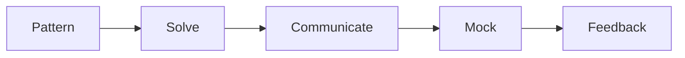

# 코딩 인터뷰 준비

> Developer Career 101 시리즈 (5/10)


## 이 글에서 다룰 문제

*패턴* 을 *모르면* *시간* 을 *낭비* 합니다.

## 전체 흐름


## Before/After

**Before**: "*문제* 를 *닥치는* *대로* *푼다*."

**After**: "*패턴* 별로 *3문제* 씩 *깊이* *판다*."

## 인터뷰 루틴

### 1단계 — 패턴 8가지

```text
two pointers, sliding window,
binary search, BFS/DFS,
heap, dp, greedy, backtracking
```

### 2단계 — UMPIRE 절차

```text
Understand → Match → Plan
Implement → Review → Evaluate
```

### 3단계 — 풀이 예시

```python
def two_sum(nums, target):
    seen = {}
    for i, n in enumerate(nums):
        if target - n in seen:
            return [seen[target - n], i]
        seen[n] = i
```

### 4단계 — 모의 면접

```text
- 주 2회, 45분
- 친구 또는 pramp.com
```

### 5단계 — 회고

```markdown
- 막힌 패턴: dp
- 다음 주: dp 5문제 + 음성 녹음
```

## 이 코드에서 주목할 점

- *패턴* 이 *지름길*.
- *말하기* 가 *평가*.
- *모의* 가 *실전*.

## 자주 하는 실수 5가지

1. ***말 없이* *코딩* 한다.**
2. ***edge case* 를 *놓친다*.**
3. ***복잡도* 를 *말하지* *않는다*.**
4. ***모의 면접* 을 *건너뛴다*.**
5. ***피드백* 을 *받지* *않는다*.**

## 실무에서는 이렇게 쓰입니다

기업도 *내부 leveling* 을 위한 *코딩 평가* 를 *주기* 적으로 *합니다*.

## 체크리스트

- [ ] *8 패턴* 별 *3문제*.
- [ ] *UMPIRE* 적용.
- [ ] *주 2회* 모의.
- [ ] *복잡도* 명시.

## 정리 및 다음 단계

다음 글은 *시스템 디자인 인터뷰* 입니다.

<!-- toc:begin -->
- [개발자 커리어란 무엇인가](./01-what-is-developer-career.md)
- [직무 이해하기](./02-understanding-roles.md)
- [학습 계획 세우기](./03-learning-plan.md)
- [이력서와 포트폴리오](./04-resume-and-portfolio.md)
- **코딩 인터뷰 준비 (현재 글)**
- 시스템 디자인 인터뷰 (예정)
- 첫 직장 적응 (예정)
- 사이드 프로젝트와 학습 (예정)
- 멘토링과 네트워킹 (예정)
- 시니어로 가는 길 (예정)
<!-- toc:end -->

## 참고 자료

- [Cracking the Coding Interview](http://www.crackingthecodinginterview.com/)
- [LeetCode patterns](https://seanprashad.com/leetcode-patterns/)
- [Pramp](https://www.pramp.com/)
- [Interviewing.io](https://interviewing.io/)
